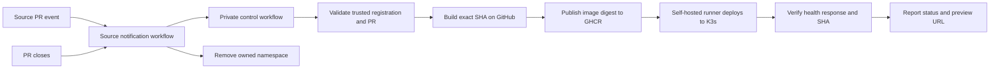

# PreviewMesh

[中文说明](README_CN.md)

PreviewMesh creates a temporary preview environment for each eligible pull request. It builds the exact source commit, deploys the image to K3s, verifies the served commit SHA, and removes the preview when the pull request closes.

> [!WARNING]
> This repository is a public template. Keep the copied control repository private. Never place GitHub tokens, kubeconfigs, real repository registrations, or runtime evidence in this repository. If you copied this directory from a private checkout, create fresh public Git history instead of pushing the old private commits.

## How it works

PreviewMesh separates the public template, the private control plane, and the application source:

| Repository | Contents | Visibility |
| --- | --- | --- |
| PreviewMesh template | Generic code, chart, workflow, and setup documentation | Public |
| Control repository | Your copy, registered source repositories, workflow variables, and Actions secrets | Private |
| Source repository | Your application, Dockerfile, health endpoint, and notification workflow | Public or private |

The hosted runner builds and publishes an immutable GHCR image. A self-hosted runner on your K3s machine deploys that digest and checks the application through Traefik.



Important boundaries:

- The preview workflow is disabled until the private control repository sets `PREVIEWMESH_ENABLED=true`.
- Only registered repositories are accepted. The numeric repository ID and full owner/name must match GitHub.
- Fork pull requests are rejected. Open preview pull requests in the registered source repository itself.
- The source workflow relays metadata only; it does not check out or execute pull request code.
- The self-hosted runner needs a restricted kubeconfig and should run only for the private control repository on a dedicated development cluster.

## Requirements

For local checks, install Git, Go 1.25 or newer, Python 3, Bash, and the GitHub CLI. For real previews, also install K3s with Traefik, Helm 3, and `kubectl` on a Linux or WSL2 machine.

The self-hosted runner must have the labels `self-hosted`, `Linux`, `X64`, and `previewmesh`, plus Go, Python, Helm, and `kubectl` on its `PATH`. The normal image build runs on a GitHub-hosted runner, so Docker is only needed locally for optional manual image builds.

## First setup

Complete these steps in order. Commands that change GitHub or K3s are operator actions; inspect the target repository and cluster before running them.

### 1. Create a private control repository

The safest GitHub flow is **Use this template** on the public PreviewMesh repository, selecting **Private**. A public fork cannot be changed into a private fork.

If you prefer to clone and push manually, replace the two placeholders and run this from a parent directory:

```bash
PUBLIC_REPOSITORY=YOUR_GITHUB_OWNER/PreviewMesh
CONTROL_REPOSITORY=YOUR_GITHUB_OWNER/previewmesh-control

gh auth login
gh repo create "$CONTROL_REPOSITORY" --private
gh repo clone "$PUBLIC_REPOSITORY" previewmesh-control
cd previewmesh-control
git remote rename origin upstream
git remote add origin "https://github.com/$CONTROL_REPOSITORY.git"
git push -u origin main
```

The control repository's default branch must be `main`, Actions must be enabled, and no self-hosted runner should be registered with the public template repository.

### 2. Enable the private workflow

The public copy is intentionally inert. In the private control repository, create the repository Actions variable:

```bash
gh variable set PREVIEWMESH_ENABLED --repo "$CONTROL_REPOSITORY" --body true
```

The value must be exactly `true`. Do not create this variable in the public template repository.

### 3. Register a source repository

The tracked `config/repositories.json` is empty by design. Copy the generic example and edit it in the private control checkout:

```bash
cp config/repositories.example.json config/repositories.json
$EDITOR config/repositories.json
```

Each entry contains an immutable repository ID, the exact GitHub owner/name, the application's HTTP port, and the name of one source-access Secret:

```json
[
  {
    "repository_id": "123456789",
    "source_repository": "YOUR_GITHUB_OWNER/your-application",
    "port": 8080,
    "source_secret": "SOURCE_APP"
  }
]
```

Get the numeric ID from GitHub, not from the repository URL:

```bash
SOURCE_REPOSITORY=YOUR_GITHUB_OWNER/your-application
REPOSITORY_ID=$(gh api "repos/$SOURCE_REPOSITORY" --jq '.id')
printf '%s\n' "$REPOSITORY_ID"
```

Use a different `source_secret` name for every source repository. The file contains names and metadata only; it must never contain token values.

Compile and validate the registration:

```bash
mkdir -p bin
go build -o bin/control ./cmd/control
go build -o bin/previewmesh ./cmd/previewmesh
./bin/control resolve \
  --repository-id "$REPOSITORY_ID" \
  --source-repository "$SOURCE_REPOSITORY" \
  --pr 1
git add config/repositories.json
git commit -m "Configure preview source repository"
git push origin main
```

The example `--pr 1` only checks the number format; it does not require that pull request to exist.

### 4. Prepare the source application

The source repository must contain a root `Dockerfile` that builds a `linux/amd64` image. The application must:

- listen on `0.0.0.0` at the registered port;
- run as UID/GID `65532` without extra capabilities; and
- return HTTP 200 from `GET /health` with this shape:

```json
{"status":"ok","commit_sha":"0123456789abcdef0123456789abcdef01234567"}
```

The returned `commit_sha` must come from the `PREVIEW_COMMIT_SHA` environment variable. PreviewMesh injects the requested source SHA during deployment; do not hardcode the example value.

### 5. Configure K3s and the runner

Apply the restricted runner permissions from the private control checkout:

```bash
sudo k3s kubectl get nodes
sudo k3s kubectl apply -f ops/kubernetes/runner-rbac.yaml
sudo k3s kubectl -n previewmesh-system create token previewmesh-runner --duration=24h
```

Create a kubeconfig outside the repository using the cluster CA data and the ServiceAccount token. Set its mode to `600`, export it as `KUBECONFIG` for the runner, and verify at least:

```bash
chmod 600 /absolute/path/previewmesh-runner.yaml
export KUBECONFIG=/absolute/path/previewmesh-runner.yaml
kubectl auth can-i create namespaces
kubectl auth can-i delete namespaces
kubectl auth can-i create secrets --all-namespaces
kubectl auth can-i create clusterroles
```

The first three checks should return `yes`; creating ClusterRoles should return `no`. Never give the runner the K3s administrator kubeconfig. See [the Kubernetes runner notes](ops/kubernetes/README.md).

Install a Linux x64 GitHub self-hosted runner in a separate directory and add the `previewmesh` label. Configure `KUBECONFIG` in the runner environment, verify that Go, Python, Helm, and `kubectl` are available, and keep the runner registered only with the private control repository.

### 6. Configure GitHub Secrets

Create least-privilege tokens and store them only in the locations below:

| Secret | Store in | Minimum purpose |
| --- | --- | --- |
| `SOURCE_APP` or each configured `source_secret` | Control repository | Read source contents, read pull requests and metadata, write commit statuses for that one source repository |
| `PREVIEWMESH_DISPATCH_TOKEN` | Every source repository | Dispatch the workflow in the private control repository |
| `GHCR_READ_TOKEN` | Control repository | Classic PAT with `read:packages` for the control-owned images |

The helper reads the private registry and prompts without printing token values:

```bash
bash scripts/configure-github-secrets.sh "$CONTROL_REPOSITORY" config/repositories.json
```

It uploads one source token per registered source, one dispatch token to each source, and the GHCR read token to the control repository. A failed upload stops the script; earlier uploads remain saved.

### 7. Configure ingress and source notifications

Preview hosts use this deterministic form:

```text
pm-r<repository-id>-pr<pr-number>.preview.test
```

Make that hostname resolve to an address reachable by both the runner and your browser. For WSL localhost forwarding, first configure Traefik as an internal `ClusterIP`, then create and edit the endpoint file:

```bash
sudo install -d -m 0755 /etc/previewmesh
sudo install -m 0644 ops/wsl/ingress.env.example /etc/previewmesh/ingress.env
sudoedit /etc/previewmesh/ingress.env
```

Install the units under `ops/wsl/` after setting the cluster-specific endpoint. It must not be committed.

Copy the notification template into the source repository:

```bash
mkdir -p .github/workflows
cp /path/to/previewmesh-control/templates/source-notify.yml \
  .github/workflows/previewmesh-notify.yml
```

Edit the two values near the top of the copied file:

```yaml
PREVIEWMESH_CONTROL_OWNER: YOUR_GITHUB_OWNER
PREVIEWMESH_CONTROL_REPOSITORY: previewmesh-control
```

Commit the workflow to the source repository's default branch. Enable Actions there. The source repository's `PREVIEWMESH_DISPATCH_TOKEN` must be present before opening a pull request.

### 8. Run a preview

Open a pull request whose base and head repositories are the registered source repository. The notification workflow dispatches the private control workflow. You can also dispatch it manually:

```bash
gh workflow run preview.yml --repo "$CONTROL_REPOSITORY" --ref main \
  -f repository_id="$REPOSITORY_ID" \
  -f source_repository="$SOURCE_REPOSITORY" \
  -f pr_number="$PR_NUMBER"
gh run list --repo "$CONTROL_REPOSITORY" --workflow preview.yml --limit 5
```

After the workflow reports success, test the preview through its hostname:

```bash
PREVIEW_HOST="pm-r${REPOSITORY_ID}-pr${PR_NUMBER}.preview.test"
curl --fail --max-time 10 "http://$PREVIEW_HOST/health"
```

The response must contain the SHA of the pull request head. Closing or merging the pull request should remove the owned namespace. Repeated close notifications should remain safe.

## Updating a private control repository

Creating a repository from the GitHub template copies the files but does not create a synchronizable fork. For the easiest long-term updates, preserve the Git history when creating the private control repository and keep the public repository as `upstream`:

```bash
git remote add upstream https://github.com/flashrick/PreviewMesh.git
git fetch upstream main
scripts/update-upstream.sh --remote upstream --ref main
```

The script creates a review branch and never pushes it. Review the branch, run the local checks, then push it to the private repository and open a pull request:

```bash
git push -u origin update/previewmesh-main-YYYYMMDDHHMMSS
```

`config/repositories.json` is customer-owned and is restored from the current private branch during the update. GitHub secrets are outside Git and are not changed. If the update has conflicts outside that registry file, the script stops for manual review; do not resolve workflow or deployment changes by blindly choosing one side.

New copies also include **Update PreviewMesh from upstream**, which checks weekly and can be started manually. It creates an update PR on a GitHub-hosted runner. Set the optional repository variable `PREVIEWMESH_UPSTREAM_REPOSITORY` if the public template is maintained under another owner.

If the private repository was created with **Use this template**, its history is unrelated to the template. The first updater run creates a small history-bridge commit while preserving the current private tree; later updates use normal Git merges. The first bridge still needs review, and any customer-specific files outside the registry remain the customer's responsibility.

The copied `templates/source-notify.yml` in each source repository and installed WSL/K3s files are separate update surfaces. Synchronize or reapply them when their corresponding upstream files change.

## Local verification

Run these checks from the private control checkout before changing GitHub or K3s:

```bash
go test ./...
go vet ./...
python3 scripts/check-workflow.py
python3 scripts/check-github-secrets.py
helm lint charts/preview
actionlint .github/workflows/preview.yml templates/source-notify.yml
```

The Python checks use fake tools and do not contact GitHub or Kubernetes. Passing local checks does not prove that your tokens, package permissions, runner, network route, or application contract are correct.

## CLI notes

`control resolve` validates a registration without calling GitHub. `control inspect` rechecks the current PR, fork status, and author permission. `control status` writes the `PreviewMesh` commit status.

`previewmesh build`, `deploy`, `verify`, and `cleanup` are lower-level operations used by the workflow. Use the workflow for the complete PR lifecycle because it rechecks current PR state before and after deployment and handles superseded revisions and cleanup.

## Project layout

| Path | Purpose |
| --- | --- |
| `cmd/control` | Trusted repository and pull-request validation CLI |
| `cmd/previewmesh` | Image, Helm, verification, rollback, and cleanup CLI |
| `charts/preview` | Restricted Deployment, Service, and Ingress chart |
| `config` | Private source registration and its public example |
| `templates` | Workflow copied into each source repository |
| `scripts` | Secret setup, lifecycle orchestration, reports, and offline checks |
| `ops` | Generic K3s, Linux, and WSL helpers |

## Troubleshooting

- **Workflow is skipped:** confirm the control repository has the Actions variable `PREVIEWMESH_ENABLED` set to exactly `true`.
- **Registration rejected:** verify the numeric repository ID, owner/name, port, and Secret name match the registry and GitHub.
- **Source checkout fails:** check the source token's repository scope and pull-request read permission.
- **No status is reported:** check commit-status write permission and the source token selected by `source_secret`.
- **Image pull fails:** verify `GHCR_READ_TOKEN`, package access, and the `ghcr-pull` Secret in the preview namespace.
- **HTTP verification fails:** test the `/health` contract, hostname resolution, Traefik route, and that the response reports `PREVIEW_COMMIT_SHA`.
- **WSL Docker networking fails:** use the optional, narrowly scoped helper in [the WSL egress notes](ops/wsl/docker-egress.md).
