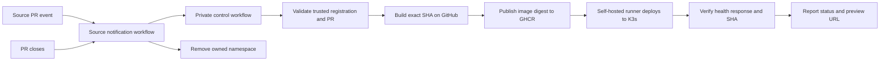

# PreviewMesh

[中文说明](README_CN.md)

PreviewMesh creates a temporary preview environment for each eligible pull request. It builds the exact source commit, deploys the image to K3s, verifies the served commit SHA, and removes the preview when the pull request closes.

> [!WARNING]
> This repository is a public template. Keep the copied control repository private. Never place GitHub tokens, kubeconfigs, real repository registrations, or runtime evidence in this repository. If you copied this directory from a private checkout, create fresh public Git history instead of pushing the old private commits.

## How it works

PreviewMesh separates the public template, the private control plane, and the application source:

| Repository | Contents | Visibility |
| --- | --- | --- |
| PreviewMesh template | Generic code, chart, workflow, and setup documentation | Public |
| Control repository | Your copy, registered source repositories, workflow variables, and Actions secrets | Private |
| Source repository | Your application, Dockerfile, health endpoint, and notification workflow | Public or private |

The hosted runner builds and publishes an immutable GHCR image. A self-hosted runner on your K3s machine deploys that digest and checks the application through Traefik.



Important boundaries:

- The preview workflow is disabled until the private control repository sets `PREVIEWMESH_ENABLED=true`.
- Only registered repositories are accepted. The numeric repository ID and full owner/name must match GitHub.
- Fork pull requests are rejected. Open preview pull requests in the registered source repository itself.
- The source workflow relays metadata only; it does not check out or execute pull request code.
- The self-hosted runner needs a restricted kubeconfig and should run only for the private control repository on a dedicated development cluster.

## Requirements

For local checks, install Git, Go 1.25 or newer, Python 3, Bash, and the GitHub CLI. For real previews, also install K3s with Traefik, Helm 3, and `kubectl` on a Linux or WSL2 machine.

### Set project variables once

Set these paths, repository names, and the source default branch once in the current terminal. Replace the examples with your own values. Later steps reuse them. Setting variables does not create directories, files, or repositories.

```bash
export PUBLIC_REPOSITORY=flashrick/PreviewMesh
export CONTROL_REPOSITORY=YOUR_GITHUB_OWNER/previewmesh-control
export SOURCE_REPOSITORY=YOUR_GITHUB_OWNER/your-application
export SOURCE_DEFAULT_BRANCH=main
export CONTROL_DIR="$HOME/workspace/previewmesh-control"
export SOURCE_DIR="$HOME/workspace/your-application"
export PREVIEWMESH_RUNNER_CONFIG="$CONTROL_DIR/config/previewmesh-runner.yaml"
```

In a new terminal or on another machine, repeat this block with the correct local paths. To resume an existing setup, also repeat the repository ID lookup in step 3, the `KUBECONFIG` selection in step 5, and the PR variable block in step 8; you do not need to recreate repositories or redeploy. When changing sources, update the source path, default branch, and repository ID too. When changing PRs, recalculate the namespace and hostname.

### Check local tools

Run this in Bash to list missing commands and inspect installed versions. Go must be 1.25 or newer, and `gh auth status` must show an authenticated account:

```bash
set -e
missing=0
for tool in git go python3 bash gh; do
  if command -v "$tool" >/dev/null 2>&1; then
    printf 'OK      %s: %s\n' "$tool" "$(command -v "$tool")"
  else
    printf 'MISSING %s\n' "$tool"
    missing=1
  fi
done
if [ "$missing" -ne 0 ]; then
  printf 'Install the missing tools, then run this check again.\n' >&2
  exit 1
fi

git --version
go version
python3 --version
python3 - <<'PY'
import re, subprocess, sys
version = subprocess.check_output(["go", "version"], text=True).strip()
match = re.search(r"\bgo(\d+)\.(\d+)", version)
if not match or tuple(map(int, match.groups())) < (1, 25):
    print(f"Go 1.25+ required; found {version}", file=sys.stderr)
    raise SystemExit(1)
print(f"Go requirement satisfied: {match.group(0)}")
PY
gh --version
gh auth status
```

### Check live-preview requirements

On the K3s operator machine, this checks Helm 3, `kubectl`, cluster access, and the Traefik IngressClass. Use the operator's kubeconfig for these read checks; keep the runner on its restricted kubeconfig from setup step 5. The Helm version output must start with `v3`.

```bash
set -e
missing=0
for tool in helm kubectl; do
  if command -v "$tool" >/dev/null 2>&1; then
    printf 'OK      %s: %s\n' "$tool" "$(command -v "$tool")"
  else
    printf 'MISSING %s\n' "$tool"
    missing=1
  fi
done
if [ "$missing" -ne 0 ]; then
  printf 'Install the missing tools, then run this check again.\n' >&2
  exit 1
fi

sudo k3s --version
sudo systemctl is-active k3s
helm_version="$(helm version --short)"
printf '%s\n' "$helm_version"
case "$helm_version" in
  v3.*) ;;
  *) printf 'Helm 3 is required.\n' >&2; exit 1 ;;
esac
kubectl version --client
kubectl config current-context
kubectl cluster-info
kubectl get nodes
kubectl get ingressclass traefik
kubectl -n kube-system rollout status deployment/traefik --timeout=30s
```

The self-hosted runner must have the labels `self-hosted`, `Linux`, `X64`, and `previewmesh`, plus Go, Python, Helm, and `kubectl` on its `PATH`. Check tools under the same account and environment as the runner service because its `PATH` can differ from an interactive shell:

```bash
missing=0
for tool in go python3 helm kubectl; do
  if command -v "$tool" >/dev/null 2>&1; then
    printf 'OK      %s: %s\n' "$tool" "$(command -v "$tool")"
  else
    printf 'MISSING %s\n' "$tool"
    missing=1
  fi
done
test "$missing" -eq 0
```

The normal image build runs on a GitHub-hosted runner, so Docker is only needed locally for optional manual image builds.

## First setup

Complete these steps in order. Commands that change GitHub or K3s are operator actions; inspect the target repository and cluster before running them.

### 1. Create a private control repository

The safest GitHub flow is **Use this template** on the public PreviewMesh repository, selecting **Private**. A public fork cannot be changed into a private fork.

If you prefer to clone and push manually, replace the control repository placeholder and run the commands below. `CONTROL_DIR` must not exist yet or must be empty. This example uses HTTPS for Git operations and reuses an existing `gh` login:

```bash
gh auth status --hostname github.com
gh auth setup-git --hostname github.com
gh repo create "$CONTROL_REPOSITORY" --private
mkdir -p "$(dirname "$CONTROL_DIR")"
git clone "https://github.com/$PUBLIC_REPOSITORY.git" "$CONTROL_DIR"
cd "$CONTROL_DIR"
git remote rename origin upstream
git remote add origin "https://github.com/$CONTROL_REPOSITORY.git"
git push -u origin main
```

The account used by `gh` must be allowed to create the private control repository. This push includes GitHub Actions workflow files, so `gh auth status` must show the `workflow` scope. If it is missing, add it with `gh auth refresh --scopes workflow`. If `gh` uses a classic PAT, GitHub CLI requires `repo`, `read:org`, and `gist`. See the [GitHub CLI login documentation](https://cli.github.com/manual/gh_auth_login).

`gh auth setup-git` configures Git to use the existing `gh` credentials for HTTPS operations such as `git push`. It updates Git's credential-helper configuration; omit it if Git already has a working GitHub credential helper.

SSH works too. Set `git_protocol` to `ssh` and use `git remote add origin "git@github.com:$CONTROL_REPOSITORY.git"`; confirm an SSH authentication key is already registered to the account. SSH Git operations use that key, so they do not need the API token's `workflow` scope. See the [`gh auth setup-git`](https://cli.github.com/manual/gh_auth_setup-git) and [`gh auth refresh`](https://cli.github.com/manual/gh_auth_refresh) documentation.

The control repository's default branch must be `main`, Actions must be enabled, and no self-hosted runner should be registered with the public template repository.

### 2. Enable the private workflow

The public copy is intentionally inert. In the private control repository, create the repository Actions variable:

```bash
gh variable set PREVIEWMESH_ENABLED --repo "$CONTROL_REPOSITORY" --body true
```

The value must be exactly `true`. Do not create this variable in the public template repository.

### 3. Register a source repository

Before editing the registry, choose the source repository and get its numeric ID from GitHub; do not infer it from the repository URL:

```bash
REPOSITORY_ID=$(gh api "repos/$SOURCE_REPOSITORY" --jq '.id')
export REPOSITORY_ID
printf '%s\n' "$REPOSITORY_ID"
```

The tracked `config/repositories.json` is empty by design. Copy the generic example and edit it in the private control checkout, using the ID and repository name from above. This uses `nano`; replace it with an editor installed on your machine if needed:

```bash
cp config/repositories.example.json config/repositories.json
nano config/repositories.json
```

Each entry contains an immutable repository ID, the exact GitHub owner/name, the application's HTTP port, and the name of one source-access Secret. Set `port` to the port the application actually listens on. PreviewMesh uses it for the container and its ClusterIP Service; it does not reserve a port on the K3s node. Each preview runs in its own namespace, so multiple previews can use port 8080 without a node-port conflict:

```json
[
  {
    "repository_id": "123456789",
    "source_repository": "YOUR_GITHUB_OWNER/your-application",
    "port": 8080,
    "source_secret": "SOURCE_APP"
  }
]
```

Give every source repository a unique `source_secret` name, such as `SOURCE_APP_ONE`. In setup step 6, the helper prompts for that repository's token and saves it as an Actions secret with this name in the private control repository. Put the secret name in this file; never put the token value here.

Compile and validate the registration:

```bash
mkdir -p bin
go build -o bin/control ./cmd/control
go build -o bin/previewmesh ./cmd/previewmesh
./bin/control resolve \
  --repository-id "$REPOSITORY_ID" \
  --source-repository "$SOURCE_REPOSITORY" \
  --pr 1
git add config/repositories.json
git commit -m "Configure preview source repository"
git push origin main
```

The example `--pr 1` only checks the number format; it does not require that pull request to exist.

If `resolve` prints `repository not registered with this exact identity`, check that `config/repositories.json` contains exactly one entry with both the same numeric repository ID and the exact `OWNER/REPO` name. The public registry is empty by design, so populate the registry in this private control checkout before running the command.

### 4. Prepare the source application

The source repository must contain a root `Dockerfile` that builds a `linux/amd64` image. The application must:

- listen on `0.0.0.0` at the registered port;
- run as UID/GID `65532` without extra capabilities; and
- return HTTP 200 from `GET /health` with this shape:

```json
{"status":"ok","commit_sha":"0123456789abcdef0123456789abcdef01234567"}
```

The returned `commit_sha` must come from the `PREVIEW_COMMIT_SHA` environment variable. PreviewMesh injects the requested source SHA during deployment; do not hardcode the example value. PreviewMesh does not modify the source application: if it does not already return this health response, you must adapt the application before it can pass revision verification.

Revision verification is exact: the build rejects a checkout whose `HEAD` differs from the pull-request SHA, and the deployment records both `requested_sha` and `served_sha`. The preview is reported ready only when `/health` returns the requested SHA and the workflow's result check confirms that both values match.

### 5. Configure K3s and the runner

Run this step on the K3s server, using the Linux account that will run the GitHub runner. It needs `sudo` access for K3s administration, plus Python 3 and `kubectl`. This example keeps the runner on the same machine as K3s and uses the `CONTROL_DIR` and `PREVIEWMESH_RUNNER_CONFIG` set above.

Using the configured path, exclude credentials from Git and apply the restricted runner permissions:

```bash
cd "$CONTROL_DIR"
mkdir -p "$(dirname "$PREVIEWMESH_RUNNER_CONFIG")"
# Keep credentials and temporary files out of Git, including older checkouts.
grep -qxF '/config/previewmesh-runner.yaml' .gitignore || printf '\n/config/previewmesh-runner.yaml\n' >> .gitignore
grep -qxF '/config/.runner-*' .gitignore || printf '\n/config/.runner-*\n' >> .gitignore
sudo k3s kubectl --kubeconfig=/etc/rancher/k3s/k3s.yaml get nodes
sudo k3s kubectl --kubeconfig=/etc/rancher/k3s/k3s.yaml apply -f ops/kubernetes/runner-rbac.yaml
```

Now create the file. Copy the entire block below: it reads the cluster address and CA, requests a runner ServiceAccount token, and writes a kubeconfig containing only that token as its authentication credential. It does not print the token. Run Python as your normal user so the runner account owns the resulting file:

```bash
python3 - <<'PYTHON'
import json
import os
from pathlib import Path
import subprocess
import tempfile

# Read only cluster connection data; never copy administrator credentials.
admin = ["sudo", "k3s", "kubectl", "--kubeconfig=/etc/rancher/k3s/k3s.yaml"]
def capture(*args):
    return subprocess.check_output([*admin, *args], text=True).strip()

cluster = json.loads(capture("config", "view", "--raw", "--minify", "-o", "json"))["clusters"][0]["cluster"]
token = capture("-n", "previewmesh-system", "create", "token", "previewmesh-runner", "--duration=24h")
config = {
    "apiVersion": "v1",
    "kind": "Config",
    "clusters": [{"name": "k3s", "cluster": {
        "server": cluster["server"],
        "certificate-authority-data": cluster["certificate-authority-data"],
    }}],
    "users": [{"name": "previewmesh-runner", "user": {"token": token}}],
    "contexts": [{"name": "previewmesh-runner", "context": {
        "cluster": "k3s", "user": "previewmesh-runner",
    }}],
    "current-context": "previewmesh-runner",
}
# JSON is valid YAML. Write with mode 600 and replace only after success.
path = Path(os.environ["PREVIEWMESH_RUNNER_CONFIG"])
fd, temporary = tempfile.mkstemp(prefix=".runner-", dir=path.parent)
try:
    with os.fdopen(fd, "w") as output:
        json.dump(config, output, indent=2)
        output.write("\n")
    os.replace(temporary, path)
finally:
    if os.path.exists(temporary):
        os.unlink(temporary)
print(f"Created runner kubeconfig: {path}")
PYTHON
```

Only continue if the block prints `Created runner kubeconfig`. Then select the generated file and check access:

```bash
chmod 600 "$PREVIEWMESH_RUNNER_CONFIG"
export KUBECONFIG="$PREVIEWMESH_RUNNER_CONFIG"
kubectl auth can-i create namespaces
kubectl auth can-i delete namespaces
kubectl auth can-i create secrets --all-namespaces
# A denied permission is expected and must not abort a shell using set -e.
if clusterrole_access=$(kubectl auth can-i create clusterroles); then
  printf 'Runner must not be allowed to create ClusterRoles.\n' >&2
  exit 1
else
  test "$clusterrole_access" = no
fi
```

The first three checks should return `yes`; the final check requires a denied ClusterRole permission and handles its expected nonzero exit status without aborting a shell using `set -e`. Never give the runner the K3s administrator kubeconfig. If the runner is on another machine, the kubeconfig's `server` must use a reachable address covered by the API server certificate instead of a loopback address. See [K3s cluster access](https://docs.k3s.io/cluster-access).

The requested token lifetime is 24 hours; the API server may issue a different lifetime. Before it expires, rerun the Python block to replace the file with a fresh token. This setup does not renew tokens automatically. See [`kubectl create token`](https://kubernetes.io/docs/reference/kubectl/generated/kubectl_create/kubectl_create_token/).

In GitHub, open the repository named by `$CONTROL_REPOSITORY`, then go to **Settings → Actions → Runners → New self-hosted runner**. Follow the Linux x64 instructions in a new directory on the K3s machine, and add the `previewmesh` label when prompted. The runner must be registered to this exact control repository because the `local` job is queued there; a runner registered to another private repository cannot accept its job. Ensure Go, Python, Helm, and `kubectl` are available to the runner account. After registration, install the runner as a service and explicitly give it the restricted kubeconfig. Run the following in the runner directory, keeping the project variables set in this shell. If the service is already installed, skip `svc.sh install` and use `sudo ./svc.sh stop` before starting it again.

```bash
# Run in the directory where you configured the GitHub runner.
sudo ./svc.sh install "$(id -un)"
RUNNER_SERVICE=$(cat .service)
sudo mkdir -p "/etc/systemd/system/${RUNNER_SERVICE}.d"
printf '[Service]\nEnvironment="KUBECONFIG=%s"\n' "$PREVIEWMESH_RUNNER_CONFIG" \
  | sudo tee "/etc/systemd/system/${RUNNER_SERVICE}.d/previewmesh.conf" >/dev/null
sudo systemctl daemon-reload
sudo ./svc.sh start
```

Verify that the runner appears online with the required labels:

```bash
gh api "repos/$CONTROL_REPOSITORY/actions/runners" \
  --jq '.runners[] | {name, status, labels: [.labels[].name]}'
```

The runner must show `status: online` and the labels `self-hosted`, `Linux`, `X64`, and `previewmesh`. The `export` above only affects this shell and its child processes: for a foreground runner, start `./run.sh` from this shell; for a service, set `KUBECONFIG` to the printed absolute file path in the runner service environment and restart the service. The service account must be able to read the file and traverse its parent directories.

For a new terminal, follow [the project variable setup](#set-project-variables-once). See [the Kubernetes runner notes](ops/kubernetes/README.md).

### 6. Configure GitHub Secrets

The setup script uploads tokens; it does not create them. If you registered one source repository, create the three tokens below before running it. For additional sources, create one source token per repository. Set an expiration date and renew the saved secret before it expires.

| Secret name | Repository the token can access | Permissions | Save the secret in |
| --- | --- | --- | --- |
| The `source_secret` from each registry entry, such as `SOURCE_APP` | That source repository only | Contents: Read-only; Metadata: Read-only; Pull requests: Read and write; Commit statuses: Read and write | Control repository |
| `PREVIEWMESH_DISPATCH_TOKEN` | Control repository only | Actions: Read and write; Metadata: Read-only | Every registered source repository |
| `GHCR_READ_TOKEN` | Packages containing the preview images | A **classic** PAT with `read:packages`, owned by a user who can read those packages | Control repository |

`SOURCE_APP` is just a secret name; it does not mean you need to create a GitHub App. Create a separate source token for each registry entry. The dispatch token calls `workflow_dispatch`, which requires [Actions write permission](https://docs.github.com/en/rest/actions/workflows#create-a-workflow-dispatch-event). GHCR requires a [classic PAT for this login](https://docs.github.com/en/packages/working-with-a-github-packages-registry/working-with-the-container-registry); a fine-grained token cannot replace it. If your organization requires token approval or SSO authorization, complete that before continuing.

#### Create the source token

Open the [fine-grained token creation page](https://github.com/settings/personal-access-tokens/new), or go to your personal **Settings → Developer settings → Personal access tokens → Fine-grained tokens → Generate new token**.

1. Set **Token name** to a descriptive label, such as `previewmesh-source`. This label is for your own reference; it does not have to match the Actions secret name.
2. Choose an **Expiration** date.
3. Set **Resource owner** to the owner of your source repository.
4. Under **Repository access**, choose **Only select repositories**, then select your application repository.
5. Under **Repository permissions**, set **Contents: Read-only**, **Pull requests: Read and write**, and **Commit statuses: Read and write**. Keep **Metadata: Read-only**, which GitHub normally adds automatically.
6. Click **Generate token** and copy the generated value into a password manager so you can paste it when the script asks for it. Do not put it in `config/repositories.json`.

For an entry with `source_secret: SOURCE_APP`, paste this value at `Paste SOURCE_APP for OWNER/APPLICATION`. If you chose another secret name, the prompt uses that name. Repeat for each registered source. See [GitHub's token creation guide](https://docs.github.com/en/authentication/keeping-your-account-and-data-secure/managing-your-personal-access-tokens).

#### Create the dispatch token

Open the [fine-grained token creation page](https://github.com/settings/personal-access-tokens/new) again.

1. Set **Token name** to `previewmesh-dispatch` and choose an **Expiration** date.
2. Set **Resource owner** to the owner of your control repository.
3. Under **Repository access → Only select repositories**, select `previewmesh-control` (or your chosen control repository name).
4. Under **Repository permissions**, set **Actions: Read and write** and keep **Metadata: Read-only**.
5. Click **Generate token** and save the generated value in your password manager.

Paste this value at `Paste PREVIEWMESH_DISPATCH_TOKEN (control Actions write only)`. The script saves the same dispatch token in every registered source repository so each can request a control run.

#### Create the GHCR read token

Open the [classic token creation page](https://github.com/settings/tokens/new), or go to **Settings → Developer settings → Personal access tokens → Tokens (classic) → Generate new token (classic)**.

1. Set **Note** to `previewmesh-ghcr-read` and choose an **Expiration** date.
2. Under scopes, select **`read:packages`**. This token only needs to pull images; leave `write:packages` and `delete:packages` unchecked.
3. Click **Generate token** and save the generated value in your password manager.

Paste this value at `Paste GHCR_READ_TOKEN (classic PAT, read:packages only)`. The user who creates it must have read access to the preview image packages; selecting the scope does not grant access to someone else's private packages. Complete SSO authorization if your organization requires it. See [GHCR authentication](https://docs.github.com/en/packages/working-with-a-github-packages-registry/working-with-the-container-registry).

#### Upload and check the secrets

Return to the control checkout and reuse the repository variables set above. The account logged into `gh` must be allowed to manage Actions secrets in both repositories. Its login is used to upload secrets; the tokens you paste are the credentials the workflows will use later.

```bash
cd "$CONTROL_DIR"
gh auth status
bash scripts/configure-github-secrets.sh "$CONTROL_REPOSITORY" config/repositories.json
```

The script asks for each source token, then the dispatch token, then the GHCR token. Pasted text stays hidden; press Enter after each token. It saves repository Actions secrets and stops if an upload fails. Earlier uploads remain saved, so rerunning the script replaces those values.

Check the saved names without displaying their values:

```bash
gh secret list --repo "$CONTROL_REPOSITORY" --app actions
gh secret list --repo "$SOURCE_REPOSITORY" --app actions
```

The control list should contain every configured `source_secret` and `GHCR_READ_TOKEN`; each source list should contain `PREVIEWMESH_DISPATCH_TOKEN`. Repeat the second command for any other registered sources. This confirms the secrets were saved; the first preview run will check whether they have the right access. You can also manage them under **Repository Settings → Secrets and variables → Actions → Repository secrets**.

#### Image package ownership

Each source image is published as `ghcr.io/OWNER/previewmesh-cCONTROL_REPOSITORY_ID-rSOURCE_REPOSITORY_ID`. The workflow takes the control repository ID from GitHub and the source repository ID from the validated registration. Its `GITHUB_TOKEN` creates and publishes the private package for this control repository; `GHCR_READ_TOKEN` lets K3s pull it. No manual package creation is needed.

### 7. Configure ingress and source notifications

A preview uses a hostname such as `pm-r123456789-pr12.preview.test`, built from the source repository ID and PR number. Both the runner and the browser need to reach Traefik using that hostname. The `.test` name does not resolve automatically; step 8 shows where to add the hosts entry once you know the PR number.

#### Set up the HTTP entry point

PreviewMesh uses host port `18080` for preview URLs and health checks. The proxy still connects to Traefik on its internal port `80`; the application port in `config/repositories.json` is separate. Hosts entries contain only the hostname, without a port.

Before installing the proxy, run `ss -ltn 'sport = :18080'` in WSL and `Get-NetTCPConnection -LocalPort 18080 -State Listen -ErrorAction SilentlyContinue` in Windows PowerShell. Neither should show a listener. If the port is occupied, resolve the conflict before continuing.

On a Linux server with a working Traefik entry point on port 18080, use that server's reachable IP for DNS or hosts entries and continue to the notification setup below.

For K3s inside WSL with a browser on Windows, the included socket proxy forwards port 18080 on WSL's loopback address to Traefik. This requires systemd in WSL, `/usr/lib/systemd/systemd-socket-proxyd`, a free local port 18080, and working [Windows-to-WSL localhost access](https://learn.microsoft.com/en-us/windows/wsl/networking). If the executable check fails, install your distribution's package providing `systemd-socket-proxyd` before continuing.

Run these commands in the WSL control checkout. They use the administrator kubeconfig explicitly because the restricted runner cannot manage Traefik:

```bash
cd "$CONTROL_DIR"
test -x /usr/lib/systemd/systemd-socket-proxyd
sudo k3s kubectl --kubeconfig=/etc/rancher/k3s/k3s.yaml apply -f ops/kubernetes/traefik-helmchartconfig.yaml
sudo k3s kubectl --kubeconfig=/etc/rancher/k3s/k3s.yaml -n kube-system get service traefik -w
```

The HelmChartConfig keeps Traefik's Service internal, disables `publishedService` address copying, and tells Traefik to publish `127.0.0.1` in Ingress status. A ClusterIP Service has no external address to copy; leaving `publishedService` enabled would keep Ingress status empty and block readiness. PreviewMesh uses that status as a readiness signal; requests still reach Traefik through the socket proxy on port `18080`. Wait until `TYPE` shows `ClusterIP` and `CLUSTER-IP` contains an address, then press Ctrl+C to stop watching. Confirm Traefik has finished applying the chart configuration:

```bash
sudo k3s kubectl --kubeconfig=/etc/rancher/k3s/k3s.yaml -n kube-system rollout status deployment/traefik --timeout=120s
```

Read the address again and create the local proxy configuration:

```bash
sudo install -d -m 0755 /etc/previewmesh
sudo k3s kubectl --kubeconfig=/etc/rancher/k3s/k3s.yaml -n kube-system get service traefik \
  -o jsonpath='{.spec.clusterIP}{"\n"}'
sudoedit /etc/previewmesh/ingress.env
```

In the editor, add this line, replacing `TRAEFIK_CLUSTER_IP` with the address just printed, then save and exit:

```text
PREVIEWMESH_TRAEFIK_ENDPOINT=TRAEFIK_CLUSTER_IP:80
```

Install and start the socket, then check the route:

```bash
sudo install -m 0644 ops/wsl/previewmesh-ingress.socket ops/wsl/previewmesh-ingress.service /etc/systemd/system/
sudo systemctl daemon-reload
sudo systemctl enable --now previewmesh-ingress.socket
curl --noproxy '*' --silent --show-error --max-time 5 -o /dev/null -w '%{http_code}\n' \
  -H 'Host: previewmesh-ingress-check.invalid' http://127.0.0.1:18080
```

Expect `404`: the request reached Traefik, but the check hostname has no preview route. In Windows PowerShell, run `curl.exe --noproxy "*" -I http://127.0.0.1:18080` and confirm it also reaches Traefik. If the Linux check fails, inspect `sudo journalctl -u previewmesh-ingress.service -n 30 --no-pager`. If only Windows fails, check WSL networking before moving on. Keep `/etc/previewmesh/ingress.env` local. If Traefik's ClusterIP changes, update that file and run `sudo systemctl restart previewmesh-ingress.service`.

#### Add the source notification workflow

Reuse the checkout paths set above. The destination below is the **source repository**, where your application lives:

```bash
cd "$SOURCE_DIR"
git remote -v
mkdir -p .github/workflows
cp -i "$CONTROL_DIR/templates/source-notify.yml" .github/workflows/previewmesh-notify.yml
```

Check that `git remote -v` shows the intended source repository. If the workflow already exists, review it before agreeing to overwrite it. Open `.github/workflows/previewmesh-notify.yml` in your editor and replace the two values under `jobs.notify.env`:

```yaml
PREVIEWMESH_CONTROL_OWNER: YOUR_GITHUB_OWNER
PREVIEWMESH_CONTROL_REPOSITORY: previewmesh-control
```

The owner is the part before `/` in `CONTROL_REPOSITORY`; the repository value is the part after it. Commit the file and merge or push it to the source repository's default branch using your usual review process. Enable Actions there and confirm step 6 saved `PREVIEWMESH_DISPATCH_TOKEN` before opening a test PR. Repeat this setup for each registered source.

The workflow sends a notification when a PR opens, reopens, receives a commit (`synchronize`), or closes. It skips fork PRs and only relays metadata. Keep its `pull_request_target` job free of steps that check out or execute PR code. The control workflow checks the current PR head around deployment and will not report an older revision as ready if a newer commit has replaced it.

### 8. Run a preview

In the source checkout, create a branch from the source repository's default branch. Use the `SOURCE_DEFAULT_BRANCH` set at the start of this guide. If you already have a pushed application branch with the change you want to preview, use it and skip this block.

```bash
cd "$SOURCE_DIR"
git status --short
git fetch origin "$SOURCE_DEFAULT_BRANCH"
git switch -c preview/demo "origin/$SOURCE_DEFAULT_BRANCH"
```

If `git status --short` lists uncommitted changes, commit or stash them before switching. Now make the application change you want PreviewMesh to build, then commit and push the changed file. Replace `path/to/changed-file` with its path relative to the source checkout:

```bash
git add -- path/to/changed-file
git commit -m "Add preview demo change"
git push -u origin preview/demo
```

On GitHub, choose **Pull requests → New pull request**. Set **base** to the source default branch (`main` in this example) and **compare** to `preview/demo`. Check that GitHub shows the same source repository on both sides, then create the PR. Use an account with write access. The PR tells PreviewMesh which application revision to build. Once the step 7 notification workflow is on the source default branch and Actions is enabled, opening it sends the preview request automatically.

In the control checkout, reuse the repository variables from setup and replace `123` with the actual PR number. These variables are needed even when the workflow starts automatically:

```bash
cd "$CONTROL_DIR"
export PR_NUMBER=123
export PREVIEW_NAMESPACE="pm-r${REPOSITORY_ID}-pr${PR_NUMBER}"
export PREVIEW_HOST="${PREVIEW_NAMESPACE}.preview.test"
go run ./cmd/control resolve \
  --repository-id "$REPOSITORY_ID" \
  --source-repository "$SOURCE_REPOSITORY" \
  --pr "$PR_NUMBER"
gh api "repos/$SOURCE_REPOSITORY/pulls/$PR_NUMBER" \
  --jq '{state: .state, base: .base.repo.full_name, head: .head.repo.full_name, sha: .head.sha}'
printf 'Preview hostname: %s\n' "$PREVIEW_HOST"
```

Confirm `resolve` accepts the registration, the PR is `open`, and both `base` and `head` name your source repository. Add the printed hostname to DNS or hosts on both the runner machine and the browser machine. For the WSL localhost setup, use this form with your actual hostname:

```text
127.0.0.1 pm-r123456789-pr12.preview.test
```

Edit `/etc/hosts` in WSL with `sudoedit /etc/hosts`. On Windows, open an editor as Administrator and edit `C:\Windows\System32\drivers\etc\hosts`. For a remote Linux server, use its reachable Traefik IP instead of `127.0.0.1`. Hosts files need one entry per preview; they do not support wildcard hostnames.

Look in the source repository's Actions tab for **Notify PreviewMesh**, then in the control repository for **PreviewMesh lifecycle**. A successful notification only means the request was sent. Wait for the control run to finish before checking the app.

If the PR was already open when you installed the notification, or the first attempt failed while you were setting up networking, start a run manually. First wait for any existing run for that PR to finish:

```bash
gh workflow run preview.yml --repo "$CONTROL_REPOSITORY" --ref main \
  -f repository_id="$REPOSITORY_ID" \
  -f source_repository="$SOURCE_REPOSITORY" \
  -f pr_number="$PR_NUMBER"
gh run list --repo "$CONTROL_REPOSITORY" --workflow preview.yml --limit 5
```

Copy this run's ID from the list, replacing the example below. If it is not listed yet, repeat the list command. Check the source and PR inputs on the run page. Update `RUN_ID` whenever you follow a new run:

```bash
export RUN_ID=123456789
gh run view "$RUN_ID" --repo "$CONTROL_REPOSITORY" --web
gh run watch "$RUN_ID" --repo "$CONTROL_REPOSITORY" --exit-status
```

After the control run succeeds, fetch the current PR head and compare the live response. Run this on a machine that can resolve and reach the preview hostname. Repeat the check after every new commit to refresh `EXPECTED_SHA`:

```bash
EXPECTED_SHA=$(gh api "repos/$SOURCE_REPOSITORY/pulls/$PR_NUMBER" --jq '.head.sha')
export EXPECTED_SHA
curl --noproxy '*' --fail --silent --show-error --max-time 10 "http://${PREVIEW_HOST}:18080/health" \
  | python3 -c '
import json, os, sys
result = json.load(sys.stdin)
if result.get("status") != "ok" or result.get("commit_sha") != os.environ["EXPECTED_SHA"]:
    raise SystemExit(f"Preview does not match the PR head: {result}")
print(json.dumps(result))
'
```

A passing check prints `status: ok` and the expected `commit_sha`. Open `http://${PREVIEW_HOST}:18080` if the app has a page. Close or merge the PR when finished and wait for the cleanup run; the walkthrough below shows how to confirm removal.

## End-to-end demo

After setup, reuse the PR and hosts entries from step 8 to demonstrate creation, updates, and cleanup. Choose a PR you are allowed to close. Its base and head must both belong to the registered source repository, and its author must have write access. Do not start concurrent deployments for the same PR during the demo.

### Prepare the demo

Reuse your project and PR variables. If you choose another PR, return to [step 8](#8-run-a-preview) to update its number, namespace, and hostname and check the registration and PR state. In a new terminal, restore the environment using [the project variable setup](#set-project-variables-once). Confirm that both the runner and browser can resolve the preview hostname.

### Start and follow the workflow

Open a PR or push a commit to an existing one to trigger **Notify PreviewMesh** in the source repository, followed by the control workflow. To reuse an existing commit, run step 8's manual dispatch commands; this skips the source notification and runs the same preview lifecycle. Follow it with step 8's tracking commands, updating `RUN_ID` to this run before waiting for completion.

On the Actions page, `build` validates the registration and PR and publishes an image, `local` deploys to K3s and checks the response, and `report` combines the results. The `combined-*` artifact contains the summary and CSV evidence. If the source token has the required write permissions, the PR also shows the PreviewMesh status and a result comment linking to the run.

### Verify the revision shown to the audience

Repeat the health check in [step 8](#8-run-a-preview) to fetch the current `EXPECTED_SHA` and compare the response. HTTP 200 alone is not enough: `status` must be `ok` and `commit_sha` must match. Once the check passes, open `http://${PREVIEW_HOST}:18080` to show the application page.

To demonstrate an update, wait for the current run to finish, push another commit to the same PR, wait for its `synchronize` notification and control run, and repeat the check. The URL and namespace stay the same.

### Show automatic cleanup

Close or merge the demo pull request, then follow the control run started by the `closed` notification. Wait for that cleanup run to finish before checking. Do not delete the namespace manually, since that would hide whether automatic cleanup worked. On the K3s machine, select the restricted runner kubeconfig from setup step 5 and confirm the namespace is absent:

```bash
kubectl --kubeconfig "$PREVIEWMESH_RUNNER_CONFIG" get namespace "$PREVIEW_NAMESPACE" --ignore-not-found
```

If the command exits successfully with no output, the namespace has been removed. An authentication or connection error does not confirm cleanup. Use your chosen kubeconfig path if it differs from the example. In a new terminal, also restore `PREVIEW_NAMESPACE` from step 8. To demonstrate cleanup idempotency, manually dispatch the same workflow once more for the closed pull request; the report should confirm the namespace is already absent.

## Updating a private control repository

Run updates from your private control checkout. Commit or stash any local changes first; the updater requires a clean working tree and a configured Git author. The script reuses the `upstream` remote from step 1, or creates it if it is missing:

```bash
cd "$CONTROL_DIR"
git switch main
git pull --ff-only origin main
git status --short
```

If `git status --short` lists files, stop and handle those changes before running the updater. With a clean working tree, run:

```bash
scripts/update-upstream.sh --remote upstream --ref main
```

When an update is available, the script creates a local commit on an update branch and leaves you on that branch. If it reports that no update is needed, stop here. Otherwise, review the changes, run the local checks below, then push the actual branch and open a PR. In a new terminal, restore [the project variables](#set-project-variables-once) first:

```bash
UPDATE_BRANCH=$(git branch --show-current)
git diff --stat main...HEAD
git diff main...HEAD
```

Run the commands in [Local verification](#local-verification). Once they pass, push the update branch and create the PR:

```bash
git push -u origin "$UPDATE_BRANCH"
gh pr create --repo "$CONTROL_REPOSITORY" --base main --head "$UPDATE_BRANCH"
```

The updater keeps your `config/repositories.json` from the private branch, so your source registrations stay in place. GitHub secrets are outside Git and are not changed. If the update has conflicts outside that registry file, the script stops for manual review; do not resolve workflow or deployment changes by blindly choosing one side.

New copies also include **Update PreviewMesh from upstream**, which checks weekly and can be started manually. It runs checks and creates an update PR on a GitHub-hosted runner, without using the deployment runner or your saved source tokens. In **Settings → Actions → General → Workflow permissions**, enable **Allow GitHub Actions to create and approve pull requests** if your organization permits it; otherwise use the local update process. See [GitHub Actions settings](https://docs.github.com/en/repositories/managing-your-repositorys-settings-and-features/enabling-features-for-your-repository/managing-github-actions-settings-for-a-repository). Set the optional repository variable `PREVIEWMESH_UPSTREAM_REPOSITORY` if the public template is maintained under another owner.

If the private repository was created with **Use this template**, its history is unrelated to the template. The first updater run creates a small history-bridge commit while preserving the current private tree; later updates use normal Git merges. This first run links the histories; it does not copy the current upstream file changes into your checkout. Review the bridge PR and reconcile any changes you need now; subsequent upstream commits can be merged normally. Review your other custom files on every update.

Updating control does not update the copied `.github/workflows/previewmesh-notify.yml` in your source repositories or the WSL/K3s files installed on your machine. When their templates change, update those copies too, keeping your repository names and local endpoint settings.

## Local verification

After editing or updating the control project, run these checks from its root. They require Go, Python 3, Helm 3, and `actionlint` on `PATH`; install missing tools before starting. These are development checks, so you do not need to repeat them for every preview:

```bash
go test ./...
go vet ./...
python3 scripts/check-workflow.py
python3 scripts/check-github-secrets.py
helm lint charts/preview
actionlint .github/workflows/preview.yml .github/workflows/update-upstream.yml templates/source-notify.yml
```

The Python checks simulate external tools and do not contact GitHub or Kubernetes. None of these commands deploys an application. Passing local checks does not prove that your tokens, package permissions, runner, network route, or application contract are correct.

## CLI notes

`control resolve` validates a registration without calling GitHub. `control inspect` rechecks the current PR, fork status, and author permission. `control status` writes the `PreviewMesh` commit status.

When it has enough PR information to report a result, the workflow attempts to post a comment to the source PR, including its commit SHA, deployment status, and workflow run link. A verified deployment also includes an **Open preview** link. Build/deployment failures, superseded revisions, and cleanup results do not advertise a live preview. Pending builds appear in the PR's `PreviewMesh` status check. Each result is a new comment; reruns can add another comment for the same commit.

`control status --comment --run-url <workflow-url>` enables result comments. The source token needs the **Pull requests: Read and write** and **Commit statuses: Read and write** permissions configured in step 6. Both writes are attempted independently, and reporting failures are recorded without changing the deployment or cleanup outcome. Preview URLs still require the configured network access and hosts entries; publishing a link does not expose the local environment publicly.

Comments include the build result, observed Deployment replica counts, Pod readiness and failure reasons, Service/Ingress presence, the last HTTP status from `/health`, commit verification, rollback, and cleanup results. Runtime observations describe the end of the attempt (after rollback when attempted); unavailable or unexecuted checks are explicitly marked. HTTP 200 alone is not a successful verification: the response must also contain `status: ok` and the expected commit SHA. Service/Ingress presence alone does not prove reachability. The CLI accepts `--build-state` and `--result-file` to supply this evidence.

Workflow evidence records each CLI stage's UTC start and end times, duration, and result in the stage CSV and result JSON. Combined evidence carries these timings into `summary.json`; `resource_observation` times runtime snapshots, and `resource_verify` times Namespace ownership or absence checks during cleanup.

The deployment readiness stage waits for the Deployment and Pods, then waits for the preview Service to receive a ClusterIP and for Traefik to publish an address in Ingress status before `/health` verification can succeed. In the WSL setup above, Traefik publishes `127.0.0.1`; this is a readiness signal, while requests use the socket proxy on port `18080`. A failed Service or Ingress readiness check fails the attempt and prevents the preview from being marked ready.

`previewmesh build`, `deploy`, `verify`, and `cleanup` are lower-level operations used by the workflow. Use the workflow for the complete PR lifecycle because it rechecks current PR state before and after deployment and handles superseded revisions and cleanup.

## Project layout

| Path | Purpose |
| --- | --- |
| `cmd/control` | Trusted repository and pull-request validation CLI |
| `cmd/previewmesh` | Image, Helm, verification, rollback, and cleanup CLI |
| `charts/preview` | Restricted Deployment, Service, and Ingress chart |
| `config` | Private source registration and its public example |
| `templates` | Workflow copied into each source repository |
| `scripts` | Secret setup, lifecycle orchestration, reports, and offline checks |
| `ops` | Generic K3s, Linux, and WSL helpers |

## Troubleshooting

Start with the failed job's log and the control run summary. A green source notification only confirms dispatch; a green `report` job only confirms that results were collected.

| What you see | What to check next |
| --- | --- |
| No source notification | Confirm the workflow is on the source default branch and Actions is enabled. Fork PRs are intentionally skipped. For a PR that was already open, push a new commit or use step 8's manual dispatch. |
| Notification returns 403 or 404 | Check the control owner/name in the source workflow, `preview.yml` on control `main`, and the dispatch token's control repository selection, Actions write permission, approval, and expiry. |
| Control jobs are skipped | Set the control repository Actions variable `PREVIEWMESH_ENABLED` to exactly `true` and dispatch `main`. |
| `local` stays queued | Check that the private repository's runner is online and has all labels: `self-hosted`, `Linux`, `X64`, `previewmesh`. |
| Registration or PR authorization fails | Compare the repository ID, owner/name, port, and `source_secret` with the committed registry on control `main`. The PR must be within the registered repository and its author must have write access. |
| Source checkout fails | Check the selected source token's repository access, Contents read permission, approval, and expiry. |
| No status or PR comment appears | Check the token named by `source_secret`, its Commit statuses and Pull requests write permissions, and reporting errors in the run summary. |
| Kubernetes returns Unauthorized or cannot load a config | Check `KUBECONFIG` in the runner service environment, file ownership, and token expiry. Rerun step 5's generation block to renew it. |
| Image push or pull fails | For push, check the control workflow's package write access, including access to an existing package. For pull, check the classic `GHCR_READ_TOKEN`, its owner's package read access, and the `ghcr-pull` Secret in the preview namespace. |
| Readiness or HTTP verification fails | If Deployment, Pod, and Service are ready but Ingress readiness times out, check that Traefik has published an Ingress address. In the WSL setup, the HelmChartConfig must set `providers.kubernetesIngress.ingressEndpoint.ip` to `127.0.0.1`; apply it and wait for the Traefik rollout. Then check DNS/hosts on the runner, the Traefik route, and `/health`: it must return `status: ok` and the expected `PREVIEW_COMMIT_SHA`. |
| Runner verification passes but the browser cannot open the preview | Check the browser machine's hosts entry and route. For WSL, repeat the Windows localhost check from step 7. |
| Preview remains after closing a PR | Find the `closed` notification and wait for its control run. If dispatch failed, fix it and manually dispatch the closed PR to retry cleanup. |
| Updater cannot create a PR | Check Actions PR creation permissions in the update section, or push the generated branch and open a PR yourself. |

For optional manual Docker builds in WSL, see [the WSL egress notes](ops/wsl/docker-egress.md) if container networking fails.
