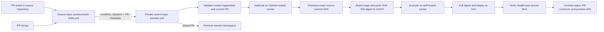

# PreviewMesh

[中文说明](README_CN.md)

PreviewMesh creates a temporary preview environment for each eligible pull request. It builds the exact source commit, deploys the image to K3s, verifies the served commit SHA, and removes the preview when the pull request closes.

> [!WARNING]
> This repository is a public template. Keep the copied control repository private. Never place GitHub tokens, kubeconfigs, real repository registrations, or runtime evidence in this repository. If you copied this directory from a private checkout, create fresh public Git history instead of pushing the old private commits.

## How it works

PreviewMesh separates the public template, the private control plane, and the application source:

| Repository | Contents | Visibility |
| --- | --- | --- |
| PreviewMesh template | Generic code, chart, workflow, and setup documentation | Public |
| Control repository | Your copy, registered source repositories, workflow variables, and Actions secrets | Private |
| Source repository | Your application, Dockerfile, health endpoint, and notification workflow | Public or private |

The source repository notifies the private control repository. The control workflow uses a GitHub-hosted runner to build and publish an immutable GHCR image, then sends a separate job to the self-hosted runner on your K3s machine. That runner deploys the exact image digest and checks the application through Traefik.


```mermaid
flowchart LR
    A[PR event in source repository] --> B[Source repo: previewmesh-notify.yml]
    B -->|workflow_dispatch + PR metadata| C[Private control repo: preview.yml]
    C --> D[Validate trusted registration and current PR]
    D --> E[build job on GitHub-hosted runner]
    E --> F[Checkout exact source commit SHA]
    F --> G[Build image and push SHA-256 digest to GHCR]
    G --> H[local job on self-hosted runner]
    H --> I[Pull digest and deploy to K3s]
    I --> J[Verify /health and served SHA]
    J --> K[Commit status, PR comment, and preview URL]
    A2[PR closes] --> B
    C -->|closed PR| L[Remove owned namespace]
```

Important boundaries:

- The preview workflow is disabled until the private control repository sets `PREVIEWMESH_ENABLED=true`.
- Only registered repositories are accepted. The numeric repository ID and full owner/name must match GitHub.
- Fork pull requests are rejected. Open preview pull requests in the registered source repository itself.
- The source workflow relays metadata only; it does not check out or execute pull request code.
- The self-hosted runner needs a restricted kubeconfig and should run only for the private control repository on a dedicated development cluster.

### Runtime handoff

`previewmesh-notify.yml` is prepared by `onboard-source` from the source repository's GitHub default branch. Its preview mode only displays the complete diff; `--create-pr` creates a dedicated reviewable PR, which you merge after inspection. The file is copied from [`templates/source-notify.yml`](templates/source-notify.yml) and, once merged, runs on GitHub's hosted `ubuntu-latest` runner. The two `jobs.notify.env` values name the destination control repository. The source repository's `PREVIEWMESH_DISPATCH_TOKEN` Secret authorizes the workflow to dispatch `preview.yml` on the control repository's `main` branch. The dispatch carries only the source repository ID, full name, and PR number.

The actual [`preview.yml`](.github/workflows/preview.yml) lifecycle runs in the private control repository. Its `build` job uses a GitHub-hosted runner. It reads the current PR head commit SHA, checks out that exact revision, and runs `previewmesh build` with `--push`. The job grants `packages: write` and logs in to GHCR with the workflow's `GITHUB_TOKEN`; no separate image-publishing job or manually created package is required.

An image digest is a content-based identifier such as `sha256:abc...`, not the source commit SHA. The commit SHA identifies the source Git revision; the image digest identifies the exact container image content. PreviewMesh deploys a reference such as `ghcr.io/OWNER/previewmesh-c123-r456@sha256:...` instead of a mutable tag, so the K3s workload cannot silently switch to a different image.

The `local` job is selected by `runs-on: [self-hosted, Linux, X64, previewmesh]`. The installer registers and starts that runner on the K3s machine. You can view it under **Settings → Actions → Runners** in the private control repository. GitHub passes the build job's `image` output and verified commit SHA to the job. [`scripts/local-attempt.sh`](scripts/local-attempt.sh) passes the full digest reference to `previewmesh deploy`; Kubernetes then pulls that image from GHCR using the namespace's `ghcr-pull` Secret, populated from `GHCR_READ_TOKEN`, and Helm creates or updates the K3s resources.

After deployment, the local job verifies the application's `/health` response and its served commit SHA. `control status` uses the configured source-repository token to call GitHub's commit-status and pull-request-comment APIs. The pending or final `PreviewMesh` status links to the workflow run or preview URL, and the final PR comment includes the run details and an **Open preview** link. The preview URL is still local/private; use the [preview access guide](ops/install/access.md) for the configured DNS or hosts path.

## Install

Use **Ubuntu 22.04 or 24.04 x64**, including those distributions on **WSL2 with systemd**. Run as a normal Linux user with sudo access, on the machine that will run K3s and the GitHub runner. Use a dedicated development cluster and a stable private LAN IPv4 address. WSL users need Windows administrator access for the LAN entry.

Download and extract this repository's ZIP into your Linux home directory, or clone it if Git is installed. Open a terminal in that directory. The public template directory and private control directory must be different. Git and other missing tools can be installed by the installer, so downloading the ZIP does not require a Git installation.

### 1. Run the configuration wizard

```bash
bash scripts/setup.sh init
```

The wizard discovers GitHub remotes in the selected checkouts, private LAN IPv4 candidates and application ports declared by `Dockerfile` `EXPOSE` lines. It checks each port before presenting it. When discovery returns no value or more than one candidate, it asks you to enter or select a value instead of choosing silently. WSL cannot identify the Windows host's LAN address from the guest, so enter that address manually when prompted.

The wizard collects ordinary settings and token file paths separately. Never paste a token into the wizard; it only writes references such as these:

| Setting | What to enter |
| --- | --- |
| Control repository | The private GitHub repository that coordinates PreviewMesh; the installer can create it |
| Control directory | Its separate local checkout, outside the public template |
| Source sections | Each application's GitHub repository, local checkout and actual HTTP listening port |
| Token file paths | Separate files outside Git for source, dispatch and GHCR tokens; never paste token values into the configuration |
| LAN IP | The Ubuntu server's stable LAN IPv4, or the **Windows host's** LAN IPv4 when using WSL |
| Domain suffix | `auto` recommends `<LAN_IP>.sslip.io`; a lowercase private DNS suffix is the manual alternative |
| Language | `auto`, `en` or `zh-CN` |

Before saving, it prints a non-sensitive summary of the repositories, directories, LAN address, ports and token file paths. Review it and confirm the save. Enter `q` at any prompt to leave without writing a configuration. If a configuration already exists, the wizard asks whether to load it for review before replacing it.

The wizard defaults to `domain_suffix = auto`, which uses the selected LAN address with `sslip.io`. To use a private DNS zone or a hosts-file fallback, choose a lowercase manual suffix and follow the [preview access guide](ops/install/access.md). The wizard and installer never print token contents.

If you need the commented file without running the wizard, use the explicit template mode:

```bash
bash scripts/setup.sh init --template
```

This copies the [commented template](config/setup.example.ini) to `~/.config/previewmesh/setup.ini` and never overwrites an existing file. You can then edit it and pass the same path to `install`.

### 2. Run the installer

```bash
bash scripts/setup.sh install
```

The `install` command explains each step before preparing tools, the private control repository, Secrets, K3s, the runner, automatic credential renewal and the LAN entry. It finishes with an eight-stage summary, the selected preview access method, and a report for each configured source showing whether its notification workflow is already on the source default branch or still needs onboarding. It may prepare a local notification file for review, but it does not commit, push, create pull requests or merge changes in **source**, and does not create a test preview. Use the explicit `onboard-source` command for a reviewed source onboarding PR. Continue from the [preview access guide](ops/install/access.md) when the installation completes.

You still complete browser login and create GitHub tokens. The installer shows each token's creation link, exact target repository and required permissions. Missing token files can be populated by pasting into a hidden prompt; they are saved with owner-only permissions. Organization approval/SSO and token expiration remain under your GitHub account's control. These personal tokens are not renewed automatically; replace their files and rerun installation before expiration.

For WSL, approve the Windows administrator prompt to configure LAN forwarding. Windows must consider the connection Private or Domain; the installer does not disable firewall protection or change a Public connection into a trusted one.

If a step fails, the installer prints the stages completed in that run, the stages still requiring completion, and the exact command to continue. Fix the reported problem and repeat the **same command**. Each stage is recorded in `~/.local/share/previewmesh/install-state.json` with configuration, installer-input and dependency summaries plus verifiable artifact details. A stage is reused only after those checks pass: the control checkout stage and source notification stage can be reused when their files and published revision still match; credentials, cluster, runner, network and readiness stages are checked again against live systems. Missing, changed or damaged artifacts, configuration, scripts or dependency versions cause that stage to run again, and the output gives the reason. The last valid state is kept in `install-state.json.bak`; if the state file is unreadable, preserve it, inspect that backup and restore a trusted copy before rerunning. State summaries contain digests and metadata rather than token values. Existing custom workflows and configuration are protected from silent overwriting. Raw tool output is saved in a redacted, owner-only log at `~/.local/share/previewmesh/setup.log`; `--verbose` also shows it in the terminal.

### 3. Create a reviewed source onboarding PR

For a source that still needs onboarding, use the command printed by the installer. Run it once for the source repository you want to connect:

```bash
bash scripts/setup.sh onboard-source \
  --config /path/to/setup.ini \
  --source OWNER/REPO
```

`onboard-source` reads the source repository's GitHub default branch and prepares exactly one file, `.github/workflows/previewmesh-notify.yml`. Without `--create-pr`, it displays the complete diff and makes no local or remote changes. If the default branch already contains the matching file, it reports that no change is needed. The command only needs Python 3 and an authenticated `gh` CLI with access to the target repository. A classic PAT for that login needs the `repo` and `workflow` scopes. A fine-grained PAT needs access to the target repository plus **Contents: Read and write**, **Workflows: Read and write**, and **Pull requests: Read and write** permissions; see GitHub's [permissions required for fine-grained personal access tokens](https://docs.github.com/en/rest/authentication/permissions-required-for-fine-grained-personal-access-tokens). It does not require systemd, K3s or a local source checkout.

To let the command create a reviewable PR, add `--create-pr`:

```bash
bash scripts/setup.sh onboard-source \
  --config /path/to/setup.ini \
  --source OWNER/REPO \
  --create-pr
```

For a new PR, the command shows the complete diff first and proceeds only after you enter exactly `create`. It uses the dedicated `previewmesh/onboard-source` branch. If an open onboarding PR already exists, it returns that link and leaves the branch and PR contents unchanged; it does not inspect mergeability. Otherwise, if the dedicated branch already differs from the proposal, it stops and prints manual handling instructions. The PR contains only the notification workflow; local source changes are not read or committed, and the command never merges the PR. Review an existing PR and resolve any merge conflicts there yourself.

After the PR is merged, run `doctor` so it checks the notification workflow again on the source default branch:

```bash
bash scripts/setup.sh doctor --config /path/to/setup.ini
```

### 4. Continue your normal development workflow

Create an ordinary test PR from a branch in the same source repository (do not use a fork), targeting its default branch. Check the complete handoff in order: the source notification Actions run, the control `Preview` workflow run, the source commit SHA and preview URL in the resulting status or comment, and cleanup after closing the test PR. Use the [preview access guide](ops/install/access.md) to retrieve and verify the generated URL from the current configuration, including from a second machine on the same LAN. Installation, the onboarding diff and a passing `doctor` check do not prove that a real preview was deployed; the test PR supplies that evidence.

Your application needs a root Dockerfile that builds for linux/amd64, listens on `0.0.0.0` at the configured application port, runs as UID/GID 65532 without extra capabilities, and returns HTTP 200 from `GET /health`:

```json
{"status":"ok","commit_sha":"the value of PREVIEW_COMMIT_SHA"}
```

#### Run the application preflight

Build the CLI outside the source checkout, then run the preflight against a clean source checkout. The report file must also be outside that checkout: the check includes untracked and ignored files, so redirecting JSON into the source directory would make the checkout dirty during the check.

```bash
go build -o /tmp/previewmesh ./cmd/previewmesh
SOURCE_DIR=/path/to/source
PREFLIGHT_DIR=$(mktemp -d /tmp/previewmesh-preflight.XXXXXX)
EXPECTED_SHA=$(git -C "$SOURCE_DIR" rev-parse HEAD)

# Static checks only; Docker is not called by this command.
/tmp/previewmesh preflight \
  --source-dir "$SOURCE_DIR" \
  --port 8080 \
  --sha "$EXPECTED_SHA" \
  > "$PREFLIGHT_DIR/static.json"
```

Replace `SOURCE_DIR` and `8080` with the source checkout and registered application port from your configuration.

`--sha SHA` is optional; when omitted, the command checks the checkout's `HEAD`. A SHA must be the full lowercase Git commit ID. Static preflight checks the port range, Git root and revision, a clean checkout (including ignored files), the root Dockerfile and its final-stage `EXPOSE`/`USER` declarations, and source markers for `0.0.0.0`, `GET /health`, `PREVIEW_COMMIT_SHA`, and the `commit_sha` health field. These are source checks and heuristics. They cannot prove the listener, HTTP response, environment propagation, file permissions, or other runtime behavior.

The JSON report records `source_sha`, `configuration_fingerprint`, `checked_at` (UTC), the port and contract, plus `static`, `container`, `deployment`, and `findings` fields. A `blocker` includes a repair direction and exits nonzero. A `warning` includes a repair direction and leaves static status as `passed_with_warnings`; the static-limit warning is always present because source scanning cannot prove runtime behavior. Review warnings before building. The report contains controlled diagnostics rather than source snippets or tool logs. Keep it outside the source checkout and treat its SHA, fingerprint, and timestamp as the identity of that check.

To opt into a local runtime check, repeat the command with `--container-check`:

```bash
# Build and run a temporary local image/container; nothing is pushed or deployed.
/tmp/previewmesh preflight \
  --source-dir "$SOURCE_DIR" \
  --port 8080 \
  --sha "$EXPECTED_SHA" \
  --container-check \
  > "$PREFLIGHT_DIR/container.json"
```

This explicit mode builds and runs the application locally for `linux/amd64`, injects `PREVIEW_COMMIT_SHA`, publishes an ephemeral loopback-only port, and checks `/health`. The container runs as UID/GID `65532:65532` with all capabilities dropped and `no-new-privileges`; it is bounded to 512 MiB, one CPU and 128 processes. `--timeout` defaults to five minutes per external operation and `--http-timeout` to one minute for startup/health; both timeout values are recorded in `container_configuration` and included in the configuration fingerprint. If a static blocker is found first, Docker is not called and `container` is reported as `not_run_static_failed`. The temporary image and container are removed after the check. This validates local startup and health behavior only; it does not validate cluster networking, mounts, ingress, or a real deployment, and it never publishes an image or creates a preview.

`previewmesh build` repeats the static inspection against the exact clean checkout before its Docker build and push. Pass the same `--port PORT` used by preflight (the default is `8080`) so the report matches the registered application port. Static blockers stop the build before publishing; static warnings are included in the build result for review. The build does not run the optional local container check automatically.

The installer prepares infrastructure; it does not rewrite your application or prove its runtime behavior. The first real PR verifies image permissions, application compatibility and the exact served SHA. After closing or merging that PR, confirm the control workflow removes its preview.

The [preview access guide](ops/install/access.md) is the canonical path from installation completion to an opened URL. The recommended `domain_suffix = auto` uses `<LAN_IP>.sslip.io`, so each generated URL resolves without a per-preview hosts entry when the DNS check succeeds. A lowercase manual suffix supports managed wildcard DNS or an explicit hosts-file fallback; the guide explains the probe entry, per-PR entries, port `18080`, and `/health` verification. If the LAN address or suffix changes, rerun installation and redeploy open PRs because existing URLs do not migrate automatically.

### Check or resume

```bash
# Read configuration and inspect prerequisites without changing the system.
bash scripts/setup.sh check
# Inspect the installed services, credentials, DNS and GitHub setup.
bash scripts/setup.sh doctor
```

All commands accept `--config /path/to/setup.ini`. You do not need to restore shell exports in a new terminal. Re-run `install` after updating configuration or token files; the installer will explain which stages must be rechecked. One installation is managed per Linux account; Windows forwarding is associated with its WSL distribution.

The runner's short-lived Kubernetes credential is renewed by a root-owned maintenance service every five minutes **when renewal is due**, based on its actual expiry. The service also refreshes the Traefik proxy target. Root privileges are dropped before writing the restricted kubeconfig. Renewal failure retains the previous credential. WSL NAT forwarding refreshes while the Windows user is logged in and that distro is running; it does not start a stopped distro.

Use `doctor` to distinguish infrastructure readiness from a source notification still awaiting publication. A successful infrastructure check is not a successful preview deployment. Existing manual installations can retain their registered sources and secret names; update old control code before adopting this installer.

For manual operations and the detailed setup steps, see the [manual installation reference](ops/install/manual.md). Both paths use the [preview access guide](ops/install/access.md) for the domain, port and verification rules.

## Updating a private control repository

Run updates from your private control checkout. Commit or stash any local changes first; the updater requires a clean working tree and a configured Git author. The script reuses the `upstream` remote created during installation, or creates it if it is missing:

```bash
git switch main
git pull --ff-only origin main
git status --short
```

If `git status --short` lists files, stop and handle those changes before running the updater. With a clean working tree, run:

```bash
scripts/update-upstream.sh --remote upstream --ref main
```

When an update is available, the script creates a local commit on an update branch and leaves you on that branch. If it reports that no update is needed, stop here. Otherwise, review the changes, run the local checks below, then push the actual branch and open a PR:

```bash
UPDATE_BRANCH=$(git branch --show-current)
git diff --stat main...HEAD
git diff main...HEAD
```

Run the commands in [Local verification](#local-verification). Once they pass, push the update branch and create the PR:

```bash
git push -u origin "$UPDATE_BRANCH"
gh pr create --base main --head "$UPDATE_BRANCH"
```

The updater keeps your `config/repositories.json` from the private branch, so your source registrations stay in place. GitHub secrets are outside Git and are not changed. If the update has conflicts outside that registry file, the script stops for manual review; do not resolve workflow or deployment changes by blindly choosing one side.

New copies also include **Update PreviewMesh from upstream**, which checks weekly and can be started manually. It runs checks and creates an update PR on a GitHub-hosted runner, without using the deployment runner or your saved source tokens. In **Settings → Actions → General → Workflow permissions**, enable **Allow GitHub Actions to create and approve pull requests** if your organization permits it; otherwise use the local update process. See [GitHub Actions settings](https://docs.github.com/en/repositories/managing-your-repositorys-settings-and-features/enabling-features-for-your-repository/managing-github-actions-settings-for-a-repository). Set the optional repository variable `PREVIEWMESH_UPSTREAM_REPOSITORY` if the public template is maintained under another owner.

If the private repository was created with **Use this template**, its history is unrelated to the template. The first updater run creates a small history-bridge commit while preserving the current private tree; later updates use normal Git merges. This first run links the histories; it does not copy the current upstream file changes into your checkout. Review the bridge PR and reconcile any changes you need now; subsequent upstream commits can be merged normally. Review your other custom files on every update.

Updating control does not update the notification workflow already published in your source repositories or the WSL/K3s files installed on your machine. After merging updates, rerun `install` with your existing configuration to refresh any local managed copies. It stops and shows a diff if you have modified a managed file. Review and commit source workflow changes yourself, or use the explicit `onboard-source --create-pr` flow when you want a reviewed source PR.

## Local verification

After editing or updating the control project, run these checks from its root. They require Git, Bash, Go 1.25+, Python 3, Helm 3, and `actionlint` on `PATH`; install missing tools before starting. These are development checks, so you do not need to repeat them for every preview:

```bash
scripts/verify-local.sh
```

The script checks tools and versions first, then runs Go tests, `go vet`, workflow/secret/setup script checks, Helm lint, and actionlint. It stops at the first failure.

The Python checks simulate external tools and do not contact GitHub or Kubernetes. None of these commands deploys an application. Passing local checks does not prove that your tokens, package permissions, runner, network route, or application contract are correct.

## CLI notes

For direct CLI use, the trusted DNS suffix is selected by `--domain-suffix`, then `PREVIEWMESH_DOMAIN_SUFFIX`, then the legacy `preview.test` default. The installer recommends `domain_suffix = auto`, which resolves to `<LAN_IP>.sslip.io`; a lowercase manual suffix is also supported. The legacy direct-CLI default still requires matching DNS or hosts entries and is not the installer recommendation. An explicit `--hostname` must still match the repository/PR identity and selected suffix. See the [preview access guide](ops/install/access.md) for URL generation and hosts/DNS verification.

`control resolve` validates a registration without calling GitHub. `control inspect` rechecks the current PR, fork status, and author permission. `control status` writes the `PreviewMesh` commit status.

### Query a preview by pull request

Use the `previewmesh status` command when you have only the source repository and PR number:

```bash
previewmesh status --repo OWNER/REPO --pr 123
previewmesh status --repo OWNER/REPO --pr 123 --json
previewmesh status --repo OWNER/REPO --pr 123 --max-age 24h
```

The command is read-only. It uses an authenticated `gh` CLI session (`gh auth login`) to read the PR's current state and head SHA, the `PreviewMesh` commit status for that SHA, and the structured feedback attached to the PR. It does not need the PreviewMesh registry, Kubernetes access, GHCR credentials or deployment credentials. `--max-age` controls how long recorded health evidence remains usable; it defaults to 24 hours. The command reports a historical observation and does not probe the preview URL or perform a live health check.

The result combines build, deployment, readiness, health, cleanup, evidence and available timing information. A `ready` result requires complete structured evidence for the current head SHA: a successful build, deployment and readiness check, HTTP 200 with the expected `status: ok` and commit revision, matching requested and served revisions, and a preview URL that matches the current status. Missing or legacy unstructured feedback is reported as missing, and old evidence is reported as expired; neither case supplies a usable URL. A pending attempt is `running`, while an unsuccessful attempt identifies the failed stage when the evidence provides it and links to the PR or workflow evidence for the next check.

Closed or merged PRs never receive a live preview URL from this query. After closure, the result can remain `running`, `missing`, `failure` or `expired` while cleanup evidence is pending, unavailable or unsuccessful; only a post-closure status that confirms the preview is absent reports `removed`. A repository or PR that cannot be found or read produces an actionable GitHub access/error message. Use `--json` when automation needs the same state fields without parsing the human-readable output.

When it has enough PR information to report a result, the workflow attempts to post a comment to the source PR, including its commit SHA, deployment status, and workflow run link. A verified deployment also includes an **Open preview** link. Build/deployment failures, superseded revisions, and cleanup results do not advertise a live preview. Pending builds appear in the PR's `PreviewMesh` status check. Each result is a new comment; reruns can add another comment for the same commit.

`control status --comment --run-url <workflow-url>` enables result comments. The source token needs the **Pull requests: Read and write** and **Commit statuses: Read and write** permissions described in the configuration template. Both writes are attempted independently, and reporting failures are recorded without changing the deployment or cleanup outcome. Preview URLs still require the configured network access and DNS resolution; publishing a link does not expose the local environment publicly.

Comments include the build result, observed Deployment replica counts, Pod readiness and failure reasons, Service/Ingress presence, the last HTTP status from `/health`, commit verification, rollback, and cleanup results. Runtime observations describe the end of the attempt (after rollback when attempted); unavailable or unexecuted checks are explicitly marked. HTTP 200 alone is not a successful verification: the response must also contain `status: ok` and the expected commit SHA. Service/Ingress presence alone does not prove reachability. The CLI accepts `--build-state` and `--result-file` to supply this evidence.

Workflow evidence records each CLI stage's UTC start and end times, duration, and result in the stage CSV and result JSON. Combined evidence carries these timings into `summary.json`; `resource_observation` times runtime snapshots, and `resource_verify` times Namespace ownership or absence checks during cleanup.

### Resource measurements

Run the read-only resource collector from a trusted control environment and keep its output outside this checkout:

```bash
python3 scripts/collect-resources.py \
  --run-id baseline-001 \
  --output /tmp/previewmesh-resource-evidence \
  --samples 13 --interval 10 --max-metric-age 60
```

Repeat `--namespace` to select particular managed preview namespaces; omit it to include every managed preview. The output directory must be new. The collector does not change workloads and writes `samples.jsonl` and `summary.json`. `--timeout` bounds each Kubernetes request, while `--max-gap` sets the largest gap that can be integrated (by default, twice the sampling interval).

Node CPU is reported in cores and memory in bytes from recent metrics windows, so node totals include system workloads and collection overhead. Preview values require fresh metrics for every expected container and a stable namespace identity. Summary integrals use trapezoids between adjacent available samples only; larger gaps remain uncovered. Repeated recent metrics windows are retained observations, not independent samples.

`helm_release_payload_bytes` counts base64-decoded Kubernetes Secret `data.release` payload bytes held in memory; it is not etcd disk usage. `pvc_requested_bytes` and `pvc_capacity_bytes` describe requested and bound PVC capacity, not filesystem use. Host filesystem use, registry storage, and volume filesystem use are unavailable to this collector.

The deployment readiness stage waits for the Deployment and Pods, then waits for the preview Service to receive a ClusterIP and for Traefik to publish an address in Ingress status before `/health` verification can succeed. In the WSL setup above, Traefik publishes `127.0.0.1`; this is a readiness signal, while requests use the socket proxy on port `18080`. A failed Service or Ingress readiness check fails the attempt and prevents the preview from being marked ready.

`previewmesh build`, `deploy`, `verify`, and `cleanup` are lower-level operations used by the workflow. Use the workflow for the complete PR lifecycle because it rechecks current PR state before and after deployment and handles superseded revisions and cleanup.

For interrupted cleanup, build the CLI with `go build -o /tmp/previewmesh ./cmd/previewmesh`. Use the same kubeconfig and registered identity as the workflow, and serialize recovery with all deployments for that PR. Confirm the PR should remain closed before retrying; these lower-level commands do not check GitHub state.

```bash
# Inspect without changing resources; save the original Namespace UID before cleanup.
/tmp/previewmesh cleanup-inspect \
  --repository-id "$REPOSITORY_ID" --pr "$PR_NUMBER" \
  --source-repository "$SOURCE_REPOSITORY" \
  --result-file /tmp/cleanup-before.json

# Use the original UID from cleanup_inspection.namespace_uid or saved pre-cleanup evidence.
/tmp/previewmesh cleanup-retry \
  --repository-id "$REPOSITORY_ID" --pr "$PR_NUMBER" \
  --source-repository "$SOURCE_REPOSITORY" \
  --namespace-uid "$ORIGINAL_NAMESPACE_UID" \
  --cleanup-attempts 3 --timeout 30s \
  --result-file /tmp/cleanup-recovery.json
```

`cleanup-retry` performs 1–10 attempts (default 3), rechecks ownership each time, and sends a UID-bound deletion request. Keep the original UID when rerunning it after interruption; do not substitute a replacement Namespace's UID. It never removes finalizers or creates resources. Each external call has its own `--timeout`; this is not a total command deadline. Failed attempts are retained in `cleanup_recovery.attempts`, even when a later attempt succeeds. Success requires confirmed Namespace absence; API errors and exhausted retries return a nonzero exit status. A failed final inspection also returns nonzero.

`cleanup-inspect` discovers all listable namespaced resource types and inventories the target Namespace without label filtering, including Helm history, unlabeled objects, deletion timestamps, and finalizers. JSON contains resource metadata only. `cleanup_inspection.state` is `remaining`, `confirmed_absent`, or `incomplete`; successful inspection with `remaining` means the inventory completed, not that cleanup succeeded. Forbidden lists, discovery failures, and a Namespace changing during inspection produce an incomplete report and nonzero exit status. Restricted runner credentials may lack access to some discovered types; completed lists are preserved alongside errors. Inspection covers the target Namespace only. Cluster-scoped storage, other Namespaces, registry images, and external resources require independent inspection. Retain result JSON and optional `--evidence` CSV securely before temporary files are lost.


## Project layout

| Path | Purpose |
| --- | --- |
| `cmd/control` | Trusted repository and pull-request validation CLI |
| `cmd/previewmesh` | Image, Helm, verification, rollback, and cleanup CLI |
| `charts/preview` | Restricted Deployment, Service, and Ingress chart |
| `config` | Private source registration and its public example |
| `templates` | Workflow copied into each source repository |
| `scripts` | Secret setup, lifecycle orchestration, reports, and offline checks |
| `ops` | Generic K3s, Linux, and WSL helpers |

## Troubleshooting

Start with the failed job's log and the control run summary. A green source notification only confirms dispatch; a green `report` job only confirms that results were collected.

| What you see | What to check next |
| --- | --- |
| No source notification | Confirm the workflow is on the source default branch and Actions is enabled; if it is missing, use `onboard-source --create-pr`. Fork PRs are intentionally skipped. For a PR that was already open, push a new commit or use the [manual dispatch reference](ops/install/manual.md#8-run-a-preview). |
| Notification returns 403 or 404 | Check the control owner/name in the source workflow, `preview.yml` on control `main`, and the dispatch token's control repository selection, Actions write permission, approval, and expiry. |
| Control jobs are skipped | Set the control repository Actions variable `PREVIEWMESH_ENABLED` to exactly `true` and dispatch `main`. |
| `local` stays queued | Check that the private repository's runner is online and has all labels: `self-hosted`, `Linux`, `X64`, `previewmesh`. |
| Registration or PR authorization fails | Compare the repository ID, owner/name, port, and `source_secret` with the committed registry on control `main`. The PR must be within the registered repository and its author must have write access. |
| Source checkout fails | Check the selected source token's repository access, Contents read permission, approval, and expiry. |
| No status or PR comment appears | Check the token named by `source_secret`, its Commit statuses and Pull requests write permissions, and reporting errors in the run summary. |
| Kubernetes returns Unauthorized or cannot load a config | Check `KUBECONFIG` in the runner service environment, file ownership, and token expiry. Run `setup.sh doctor` and inspect `previewmesh-maintenance.service`; manual installations can renew using the [manual runner steps](ops/install/manual.md#5-configure-k3s-and-the-runner). |
| Image push or pull fails | For push, check the control workflow's package write access, including access to an existing package. For pull, check the classic `GHCR_READ_TOKEN`, its owner's package read access, and the `ghcr-pull` Secret in the preview namespace. |
| Readiness or HTTP verification fails | If Deployment, Pod, and Service are ready but Ingress readiness times out, check that Traefik has published an Ingress address. In the WSL setup, the HelmChartConfig must set `providers.kubernetesIngress.ingressEndpoint.ip` to `127.0.0.1`; apply it and wait for the Traefik rollout. Then follow the [preview access guide](ops/install/access.md) for the configured DNS/hosts probe, generated URL and `/health` check. |
| Runner verification passes but the browser cannot open the preview | Follow the [preview access guide](ops/install/access.md) from the browser machine, then run `setup.sh doctor`. If `lan_ip` or the suffix changed, reinstall and redeploy open PRs; old URLs do not migrate. |
| Preview remains after closing a PR | Find the `closed` notification and wait for its control run. If dispatch failed, fix it and manually dispatch the closed PR to retry cleanup. |
| Updater cannot create a PR | Check Actions PR creation permissions in the update section, or push the generated branch and open a PR yourself. |

For optional manual Docker builds in WSL, see [the WSL egress notes](ops/wsl/docker-egress.md) if container networking fails.
