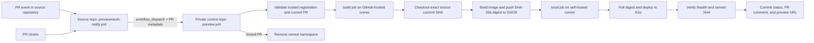

# PreviewMesh

[中文说明](README_CN.md)

PreviewMesh creates a temporary preview environment for each eligible pull request. It builds the exact source commit, deploys the image to K3s, verifies the served commit SHA, and removes the preview when the pull request closes.

> [!WARNING]
> This repository is a public template. Keep the copied control repository private. Never place GitHub tokens, kubeconfigs, real repository registrations, or runtime evidence in this repository. If you copied this directory from a private checkout, create fresh public Git history instead of pushing the old private commits.

## How it works

PreviewMesh separates the public template, the private control plane, and the application source:

| Repository | Contents | Visibility |
| --- | --- | --- |
| PreviewMesh template | Generic code, chart, workflow, and setup documentation | Public |
| Control repository | Your copy, registered source repositories, workflow variables, and Actions secrets | Private |
| Source repository | Your application, Dockerfile, health endpoint, and notification workflow | Public or private |

The source repository notifies the private control repository. The control workflow uses a GitHub-hosted runner to build and publish an immutable GHCR image, then sends a separate job to the self-hosted runner on your K3s machine. That runner deploys the exact image digest and checks the application through Traefik.


```mermaid
flowchart LR
    A[PR event in source repository] --> B[Source repo: previewmesh-notify.yml]
    B -->|workflow_dispatch + PR metadata| C[Private control repo: preview.yml]
    C --> D[Validate trusted registration and current PR]
    D --> E[build job on GitHub-hosted runner]
    E --> F[Checkout exact source commit SHA]
    F --> G[Build image and push SHA-256 digest to GHCR]
    G --> H[local job on self-hosted runner]
    H --> I[Pull digest and deploy to K3s]
    I --> J[Verify /health and served SHA]
    J --> K[Commit status, PR comment, and preview URL]
    A2[PR closes] --> B
    C -->|closed PR| L[Remove owned namespace]
```

Important boundaries:

- The preview workflow is disabled until the private control repository sets `PREVIEWMESH_ENABLED=true`.
- Only registered repositories are accepted. The numeric repository ID and full owner/name must match GitHub.
- Fork pull requests are rejected. Open preview pull requests in the registered source repository itself.
- The source workflow relays metadata only; it does not check out or execute pull request code.
- The self-hosted runner needs a restricted kubeconfig and should run only for the private control repository on a dedicated development cluster.

### Runtime handoff

`previewmesh-notify.yml` is generated locally by the installer for each registered source repository, then committed by you. It is copied from [`templates/source-notify.yml`](templates/source-notify.yml), committed to the source repository's default branch, and runs on GitHub's hosted `ubuntu-latest` runner. The two `jobs.notify.env` values name the destination control repository. The source repository's `PREVIEWMESH_DISPATCH_TOKEN` Secret authorizes the workflow to dispatch `preview.yml` on the control repository's `main` branch. The dispatch carries only the source repository ID, full name, and PR number.

The actual [`preview.yml`](.github/workflows/preview.yml) lifecycle runs in the private control repository. Its `build` job uses a GitHub-hosted runner. It reads the current PR head commit SHA, checks out that exact revision, and runs `previewmesh build` with `--push`. The job grants `packages: write` and logs in to GHCR with the workflow's `GITHUB_TOKEN`; no separate image-publishing job or manually created package is required.

An image digest is a content-based identifier such as `sha256:abc...`, not the source commit SHA. The commit SHA identifies the source Git revision; the image digest identifies the exact container image content. PreviewMesh deploys a reference such as `ghcr.io/OWNER/previewmesh-c123-r456@sha256:...` instead of a mutable tag, so the K3s workload cannot silently switch to a different image.

The `local` job is selected by `runs-on: [self-hosted, Linux, X64, previewmesh]`. The installer registers and starts that runner on the K3s machine. You can view it under **Settings → Actions → Runners** in the private control repository. GitHub passes the build job's `image` output and verified commit SHA to the job. [`scripts/local-attempt.sh`](scripts/local-attempt.sh) passes the full digest reference to `previewmesh deploy`; Kubernetes then pulls that image from GHCR using the namespace's `ghcr-pull` Secret, populated from `GHCR_READ_TOKEN`, and Helm creates or updates the K3s resources.

After deployment, the local job verifies the application's `/health` response and its served commit SHA. `control status` uses the configured source-repository token to call GitHub's commit-status and pull-request-comment APIs. The pending or final `PreviewMesh` status links to the workflow run or preview URL, and the final PR comment includes the run details and an **Open preview** link. The preview URL is still a local/private URL: the PR viewer must have network access and the corresponding hosts/DNS entry.

## Install

Use **Ubuntu 22.04 or 24.04 x64**, including those distributions on **WSL2 with systemd**. Run as a normal Linux user with sudo access, on the machine that will run K3s and the GitHub runner. Use a dedicated development cluster and a stable private LAN IPv4 address. WSL users need Windows administrator access for the LAN entry.

Download and extract this repository's ZIP into your Linux home directory, or clone it if Git is installed. Open a terminal in that directory. The public template directory and private control directory must be different. Git and other missing tools can be installed by the installer, so downloading the ZIP does not require a Git installation.

### 1. Copy the configuration template

```bash
bash scripts/setup.sh init
```

This copies the [commented template](config/setup.example.ini) to `~/.config/previewmesh/setup.ini` and prints its location. Existing configuration is never overwritten. Open that file in your editor and fill in:

| Setting | What to enter |
| --- | --- |
| Control repository | The private GitHub repository that coordinates PreviewMesh; the installer can create it |
| Control directory | Its separate local checkout, outside the public template |
| Source sections | Each application's GitHub repository, local checkout and actual HTTP listening port |
| Token file paths | Separate files outside Git for source, dispatch and GHCR tokens; never paste token values into the configuration |
| LAN IP | The Ubuntu server's stable LAN IPv4, or the **Windows host's** LAN IPv4 when using WSL |
| Language | `auto`, `en` or `zh-CN` |

Add another `[source:name]` section for each application. Each option in the template explains its purpose and examples. Repository IDs, secret names and internal service addresses are discovered automatically.

### 2. Run the installer

```bash
bash scripts/setup.sh install
```

The installer explains each step before preparing tools, the private control repository, Secrets, K3s, the runner, automatic credential renewal, the LAN entry and source notification files. It publishes installation configuration to **control**. It does **not** commit, push, create pull requests or merge changes in **source**, and does not create a test preview.

You still complete browser login and create GitHub tokens. The installer shows each token's creation link, exact target repository and required permissions. Missing token files can be populated by pasting into a hidden prompt; they are saved with owner-only permissions. Organization approval/SSO and token expiration remain under your GitHub account's control. These personal tokens are not renewed automatically; replace their files and rerun installation before expiration.

For WSL, approve the Windows administrator prompt to configure LAN forwarding. Windows must consider the connection Private or Domain; the installer does not disable firewall protection or change a Public connection into a trusted one.

If a step fails, fix the reported problem and repeat the **same command**. Completed resources are checked and reused. Existing custom workflows and configuration are protected from silent overwriting. Raw tool output is saved in a redacted, owner-only log at `~/.local/share/previewmesh/setup.log`; `--verbose` also shows it in the terminal.

### 3. Continue your normal development workflow

The installer prepares `.github/workflows/previewmesh-notify.yml` in each source checkout. Review, commit and publish that file to the source repository's default branch yourself. Then open your application PR as usual.

Your application needs a root Dockerfile that builds for linux/amd64, listens on `0.0.0.0` at the configured application port, runs as UID/GID 65532 without extra capabilities, and returns HTTP 200 from `GET /health`:

```json
{"status":"ok","commit_sha":"the value of PREVIEW_COMMIT_SHA"}
```

The installer prepares infrastructure; it does not rewrite your application or prove its runtime behavior. The first real PR verifies image permissions, application compatibility and the exact served SHA. After closing or merging that PR, confirm the control workflow removes its preview.

Preview links look like `http://pm-r123-pr4.192.168.1.20.sslip.io:18080`. [sslip.io](https://nip.io/) resolves the embedded private IP, so colleagues on the LAN do not need per-preview hosts entries. This relies on external DNS; if your network blocks private-IP DNS answers, installation stops with an explanation instead of silently changing the networking approach. A private IP does not make the preview publicly reachable. Ask a colleague to test from a second LAN machine too.

### Check or resume

```bash
# Read configuration and inspect prerequisites without changing the system.
bash scripts/setup.sh check
# Inspect the installed services, credentials, DNS and GitHub setup.
bash scripts/setup.sh doctor
```

All commands accept `--config /path/to/setup.ini`. You do not need to restore shell exports in a new terminal. Re-run `install` after updating configuration or token files. One installation is managed per Linux account; Windows forwarding is associated with its WSL distribution.

The runner's short-lived Kubernetes credential is renewed by a root-owned maintenance service every five minutes **when renewal is due**, based on its actual expiry. The service also refreshes the Traefik proxy target. Root privileges are dropped before writing the restricted kubeconfig. Renewal failure retains the previous credential. WSL NAT forwarding refreshes while the Windows user is logged in and that distro is running; it does not start a stopped distro.

Use `doctor` to distinguish infrastructure readiness from a source notification still awaiting publication. A successful infrastructure check is not a successful preview deployment. Existing manual installations can retain their registered sources and secret names; update old control code before adopting this installer.

For manual operations and the former detailed setup steps, see the [manual installation reference](ops/install/manual.md). The manual workflow retains the legacy `preview.test` default.

## Updating a private control repository

Run updates from your private control checkout. Commit or stash any local changes first; the updater requires a clean working tree and a configured Git author. The script reuses the `upstream` remote created during installation, or creates it if it is missing:

```bash
git switch main
git pull --ff-only origin main
git status --short
```

If `git status --short` lists files, stop and handle those changes before running the updater. With a clean working tree, run:

```bash
scripts/update-upstream.sh --remote upstream --ref main
```

When an update is available, the script creates a local commit on an update branch and leaves you on that branch. If it reports that no update is needed, stop here. Otherwise, review the changes, run the local checks below, then push the actual branch and open a PR:

```bash
UPDATE_BRANCH=$(git branch --show-current)
git diff --stat main...HEAD
git diff main...HEAD
```

Run the commands in [Local verification](#local-verification). Once they pass, push the update branch and create the PR:

```bash
git push -u origin "$UPDATE_BRANCH"
gh pr create --base main --head "$UPDATE_BRANCH"
```

The updater keeps your `config/repositories.json` from the private branch, so your source registrations stay in place. GitHub secrets are outside Git and are not changed. If the update has conflicts outside that registry file, the script stops for manual review; do not resolve workflow or deployment changes by blindly choosing one side.

New copies also include **Update PreviewMesh from upstream**, which checks weekly and can be started manually. It runs checks and creates an update PR on a GitHub-hosted runner, without using the deployment runner or your saved source tokens. In **Settings → Actions → General → Workflow permissions**, enable **Allow GitHub Actions to create and approve pull requests** if your organization permits it; otherwise use the local update process. See [GitHub Actions settings](https://docs.github.com/en/repositories/managing-your-repositorys-settings-and-features/enabling-features-for-your-repository/managing-github-actions-settings-for-a-repository). Set the optional repository variable `PREVIEWMESH_UPSTREAM_REPOSITORY` if the public template is maintained under another owner.

If the private repository was created with **Use this template**, its history is unrelated to the template. The first updater run creates a small history-bridge commit while preserving the current private tree; later updates use normal Git merges. This first run links the histories; it does not copy the current upstream file changes into your checkout. Review the bridge PR and reconcile any changes you need now; subsequent upstream commits can be merged normally. Review your other custom files on every update.

Updating control does not update the copied `.github/workflows/previewmesh-notify.yml` in your source repositories or the WSL/K3s files installed on your machine. After merging updates, rerun the installer with your existing configuration to update those copies. It stops and shows a diff if you have modified a managed file. Review and commit source workflow changes yourself.

## Local verification

After editing or updating the control project, run these checks from its root. They require Git, Bash, Go 1.25+, Python 3, Helm 3, and `actionlint` on `PATH`; install missing tools before starting. These are development checks, so you do not need to repeat them for every preview:

```bash
scripts/verify-local.sh
```

The script checks tools and versions first, then runs Go tests, `go vet`, workflow/secret/setup script checks, Helm lint, and actionlint. It stops at the first failure.

The Python checks simulate external tools and do not contact GitHub or Kubernetes. None of these commands deploys an application. Passing local checks does not prove that your tokens, package permissions, runner, network route, or application contract are correct.

## CLI notes

The trusted DNS suffix is selected by the `--domain-suffix` flag, then `PREVIEWMESH_DOMAIN_SUFFIX`, then the legacy default `preview.test`. The installer saves the variable in control. An explicit `--hostname` must still match the repository/PR identity and selected suffix.

`control resolve` validates a registration without calling GitHub. `control inspect` rechecks the current PR, fork status, and author permission. `control status` writes the `PreviewMesh` commit status.

When it has enough PR information to report a result, the workflow attempts to post a comment to the source PR, including its commit SHA, deployment status, and workflow run link. A verified deployment also includes an **Open preview** link. Build/deployment failures, superseded revisions, and cleanup results do not advertise a live preview. Pending builds appear in the PR's `PreviewMesh` status check. Each result is a new comment; reruns can add another comment for the same commit.

`control status --comment --run-url <workflow-url>` enables result comments. The source token needs the **Pull requests: Read and write** and **Commit statuses: Read and write** permissions described in the configuration template. Both writes are attempted independently, and reporting failures are recorded without changing the deployment or cleanup outcome. Preview URLs still require the configured network access and DNS resolution; publishing a link does not expose the local environment publicly.

Comments include the build result, observed Deployment replica counts, Pod readiness and failure reasons, Service/Ingress presence, the last HTTP status from `/health`, commit verification, rollback, and cleanup results. Runtime observations describe the end of the attempt (after rollback when attempted); unavailable or unexecuted checks are explicitly marked. HTTP 200 alone is not a successful verification: the response must also contain `status: ok` and the expected commit SHA. Service/Ingress presence alone does not prove reachability. The CLI accepts `--build-state` and `--result-file` to supply this evidence.

Workflow evidence records each CLI stage's UTC start and end times, duration, and result in the stage CSV and result JSON. Combined evidence carries these timings into `summary.json`; `resource_observation` times runtime snapshots, and `resource_verify` times Namespace ownership or absence checks during cleanup.

The deployment readiness stage waits for the Deployment and Pods, then waits for the preview Service to receive a ClusterIP and for Traefik to publish an address in Ingress status before `/health` verification can succeed. In the WSL setup above, Traefik publishes `127.0.0.1`; this is a readiness signal, while requests use the socket proxy on port `18080`. A failed Service or Ingress readiness check fails the attempt and prevents the preview from being marked ready.

`previewmesh build`, `deploy`, `verify`, and `cleanup` are lower-level operations used by the workflow. Use the workflow for the complete PR lifecycle because it rechecks current PR state before and after deployment and handles superseded revisions and cleanup.

For interrupted cleanup, build the CLI with `go build -o /tmp/previewmesh ./cmd/previewmesh`. Use the same kubeconfig and registered identity as the workflow, and serialize recovery with all deployments for that PR. Confirm the PR should remain closed before retrying; these lower-level commands do not check GitHub state.

```bash
# Inspect without changing resources; save the original Namespace UID before cleanup.
/tmp/previewmesh cleanup-inspect \
  --repository-id "$REPOSITORY_ID" --pr "$PR_NUMBER" \
  --source-repository "$SOURCE_REPOSITORY" \
  --result-file /tmp/cleanup-before.json

# Use the original UID from cleanup_inspection.namespace_uid or saved pre-cleanup evidence.
/tmp/previewmesh cleanup-retry \
  --repository-id "$REPOSITORY_ID" --pr "$PR_NUMBER" \
  --source-repository "$SOURCE_REPOSITORY" \
  --namespace-uid "$ORIGINAL_NAMESPACE_UID" \
  --cleanup-attempts 3 --timeout 30s \
  --result-file /tmp/cleanup-recovery.json
```

`cleanup-retry` performs 1–10 attempts (default 3), rechecks ownership each time, and sends a UID-bound deletion request. Keep the original UID when rerunning it after interruption; do not substitute a replacement Namespace's UID. It never removes finalizers or creates resources. Each external call has its own `--timeout`; this is not a total command deadline. Failed attempts are retained in `cleanup_recovery.attempts`, even when a later attempt succeeds. Success requires confirmed Namespace absence; API errors and exhausted retries return a nonzero exit status. A failed final inspection also returns nonzero.

`cleanup-inspect` discovers all listable namespaced resource types and inventories the target Namespace without label filtering, including Helm history, unlabeled objects, deletion timestamps, and finalizers. JSON contains resource metadata only. `cleanup_inspection.state` is `remaining`, `confirmed_absent`, or `incomplete`; successful inspection with `remaining` means the inventory completed, not that cleanup succeeded. Forbidden lists, discovery failures, and a Namespace changing during inspection produce an incomplete report and nonzero exit status. Restricted runner credentials may lack access to some discovered types; completed lists are preserved alongside errors. Inspection covers the target Namespace only. Cluster-scoped storage, other Namespaces, registry images, and external resources require independent inspection. Retain result JSON and optional `--evidence` CSV securely before temporary files are lost.


## Project layout

| Path | Purpose |
| --- | --- |
| `cmd/control` | Trusted repository and pull-request validation CLI |
| `cmd/previewmesh` | Image, Helm, verification, rollback, and cleanup CLI |
| `charts/preview` | Restricted Deployment, Service, and Ingress chart |
| `config` | Private source registration and its public example |
| `templates` | Workflow copied into each source repository |
| `scripts` | Secret setup, lifecycle orchestration, reports, and offline checks |
| `ops` | Generic K3s, Linux, and WSL helpers |

## Troubleshooting

Start with the failed job's log and the control run summary. A green source notification only confirms dispatch; a green `report` job only confirms that results were collected.

| What you see | What to check next |
| --- | --- |
| No source notification | Confirm the workflow is on the source default branch and Actions is enabled. Fork PRs are intentionally skipped. For a PR that was already open, push a new commit or use the [manual dispatch reference](ops/install/manual.md#8-run-a-preview). |
| Notification returns 403 or 404 | Check the control owner/name in the source workflow, `preview.yml` on control `main`, and the dispatch token's control repository selection, Actions write permission, approval, and expiry. |
| Control jobs are skipped | Set the control repository Actions variable `PREVIEWMESH_ENABLED` to exactly `true` and dispatch `main`. |
| `local` stays queued | Check that the private repository's runner is online and has all labels: `self-hosted`, `Linux`, `X64`, `previewmesh`. |
| Registration or PR authorization fails | Compare the repository ID, owner/name, port, and `source_secret` with the committed registry on control `main`. The PR must be within the registered repository and its author must have write access. |
| Source checkout fails | Check the selected source token's repository access, Contents read permission, approval, and expiry. |
| No status or PR comment appears | Check the token named by `source_secret`, its Commit statuses and Pull requests write permissions, and reporting errors in the run summary. |
| Kubernetes returns Unauthorized or cannot load a config | Check `KUBECONFIG` in the runner service environment, file ownership, and token expiry. Run `setup.sh doctor` and inspect `previewmesh-maintenance.service`; manual installations can renew using the [manual runner steps](ops/install/manual.md#5-configure-k3s-and-the-runner). |
| Image push or pull fails | For push, check the control workflow's package write access, including access to an existing package. For pull, check the classic `GHCR_READ_TOKEN`, its owner's package read access, and the `ghcr-pull` Secret in the preview namespace. |
| Readiness or HTTP verification fails | If Deployment, Pod, and Service are ready but Ingress readiness times out, check that Traefik has published an Ingress address. In the WSL setup, the HelmChartConfig must set `providers.kubernetesIngress.ingressEndpoint.ip` to `127.0.0.1`; apply it and wait for the Traefik rollout. Then check DNS/hosts on the runner, the Traefik route, and `/health`: it must return `status: ok` and the expected `PREVIEW_COMMIT_SHA`. |
| Runner verification passes but the browser cannot open the preview | Check the browser machine's hosts entry and route. For WSL, run `setup.sh doctor` and test the configured LAN IP from Windows. |
| Preview remains after closing a PR | Find the `closed` notification and wait for its control run. If dispatch failed, fix it and manually dispatch the closed PR to retry cleanup. |
| Updater cannot create a PR | Check Actions PR creation permissions in the update section, or push the generated branch and open a PR yourself. |

For optional manual Docker builds in WSL, see [the WSL egress notes](ops/wsl/docker-egress.md) if container networking fails.
