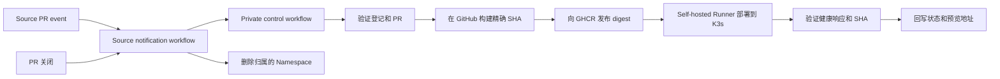

# PreviewMesh

[English](README.md)

PreviewMesh 为每个符合条件的 Pull Request 创建临时预览环境：构建精确的源代码提交，将镜像部署到 K3s，验证应用实际提供的 commit SHA，并在 Pull Request 关闭时删除预览。

> [!WARNING]
> 本仓库是公开模板。复制出来实际运行 PreviewMesh 的 control 仓库必须保持 private。不要把 GitHub Token、kubeconfig、真实仓库登记信息或运行证据放进本仓库。如果本目录来自 private checkout，请创建全新的公开 Git 历史，不要推送原 private 项目的旧提交。

## 工作原理

PreviewMesh 将公开模板、私有控制平面和应用源仓库分开：

| 仓库 | 内容 | 可见性 |
| --- | --- | --- |
| PreviewMesh 模板 | 通用代码、Chart、工作流和配置说明 | Public |
| Control 仓库 | 你的副本、源仓库登记、工作流变量和 Actions Secrets | Private |
| Source 仓库 | 应用、Dockerfile、健康接口和通知工作流 | Public 或 private |

GitHub 托管 Runner 构建并发布不可变的 GHCR 镜像。K3s 机器上的 self-hosted Runner 部署该 digest，并通过 Traefik 检查应用。



重要边界：

- 只有 private control 仓库设置 PREVIEWMESH_ENABLED=true 后，预览工作流才会运行。
- 只有登记过的仓库可以使用；数字仓库 ID 和完整 owner/name 必须与 GitHub 一致。
- Fork PR 会被拒绝。请在已登记的 source 仓库自身创建 PR。
- Source 工作流只转发元数据，不检出或执行 PR 代码。
- Self-hosted Runner 需要受限 kubeconfig，并且只应服务于 private control 仓库和专用开发集群。

## 前提条件

本地检查需要 Git、Go 1.25 或更高版本、Python 3、Bash 和 GitHub CLI。真实预览还需要 Linux 或 WSL2 机器上的 K3s、Traefik、Helm 3 和 kubectl。

### 检查本地工具

在 Bash 中运行以下命令，查看缺少的命令和已安装版本。Go 必须为 1.25 或更高版本，且 `gh auth status` 应显示已登录账号：

```bash
set -e
missing=0
for tool in git go python3 bash gh; do
  if command -v "$tool" >/dev/null 2>&1; then
    printf '已安装  %s：%s\n' "$tool" "$(command -v "$tool")"
  else
    printf '缺少    %s\n' "$tool"
    missing=1
  fi
done
if [ "$missing" -ne 0 ]; then
  printf '请安装缺少的工具后重新运行检查。\n' >&2
  exit 1
fi

git --version
go version
python3 --version
python3 - <<'PY'
import re, subprocess, sys
version = subprocess.check_output(["go", "version"], text=True).strip()
match = re.search(r"\bgo(\d+)\.(\d+)", version)
if not match or tuple(map(int, match.groups())) < (1, 25):
    print(f"需要 Go 1.25 或更高版本；当前为 {version}", file=sys.stderr)
    raise SystemExit(1)
print(f"Go 版本满足要求：{match.group(0)}")
PY
gh --version
gh auth status
```

### 检查真实预览环境

在 K3s 运维机器上运行以下命令，检查 Helm 3、kubectl、集群连接和 Traefik IngressClass。这里的只读检查使用运维人员的 kubeconfig；Runner 仍应使用首次配置步骤 5 中的受限 kubeconfig。Helm 版本输出应以 `v3` 开头。

```bash
set -e
missing=0
for tool in helm kubectl; do
  if command -v "$tool" >/dev/null 2>&1; then
    printf '已安装  %s：%s\n' "$tool" "$(command -v "$tool")"
  else
    printf '缺少    %s\n' "$tool"
    missing=1
  fi
done
if [ "$missing" -ne 0 ]; then
  printf '请安装缺少的工具后重新运行检查。\n' >&2
  exit 1
fi

sudo k3s --version
sudo systemctl is-active k3s
helm_version="$(helm version --short)"
printf '%s\n' "$helm_version"
case "$helm_version" in
  v3.*) ;;
  *) printf '需要 Helm 3。\n' >&2; exit 1 ;;
esac
kubectl version --client
kubectl config current-context
kubectl cluster-info
kubectl get nodes
kubectl get ingressclass traefik
kubectl -n kube-system rollout status deployment/traefik --timeout=30s
```

Self-hosted Runner 必须有 self-hosted、Linux、X64、previewmesh 四个标签，并能在 PATH 中找到 Go、Python、Helm 和 kubectl。Runner 服务的 PATH 可能不同于交互式 Shell，因此请在与 Runner 服务相同的账号和环境中检查：

```bash
missing=0
for tool in go python3 helm kubectl; do
  if command -v "$tool" >/dev/null 2>&1; then
    printf '已安装  %s：%s\n' "$tool" "$(command -v "$tool")"
  else
    printf '缺少    %s\n' "$tool"
    missing=1
  fi
done
test "$missing" -eq 0
```

设置 `CONTROL_REPOSITORY` 后，使用有权限查看 Runner 设置的账号，检查 Runner 是否在线并带有四个必需标签：

```bash
export CONTROL_REPOSITORY=YOUR_GITHUB_OWNER/previewmesh-control
gh api "repos/$CONTROL_REPOSITORY/actions/runners" \
  --jq '.runners[] | {name, status, labels: [.labels[].name]}'
```

正常镜像构建运行在 GitHub-hosted Runner；本地 Docker 只用于可选的手动构建。

## 首次配置

请按顺序完成。会改变 GitHub 或 K3s 的命令都属于运维操作，执行前请确认目标仓库和集群。

### 1. 创建 private control 仓库

推荐在公开 PreviewMesh 仓库页面点击 Use this template，并选择 Private。Public fork 不能直接改成 private fork。

如果要手动 clone 并推送，请替换 control 仓库占位符，然后在父目录运行。此示例通过 HTTPS 执行 Git 操作，并复用已有的 `gh` 登录：

```bash
PUBLIC_REPOSITORY=flashrick/PreviewMesh
CONTROL_REPOSITORY=YOUR_GITHUB_OWNER/previewmesh-control

gh auth status --hostname github.com
gh auth setup-git --hostname github.com
gh repo create "$CONTROL_REPOSITORY" --private
git clone "https://github.com/$PUBLIC_REPOSITORY.git" previewmesh-control
cd previewmesh-control
git remote rename origin upstream
git remote add origin "https://github.com/$CONTROL_REPOSITORY.git"
git push -u origin main
```

`gh` 使用的账号必须有权创建 private control 仓库。本次推送会包含 GitHub Actions workflow 文件，因此 `gh auth status` 必须显示 `workflow` scope。若缺少该 scope，运行 `gh auth refresh --scopes workflow` 添加。如果 `gh` 使用 classic PAT，GitHub CLI 要求 `repo`、`read:org` 和 `gist`。详见 [GitHub CLI 登录文档](https://cli.github.com/manual/gh_auth_login)。

`gh auth setup-git` 会配置 Git 在 HTTPS 操作（例如 `git push`）时使用现有的 `gh` 凭据，并更新 Git 的 credential helper 配置。如果 Git 已有可用的 GitHub 凭据管理器，可以省略这条命令。

SSH 也可以使用。将 `git_protocol` 设为 `ssh`，并使用 `git remote add origin "git@github.com:$CONTROL_REPOSITORY.git"`；同时确认该账号已登记 SSH authentication key。SSH Git 操作使用这把密钥，不需要 API Token 的 `workflow` scope。详见 [`gh auth setup-git`](https://cli.github.com/manual/gh_auth_setup-git) 和 [`gh auth refresh`](https://cli.github.com/manual/gh_auth_refresh) 文档。

Control 仓库默认分支必须是 main，并且已启用 Actions。不要把 self-hosted Runner 注册到公开模板仓库。

### 2. 启用 private 工作流

公开副本默认不会运行部署。在 private control 仓库创建 Actions repository variable：

```bash
gh variable set PREVIEWMESH_ENABLED --repo "$CONTROL_REPOSITORY" --body true
```

值必须严格为 true。不要在公开模板仓库创建这个变量。

### 3. 登记 source 仓库

编辑登记文件前，先选定 source 仓库并从 GitHub 查询数字 ID；不要从仓库 URL 推测 ID：

```bash
SOURCE_REPOSITORY=YOUR_GITHUB_OWNER/your-application
REPOSITORY_ID=$(gh api "repos/$SOURCE_REPOSITORY" --jq '.id')
printf '%s\n' "$REPOSITORY_ID"
```

当前跟踪的 config/repositories.json 有意为空。复制通用示例，并在 private control checkout 中编辑，填入上面查到的 ID 和仓库名称。以下示例使用 `nano`；如果机器上没有安装它，可以换成已安装的编辑器：

```bash
cp config/repositories.example.json config/repositories.json
nano config/repositories.json
```

每一项包括不可变的仓库 ID、精确的 GitHub owner/name、应用 HTTP 端口，以及一个 source-access Secret 的名称。`port` 应与应用实际监听的端口一致。PreviewMesh 将它用于容器和 ClusterIP Service，不会占用 K3s 节点端口。每个预览运行在独立的 namespace 中，因此多个预览可以共用 8080，不会争用节点端口：

```json
[
  {
    "repository_id": "123456789",
    "source_repository": "YOUR_GITHUB_OWNER/your-application",
    "port": 8080,
    "source_secret": "SOURCE_APP"
  }
]
```

为每个 source 仓库填写唯一的 `source_secret` 名称，例如 `SOURCE_APP_ONE`。首次配置步骤 6 中的辅助脚本会提示输入该仓库的 Token，并在 private control 仓库中以此名称保存为 Actions Secret。登记文件只填写 Secret 名称，绝不能写入 Token 值。

编译并验证登记：

```bash
mkdir -p bin
go build -o bin/control ./cmd/control
go build -o bin/previewmesh ./cmd/previewmesh
./bin/control resolve \
  --repository-id "$REPOSITORY_ID" \
  --source-repository "$SOURCE_REPOSITORY" \
  --pr 1
git add config/repositories.json
git commit -m "Configure preview source repository"
git push origin main
```

示例中的 --pr 1 只检查编号格式，不要求 PR #1 已存在。

如果 `resolve` 报错 `repository not registered with this exact identity`，请检查 `config/repositories.json` 中是否恰好有一项同时匹配相同的 GitHub 数字仓库 ID 和完整 `OWNER/REPO` 名称。公开仓库中的登记文件有意留空；运行此命令前，必须先在 private control checkout 中填写登记信息。

### 4. 准备 source 应用

Source 仓库根目录必须有能构建 linux/amd64 镜像的 Dockerfile。应用必须：

- 在登记的端口监听 0.0.0.0；
- 能以 UID/GID 65532 运行，且不需要额外 capabilities；
- 对 GET /health 返回 HTTP 200，格式如下：

```json
{"status":"ok","commit_sha":"0123456789abcdef0123456789abcdef01234567"}
```

返回的 `commit_sha` 必须来自 `PREVIEW_COMMIT_SHA` 环境变量。PreviewMesh 部署时会注入请求的 source SHA，不要硬编码示例值。PreviewMesh 不会修改 source 应用；如果应用原本不返回这种健康检查响应，就必须先适配应用，才能通过版本验证。

版本验证必须精确匹配：如果 checkout 的 `HEAD` 与 Pull Request SHA 不同，构建会失败；部署结果会记录 `requested_sha` 和 `served_sha`。只有 `/health` 返回请求的 SHA，且工作流确认两者一致时，预览才会被报告为 ready。

### 5. 配置 K3s 和 Runner

在 K3s 服务器上，以将来运行 GitHub Runner 的 Linux 用户执行本步骤。该用户需要通过 `sudo` 管理 K3s，并且已安装 Python 3 和 `kubectl`。本例将 Runner 与 K3s 放在同一台机器上，private control checkout 使用 `~/workspace/previewmesh-control`；如果你的目录不同，请修改 `cd` 路径。

先设置本地配置文件路径，将凭据排除在 Git 之外，然后应用受限的 Runner 权限：

```bash
cd "$HOME/workspace/previewmesh-control"
export PREVIEWMESH_RUNNER_CONFIG="$PWD/config/previewmesh-runner.yaml"
mkdir -p "$(dirname "$PREVIEWMESH_RUNNER_CONFIG")"
# Keep credentials and temporary files out of Git, including older checkouts.
grep -qxF '/config/previewmesh-runner.yaml' .gitignore || printf '\n/config/previewmesh-runner.yaml\n' >> .gitignore
grep -qxF '/config/.runner-*' .gitignore || printf '\n/config/.runner-*\n' >> .gitignore
sudo k3s kubectl --kubeconfig=/etc/rancher/k3s/k3s.yaml get nodes
sudo k3s kubectl --kubeconfig=/etc/rancher/k3s/k3s.yaml apply -f ops/kubernetes/runner-rbac.yaml
```

接下来创建文件。完整复制下面的代码块：它会读取集群地址和 CA，申请 Runner ServiceAccount Token，并生成仅使用该 Token 认证的 kubeconfig，不会打印 Token。请以普通用户运行 Python，以确保生成文件归 Runner 用户所有：

```bash
python3 - <<'PYTHON'
import json
import os
from pathlib import Path
import subprocess
import tempfile

# Read only cluster connection data; never copy administrator credentials.
admin = ["sudo", "k3s", "kubectl", "--kubeconfig=/etc/rancher/k3s/k3s.yaml"]
def capture(*args):
    return subprocess.check_output([*admin, *args], text=True).strip()

cluster = json.loads(capture("config", "view", "--raw", "--minify", "-o", "json"))["clusters"][0]["cluster"]
token = capture("-n", "previewmesh-system", "create", "token", "previewmesh-runner", "--duration=24h")
config = {
    "apiVersion": "v1",
    "kind": "Config",
    "clusters": [{"name": "k3s", "cluster": {
        "server": cluster["server"],
        "certificate-authority-data": cluster["certificate-authority-data"],
    }}],
    "users": [{"name": "previewmesh-runner", "user": {"token": token}}],
    "contexts": [{"name": "previewmesh-runner", "context": {
        "cluster": "k3s", "user": "previewmesh-runner",
    }}],
    "current-context": "previewmesh-runner",
}
# JSON is valid YAML. Write with mode 600 and replace only after success.
path = Path(os.environ["PREVIEWMESH_RUNNER_CONFIG"])
fd, temporary = tempfile.mkstemp(prefix=".runner-", dir=path.parent)
try:
    with os.fdopen(fd, "w") as output:
        json.dump(config, output, indent=2)
        output.write("\n")
    os.replace(temporary, path)
finally:
    if os.path.exists(temporary):
        os.unlink(temporary)
print(f"Created runner kubeconfig: {path}")
PYTHON
```

只有看到 `Created runner kubeconfig` 提示后，才继续选择生成的文件并检查权限：

```bash
chmod 600 "$PREVIEWMESH_RUNNER_CONFIG"
export KUBECONFIG="$PREVIEWMESH_RUNNER_CONFIG"
kubectl auth can-i create namespaces
kubectl auth can-i delete namespaces
kubectl auth can-i create secrets --all-namespaces
kubectl auth can-i create clusterroles
```

前 3 项应返回 `yes`；创建 ClusterRole 应返回 `no`（同时返回非零退出码，这是预期结果）。不要把 K3s 管理员 kubeconfig 交给 Runner。如果 Runner 位于另一台机器，kubeconfig 中的 `server` 必须使用 Runner 可访问且包含在 API Server 证书中的地址，不能使用回环地址。参见 [K3s 集群访问说明](https://docs.k3s.io/cluster-access)。

请求的 Token 有效期为 24 小时，但 API Server 实际签发的时长可能不同。到期前重新执行 Python 代码块，用新 Token 替换配置文件；本流程不会自动续期。参见 [`kubectl create token` 文档](https://kubernetes.io/docs/reference/kubectl/generated/kubectl_create/kubectl_create_token/)。

在独立目录安装 Linux x64 GitHub self-hosted Runner，仅注册到 private control 仓库，并添加 `previewmesh` 标签。确认 Runner 用户可以使用 Go、Python、Helm 和 `kubectl`。上面的 `export` 只影响当前终端及其子进程：前台运行时，从这个终端启动 `./run.sh`；作为服务运行时，在 Runner 服务环境中将 `KUBECONFIG` 设为提示中输出的文件绝对路径，然后重启服务。服务用户必须能够读取该文件并访问它的各级父目录。

新开终端后，使用 Runner 命令前重新设置变量：

```bash
export PREVIEWMESH_RUNNER_CONFIG="$HOME/workspace/previewmesh-control/config/previewmesh-runner.yaml"
export KUBECONFIG="$PREVIEWMESH_RUNNER_CONFIG"
```

如果前面修改了路径，这里也使用你选定的路径。详见 [Kubernetes Runner 说明](ops/kubernetes/README.md)。

### 6. 配置 GitHub Secrets

配置脚本负责上传 Token，不会自动生成。如果只登记了一个 source 仓库，请先按下面的步骤创建三个 Token，再运行脚本。每增加一个 source 仓库，需要多创建一个对应的 source Token。记下到期时间，到期前更新对应的 Secret。

| Secret 名称 | Token 可以访问的资源 | 所需权限 | Secret 保存位置 |
| --- | --- | --- | --- |
| 登记文件中的 `source_secret`，例如 `SOURCE_APP` | 该条登记对应的 source 仓库 | Contents: Read-only；Metadata: Read-only；Pull requests: Read and write；Commit statuses: Read and write | Control 仓库 |
| `PREVIEWMESH_DISPATCH_TOKEN` | Control 仓库 | Actions: Read and write；Metadata: Read-only | 每个已登记的 source 仓库 |
| `GHCR_READ_TOKEN` | 存放预览镜像的 Package | 使用 **classic** PAT，勾选 `read:packages`；Token 所属用户需要有这些 Package 的读取权限 | Control 仓库 |

`SOURCE_APP` 只是 Secret 名称，不需要因此创建 GitHub App。每个 source 仓库分别创建一个 source Token。Dispatch Token 用来调用 `workflow_dispatch`，需要 [Actions 写权限](https://docs.github.com/en/rest/actions/workflows#create-a-workflow-dispatch-event)。GHCR 的这种登录方式需要 [classic PAT](https://docs.github.com/en/packages/working-with-a-github-packages-registry/working-with-the-container-registry)，不能用 fine-grained Token 替代。如果组织要求审批 Token 或完成 SSO 授权，先完成这些操作。

#### 创建 source Token

打开 [fine-grained Token 创建页面](https://github.com/settings/personal-access-tokens/new)，也可以从个人账号的 **Settings → Developer settings → Personal access tokens → Fine-grained tokens → Generate new token** 进入。

1. **Token name** 填写方便识别的名称，例如 `previewmesh-source`。这个名称只是给你自己看的，不必与 Actions Secret 名称一致。
2. 在 **Expiration** 中选择有效期。
3. **Resource owner** 选择 source 仓库的所有者。
4. **Repository access** 选择 **Only select repositories**，然后选中你的应用仓库。
5. 在 **Repository permissions** 中设置 **Contents: Read-only**、**Pull requests: Read and write** 和 **Commit statuses: Read and write**。保留 **Metadata: Read-only**，GitHub 通常会自动添加它。
6. 点击 **Generate token**，将生成的值复制到密码管理器中，稍后粘贴给脚本。不要把它写进 `config/repositories.json`。

如果登记文件中填写的是 `source_secret: SOURCE_APP`，就在脚本提示 `Paste SOURCE_APP for OWNER/APPLICATION` 时粘贴这个值。如果使用了其他 Secret 名称，提示也会使用对应名称。每个已登记的 source 仓库分别创建一个 Token。参见 [GitHub Token 创建指南](https://docs.github.com/en/authentication/keeping-your-account-and-data-secure/managing-your-personal-access-tokens)。

#### 创建 dispatch Token

再次打开 [fine-grained Token 创建页面](https://github.com/settings/personal-access-tokens/new)。

1. **Token name** 填写 `previewmesh-dispatch`，并选择 **Expiration** 有效期。
2. **Resource owner** 选择 control 仓库的所有者。
3. 在 **Repository access → Only select repositories** 中，选中 `previewmesh-control`；如果你的 control 仓库用了其他名称，就选那个仓库。
4. 在 **Repository permissions** 中设置 **Actions: Read and write**，并保留 **Metadata: Read-only**。
5. 点击 **Generate token**，将生成的值保存到密码管理器中。

在脚本提示 `Paste PREVIEWMESH_DISPATCH_TOKEN (control Actions write only)` 时粘贴这个值。脚本会把同一个 dispatch Token 保存到每个已登记的 source 仓库，让它们能够触发 control 工作流。

#### 创建 GHCR 读取 Token

打开 [classic Token 创建页面](https://github.com/settings/tokens/new)，也可以从 **Settings → Developer settings → Personal access tokens → Tokens (classic) → Generate new token (classic)** 进入。

1. **Note** 填写 `previewmesh-ghcr-read`，并选择 **Expiration** 有效期。
2. 在权限范围中勾选 **`read:packages`**。这个 Token 只用于拉取镜像，不需要勾选 `write:packages` 或 `delete:packages`。
3. 点击 **Generate token**，将生成的值保存到密码管理器中。

在脚本提示 `Paste GHCR_READ_TOKEN (classic PAT, read:packages only)` 时粘贴这个值。创建 Token 的用户必须有预览镜像 Package 的读取权限；勾选权限范围不会自动授予其他用户私有 Package 的访问权。如果组织要求 SSO 授权，也需要完成。参见 [GHCR 认证说明](https://docs.github.com/en/packages/working-with-a-github-packages-registry/working-with-the-container-registry)。

#### 上传并检查 Secrets

回到 control 项目目录，将下面的仓库名称换成你自己的。`SOURCE_REPOSITORY` 应与第 3 步的登记一致。当前 `gh` 登录账号需要有两个仓库的 Actions Secret 管理权限：它负责上传 Secret，你稍后粘贴的 Token 则供工作流运行时使用。

```bash
cd "$HOME/workspace/previewmesh-control"
export CONTROL_REPOSITORY=YOUR_GITHUB_OWNER/previewmesh-control
export SOURCE_REPOSITORY=YOUR_GITHUB_OWNER/your-application
gh auth status
bash scripts/configure-github-secrets.sh "$CONTROL_REPOSITORY" config/repositories.json
```

脚本会依次询问每个 source Token、dispatch Token 和 GHCR Token。粘贴时终端不会显示内容，粘贴后按 Enter 即可。脚本将它们保存为仓库级 Actions Secret；如果上传失败，会停止执行，已经保存的值会保留。重新运行脚本会覆盖这些值。

查看保存的名称，不会显示 Token 内容：

```bash
gh secret list --repo "$CONTROL_REPOSITORY" --app actions
gh secret list --repo "$SOURCE_REPOSITORY" --app actions
```

Control 仓库应包含所有登记的 `source_secret` 和 `GHCR_READ_TOKEN`；每个 source 仓库应包含 `PREVIEWMESH_DISPATCH_TOKEN`。如果登记了多个 source，分别执行第二条命令检查。这一步只能确认保存成功，实际访问权限还需要通过首次预览验证。也可以在 **Repository Settings → Secrets and variables → Actions → Repository secrets** 中管理它们。

### 7. 配置 Ingress 和 source 通知

预览域名由 source 仓库 ID 和 PR 编号组成，例如 `pm-r123456789-pr12.preview.test`。Runner 和浏览器都需要通过这个域名访问 Traefik。`.test` 域名不会自动解析；第 8 步拿到 PR 编号后，再添加对应的 hosts 记录。

#### 配置 HTTP 入口

PreviewMesh 的预览链接和健康检查统一使用主机端口 `18080`。代理连接 Traefik 时仍使用集群内部的 `80` 端口；`config/repositories.json` 中的应用端口是另一项配置。Hosts 记录只填写域名，不要加端口。

安装代理前，在 WSL 中执行 `ss -ltn 'sport = :18080'`，在 Windows PowerShell 中执行 `Get-NetTCPConnection -LocalPort 18080 -State Listen -ErrorAction SilentlyContinue`。两边都不应显示监听记录。如果端口已被占用，先处理冲突再继续。

如果使用普通 Linux 服务器，且 Traefik 已经可以通过服务器的 18080 端口访问，后续使用该服务器可访问的 IP 配置 DNS 或 hosts 即可，可以直接继续下面的通知配置。

如果 K3s 运行在 WSL 中，浏览器在 Windows 上，可以使用项目提供的 socket 代理，将 WSL 回环地址的 18080 端口转发到 Traefik。这要求 WSL 已启用 systemd，存在 `/usr/lib/systemd/systemd-socket-proxyd`，本地 18080 端口空闲，并且 [Windows 可以通过 localhost 访问 WSL](https://learn.microsoft.com/en-us/windows/wsl/networking)。如果下面的可执行文件检查失败，请先安装发行版中提供 `systemd-socket-proxyd` 的软件包。

在 WSL 的 control 项目目录中执行。这里显式使用管理员 kubeconfig，因为受限的 Runner 无权修改 Traefik：

```bash
cd "$HOME/workspace/previewmesh-control"
test -x /usr/lib/systemd/systemd-socket-proxyd
sudo k3s kubectl --kubeconfig=/etc/rancher/k3s/k3s.yaml apply -f ops/kubernetes/traefik-helmchartconfig.yaml
sudo k3s kubectl --kubeconfig=/etc/rancher/k3s/k3s.yaml -n kube-system get service traefik -w
```

等到 `TYPE` 显示为 `ClusterIP`，且 `CLUSTER-IP` 出现地址后，按 Ctrl+C 结束观察。再次读取地址，并创建本地代理配置文件：

```bash
sudo install -d -m 0755 /etc/previewmesh
sudo k3s kubectl --kubeconfig=/etc/rancher/k3s/k3s.yaml -n kube-system get service traefik \
  -o jsonpath='{.spec.clusterIP}{"\n"}'
sudoedit /etc/previewmesh/ingress.env
```

在编辑器中写入下面这一行，将 `TRAEFIK_CLUSTER_IP` 替换为刚才输出的地址，保存后退出：

```text
PREVIEWMESH_TRAEFIK_ENDPOINT=TRAEFIK_CLUSTER_IP:80
```

安装并启动 socket，然后检查转发是否正常：

```bash
sudo install -m 0644 ops/wsl/previewmesh-ingress.socket ops/wsl/previewmesh-ingress.service /etc/systemd/system/
sudo systemctl daemon-reload
sudo systemctl enable --now previewmesh-ingress.socket
curl --noproxy '*' --silent --show-error --max-time 5 -o /dev/null -w '%{http_code}\n' \
  -H 'Host: previewmesh-ingress-check.invalid' http://127.0.0.1:18080
```

如果之前已经安装了监听 80 端口的版本，先用上面的命令重新安装两个 unit 文件，再依次执行 `sudo systemctl stop previewmesh-ingress.service previewmesh-ingress.socket`、`sudo systemctl daemon-reload` 和 `sudo systemctl start previewmesh-ingress.socket`，然后重新检查。

预期输出是 `404`：请求已经到达 Traefik，但这个检查域名没有对应的预览。在 Windows PowerShell 中执行 `curl.exe --noproxy "*" -I http://127.0.0.1:18080`，确认 Windows 也能访问 Traefik。如果 Linux 检查失败，查看 `sudo journalctl -u previewmesh-ingress.service -n 30 --no-pager`；如果只有 Windows 失败，先检查 WSL 网络设置。`/etc/previewmesh/ingress.env` 只保存在本机。如果 Traefik 的 ClusterIP 改变，修改该文件，再执行 `sudo systemctl restart previewmesh-ingress.service`。

#### 添加 source 通知工作流

填写两个已有项目的本地路径。下面复制的目标是存放应用代码的 **source 仓库**：

```bash
export CONTROL_DIR="$HOME/workspace/previewmesh-control"
export SOURCE_DIR="$HOME/workspace/your-application"
cd "$SOURCE_DIR"
git remote -v
mkdir -p .github/workflows
cp -i "$CONTROL_DIR/templates/source-notify.yml" .github/workflows/previewmesh-notify.yml
```

确认 `git remote -v` 显示的是目标 source 仓库。如果已有同名工作流，先检查内容，再决定是否覆盖。用编辑器打开 `.github/workflows/previewmesh-notify.yml`，修改 `jobs.notify.env` 下的两个值：

```yaml
PREVIEWMESH_CONTROL_OWNER: YOUR_GITHUB_OWNER
PREVIEWMESH_CONTROL_REPOSITORY: previewmesh-control
```

Owner 是 `CONTROL_REPOSITORY` 中 `/` 前面的部分，repository 是后面的部分。按照你的正常代码审核流程，将文件提交并合并或推送到 source 仓库的默认分支。在该仓库启用 Actions，并确认第 6 步已经保存 `PREVIEWMESH_DISPATCH_TOKEN`，然后再创建测试 PR。每个已登记的 source 仓库都需要配置一次。

PR 打开、重新打开、收到新提交（`synchronize`）或关闭时，通知工作流都会发送请求。它会跳过 Fork PR，只传递元数据；不要在这个 `pull_request_target` Job 中加入检出或执行 PR 代码的步骤。Control 工作流会在部署前后检查当前 PR head，如果已经有更新的提交，就不会将旧版本报告为 ready。

### 8. 运行预览

在 source 仓库中创建一个 PR，base 和 head 使用同一仓库内的两个分支，PR 作者需要有写权限。如果已经安装通知工作流，创建 PR 就会自动发起一次预览。

回到 control 项目目录，填写仓库名称，并把 `123` 换成实际 PR 编号。即使工作流自动启动，后面的检查也需要这些变量：

```bash
cd "$HOME/workspace/previewmesh-control"
export CONTROL_REPOSITORY=YOUR_GITHUB_OWNER/previewmesh-control
export SOURCE_REPOSITORY=YOUR_GITHUB_OWNER/your-application
export PR_NUMBER=123
REPOSITORY_ID=$(gh api "repos/$SOURCE_REPOSITORY" --jq '.id')
export REPOSITORY_ID
export PREVIEW_NAMESPACE="pm-r${REPOSITORY_ID}-pr${PR_NUMBER}"
export PREVIEW_HOST="${PREVIEW_NAMESPACE}.preview.test"
go run ./cmd/control resolve \
  --repository-id "$REPOSITORY_ID" \
  --source-repository "$SOURCE_REPOSITORY" \
  --pr "$PR_NUMBER"
gh api "repos/$SOURCE_REPOSITORY/pulls/$PR_NUMBER" \
  --jq '{state: .state, base: .base.repo.full_name, head: .head.repo.full_name, sha: .head.sha}'
printf 'Preview hostname: %s\n' "$PREVIEW_HOST"
```

确认 `resolve` 接受该登记，PR 状态为 `open`，且 `base` 和 `head` 都是你的 source 仓库。让 Runner 和浏览器所在的机器都能解析输出的域名。如果采用 WSL localhost 方案，按下面的格式填写 hosts，域名使用你刚才得到的实际值：

```text
127.0.0.1 pm-r123456789-pr12.preview.test
```

在 WSL 中用 `sudoedit /etc/hosts` 编辑；在 Windows 中以管理员身份打开编辑器，修改 `C:\Windows\System32\drivers\etc\hosts`。如果使用远程 Linux 服务器，将 `127.0.0.1` 换成可访问 Traefik 的服务器 IP。每个预览需要一条 hosts 记录，hosts 文件不支持通配域名。

先在 source 仓库的 Actions 页面查看 **Notify PreviewMesh**，再到 control 仓库查看 **PreviewMesh lifecycle**。通知成功只代表请求已经发出，要等 control 工作流完成后再检查应用。

如果安装通知工作流时 PR 已经存在，或者首次运行因网络尚未配置好而失败，可以手动启动一次。先等该 PR 已有的运行结束，再执行：

```bash
gh workflow run preview.yml --repo "$CONTROL_REPOSITORY" --ref main \
  -f repository_id="$REPOSITORY_ID" \
  -f source_repository="$SOURCE_REPOSITORY" \
  -f pr_number="$PR_NUMBER"
gh run list --repo "$CONTROL_REPOSITORY" --workflow preview.yml --limit 5
```

从列表中复制对应的运行 ID，替换下面的示例。如果新运行还没出现，再执行一次列表命令。打开运行页面后，核对输入参数中的 source 和 PR 编号，避免跟错运行：

```bash
export RUN_ID=123456789
gh run view "$RUN_ID" --repo "$CONTROL_REPOSITORY" --web
gh run watch "$RUN_ID" --repo "$CONTROL_REPOSITORY" --exit-status
```

Control 工作流成功后，将线上健康响应与 PR 当前 head 比较。执行检查的机器需要已经配置域名解析，并且能访问预览：

```bash
EXPECTED_SHA=$(gh api "repos/$SOURCE_REPOSITORY/pulls/$PR_NUMBER" --jq '.head.sha')
export EXPECTED_SHA
curl --noproxy '*' --fail --silent --show-error --max-time 10 "http://${PREVIEW_HOST}:18080/health" \
  | python3 -c '
import json, os, sys
result = json.load(sys.stdin)
if result.get("status") != "ok" or result.get("commit_sha") != os.environ["EXPECTED_SHA"]:
    raise SystemExit(f"Preview does not match the PR head: {result}")
print(json.dumps(result))
'
```

检查通过会输出 JSON，其中 `status` 为 `ok`，`commit_sha` 与预期一致。如果应用有页面，就可以在浏览器打开 `http://${PREVIEW_HOST}:18080`。如果等待期间又推送了新提交，先等新提交对应的运行完成，再核对版本。

测试结束后关闭或合并 PR，等待随后的 control 工作流完成，它应当删除对应的预览 Namespace。下面的清理演示给出了确认方法。


## 端到端演示

如果想完整展示创建、更新和清理，可以使用下面的演示流程。先完成首次配置步骤 1 至 7；如果第 8 步已经成功，可以复用那个 PR 和 hosts 记录。从 private control checkout 执行命令，并选择一个你可以关闭的 open demo PR。它的 base 和 head 必须都属于已登记的 source 仓库，PR 作者也必须有该仓库的写权限。以下命令会启动完整的 GitHub Actions 工作流；`build`、`local` 和 `report` 三个 Job 会自动运行。演示期间不要对同一个仓库 ID 和 PR 并行启动另一次部署。

### 准备演示

填写 control 仓库、已登记的 source 仓库和一个 open PR 编号。仓库 ID 从 GitHub 查询，然后与 private 登记文件核对：

```bash
cd "$HOME/workspace/previewmesh-control"
export CONTROL_REPOSITORY=YOUR_GITHUB_OWNER/previewmesh-control
export SOURCE_REPOSITORY=YOUR_GITHUB_OWNER/your-application
REPOSITORY_ID=$(gh api "repos/$SOURCE_REPOSITORY" --jq '.id')
export REPOSITORY_ID
export PR_NUMBER=123
export PREVIEW_NAMESPACE="pm-r${REPOSITORY_ID}-pr${PR_NUMBER}"
export PREVIEW_HOST="${PREVIEW_NAMESPACE}.preview.test"

gh auth status
go run ./cmd/control resolve \
  --repository-id "$REPOSITORY_ID" \
  --source-repository "$SOURCE_REPOSITORY" \
  --pr "$PR_NUMBER"
gh api "repos/$SOURCE_REPOSITORY/pulls/$PR_NUMBER" \
  --jq '{state: .state, base: .base.repo.full_name, head: .head.repo.full_name, sha: .head.sha}'
```

确认 PR 处于 open 状态，`base` 和 `head` 都等于 `SOURCE_REPOSITORY`，且 `resolve` 接受该登记。Runner 和演示用浏览器都必须能通过 DNS 或 hosts 访问预览域名。

### 启动并跟踪工作流

要展示 source 到 control 的通知链路，可以新建 demo PR，或向现有 PR 推送新 commit，然后跟踪 source 仓库中的 `Notify PreviewMesh` 运行及其派发的 control 工作流。若要重复演示且不修改 source，可从 private control 仓库手动派发已登记的 PR。手动派发会运行相同的生命周期，但会跳过 source 通知这一步：

```bash
gh workflow run preview.yml --repo "$CONTROL_REPOSITORY" --ref main \
  -f repository_id="$REPOSITORY_ID" \
  -f source_repository="$SOURCE_REPOSITORY" \
  -f pr_number="$PR_NUMBER"
gh run list --repo "$CONTROL_REPOSITORY" --workflow preview.yml --limit 5
```

从列表复制对应的运行 ID，替换下面的 `123456789`。先在 Actions 页面核对运行的输入参数，再等待它完成。如果新运行还没有显示，再执行一次列表命令：

```bash
export RUN_ID=123456789
gh run watch "$RUN_ID" --repo "$CONTROL_REPOSITORY" --exit-status
```

Actions 页面可以看到进度：`build` 验证登记和 PR，然后发布镜像；`local` 在 K3s 部署并检查响应；`report` 汇总结果。如果某一步失败，先看运行摘要。`combined-*` artifact 包含运行摘要和 CSV 证据。如果 source Token 具有所需写权限，source PR 还会显示 PreviewMesh 状态和链接到本次运行的结果评论。

### 核对展示的代码版本

将线上健康响应与 PR 当前 head 比较。这会同时检查健康接口契约和精确的 commit SHA：

```bash
EXPECTED_SHA=$(gh api "repos/$SOURCE_REPOSITORY/pulls/$PR_NUMBER" --jq '.head.sha')
export EXPECTED_SHA
printf '预期 PR head：%s\n' "$EXPECTED_SHA"
curl --noproxy '*' --fail --silent --show-error --max-time 10 "http://${PREVIEW_HOST}:18080/health" \
  | EXPECTED_SHA="$EXPECTED_SHA" python3 -c '
import json, os, sys
result = json.load(sys.stdin)
if result.get("status") != "ok" or result.get("commit_sha") != os.environ["EXPECTED_SHA"]:
    raise SystemExit(f"预览版本与 PR head 不匹配：{result}")
print(json.dumps(result))
'
```

如果应用有用户页面，可在浏览器打开 `http://${PREVIEW_HOST}:18080`。健康响应必须包含 `status: ok`，并且 SHA 与上面显示的值相同。

要演示版本更新，先等本次运行结束，再向同一个 PR 推送另一条已审核的 commit，等待 `synchronize` 通知和 control 工作流运行。URL 和 Namespace 保持不变；重复健康检查可以展示新的 PR head SHA。

### 展示自动清理

关闭或合并 demo PR，然后跟踪 `closed` 通知启动的 control 工作流。等清理运行完成后再检查，不要手动删除 Namespace，否则无法确认自动清理是否正常。在 K3s 机器上选择首次配置步骤 5 中的受限 runner kubeconfig，然后确认 Namespace 已不存在：

```bash
export PREVIEWMESH_RUNNER_CONFIG="$HOME/workspace/previewmesh-control/config/previewmesh-runner.yaml"
export KUBECONFIG="$PREVIEWMESH_RUNNER_CONFIG"
kubectl get namespace "$PREVIEW_NAMESPACE" --ignore-not-found
```

命令成功退出且没有输出，才表示 Namespace 已删除。认证失败或连接错误不能作为清理成功的依据。如果使用了不同的 kubeconfig 路径，这里也要修改；如果新开了终端，还需要从演示准备步骤恢复 `PREVIEW_NAMESPACE`。要演示清理的幂等性，可以对已关闭的 PR 再手动派发一次相同工作流；报告应确认 Namespace 已经不存在。

## 更新 private control 仓库

在 private control 项目目录中执行更新。先提交本地改动，或用 `git stash` 收起它们；更新脚本要求工作区干净，并且 Git 已配置提交者身份。脚本会复用第 1 步的 `upstream`，如果没有这个 remote，就自动创建：

```bash
cd "$HOME/workspace/previewmesh-control"
git switch main
git pull --ff-only origin main
git status --short
```

如果 `git status --short` 列出了文件，先处理这些改动，再运行更新脚本。确认工作区干净后再执行：

```bash
scripts/update-upstream.sh --remote upstream --ref main
```

有更新时，脚本会在本地更新分支上创建提交，并停留在该分支。如果提示无需更新，就到此结束。否则，检查差异、执行下方的本地检查，再推送实际分支并创建 PR。新开终端时，先将 `CONTROL_REPOSITORY` 设为你的 private 仓库：

```bash
UPDATE_BRANCH=$(git branch --show-current)
git diff --stat main...HEAD
git diff main...HEAD
```

执行[本地检查](#本地检查)中的命令。通过后再推送更新分支并创建 PR：

```bash
git push -u origin "$UPDATE_BRANCH"
gh pr create --repo "$CONTROL_REPOSITORY" --base main --head "$UPDATE_BRANCH"
```

更新脚本会保留 private 分支中的 `config/repositories.json`，所以你的 source 登记不会被覆盖。GitHub Secrets 不在 Git 中，因此不会被修改。如果除了该登记文件以外还有冲突，脚本会停止并要求人工检查；不要对工作流或部署代码直接选择一侧覆盖。

新创建的副本还包含 **Update PreviewMesh from upstream** 工作流，每周检查一次，也可以手动运行。它在 GitHub 托管的 Runner 上执行检查并创建更新 PR，不使用部署 Runner 或你保存的 source Token。在 **Settings → Actions → General → Workflow permissions** 中启用 **Allow GitHub Actions to create and approve pull requests**；如果组织策略不允许，请使用本地更新流程。参见 [GitHub Actions 设置](https://docs.github.com/en/repositories/managing-your-repositorys-settings-and-features/enabling-features-for-your-repository/managing-github-actions-settings-for-a-repository)。如果公开模板由其他 owner 维护，可设置可选的 repository variable：`PREVIEWMESH_UPSTREAM_REPOSITORY`。

如果 private 仓库是通过 **Use this template** 创建的，它与模板之间没有共同 Git 历史。第一次运行更新器时会创建一个小的历史桥接提交，同时保留当前 private 文件；之后就可以使用普通 Git merge。第一次运行只关联历史，不会把上游当前的文件改动同步到你的项目中。审核桥接 PR 时，手动合入目前需要的改动；上游之后的新提交才能正常合并。每次更新也要检查登记文件之外的自定义内容。

更新 control 不会自动更新 source 仓库中的 `.github/workflows/previewmesh-notify.yml`，也不会替换本机已安装的 WSL/K3s 文件。对应模板变化时，需要同步这些副本，同时保留你填写的仓库名称和本地入口地址。

## 本地检查

修改或更新 control 项目后，在项目根目录执行下面的检查。需要 Go、Python 3、Helm 3 和 `actionlint`，缺少时先安装。这些是开发检查，不需要每次运行预览时重复执行：

```bash
go test ./...
go vet ./...
python3 scripts/check-workflow.py
python3 scripts/check-github-secrets.py
helm lint charts/preview
actionlint .github/workflows/preview.yml .github/workflows/update-upstream.yml templates/source-notify.yml
```

Python 检查会模拟外部工具，不会访问 GitHub 或 Kubernetes。这些命令都不会部署应用。检查通过后，仍需运行一次真实预览，确认 Token、镜像权限、Runner、网络和健康接口配置正确。

## CLI 说明

`control resolve` 只验证登记文件，不访问 GitHub。`control inspect` 检查当前 PR、Fork 状态和作者权限。`control status` 写入 `PreviewMesh` commit status。

工作流拿到足够的 PR 信息后，会尝试在 source PR 中发布结果评论，包含提交 SHA、部署状态和工作流运行链接。部署验证通过后还会显示 **Open preview** 链接。构建或部署失败、版本过期和清理结果不会显示可用预览链接。构建中的状态显示在 PR 的 PreviewMesh 状态检查中。每次结果都会新增评论，重跑同一提交可能再次产生评论。

`control status --comment --run-url <workflow-url>` 启用结果评论。source Token 需要第 6 步配置的 **Commit statuses: Read and write** 和 **Pull requests: Read and write** 权限。两种回写会独立尝试，回写失败会记录在结果中，不改变实际部署或清理结果。预览链接仍要求配置相应网络访问和 hosts 映射，发布链接不会把本地环境公开到互联网。

评论还展示构建结果、Deployment 副本数量、Pod 就绪情况及失败原因、Service/Ingress 是否存在、`/health` 最后一次 HTTP 状态码、提交版本验证、回滚和清理结果。运行状态是本次尝试结束时的快照（若进行了回滚，则为回滚之后），未执行或无法获取的检查会明确标记。HTTP 200 不直接等于验证成功，响应还必须包含 `status: ok` 和预期提交 SHA；Service/Ingress 存在也不代表可访问。CLI 通过 `--build-state` 和 `--result-file` 接收这些证据。

运行记录会保存各 CLI 阶段的 UTC 开始和结束时间、耗时及结果，写入阶段 CSV 和结果 JSON，并汇总到 `summary.json`。`resource_observation` 记录运行状态快照的耗时，`resource_verify` 记录清理时检查 Namespace 归属或是否已删除的耗时。

部署就绪阶段会先等待 Deployment 和 Pod，然后等待预览 Service 获得 ClusterIP、Traefik Ingress 发布入口，之后才进行 `/health` 验证。Service 或 Ingress 就绪检查失败时，本次尝试会失败，预览不会被标记为 ready。

`previewmesh build`、`deploy`、`verify` 和 `cleanup` 是工作流使用的底层操作。完整 PR 生命周期应使用工作流，因为它会在部署前后重新检查 PR 状态，并处理过期版本和清理。

## 项目结构

| 路径 | 用途 |
| --- | --- |
| cmd/control | 可信的仓库和 Pull Request 验证 CLI |
| cmd/previewmesh | 镜像、Helm、验证、回滚和清理 CLI |
| charts/preview | 受限的 Deployment、Service 和 Ingress Chart |
| config | 私有 source 登记及公开示例 |
| templates | 复制到各 source 仓库的工作流 |
| scripts | Secret 配置、生命周期编排、报告和离线检查 |
| ops | 通用 K3s、Linux 和 WSL 辅助文件 |

## 故障排查

先看失败 Job 的日志和 control 运行摘要。Source 通知变绿只代表请求发送成功，`report` 变绿只代表结果收集完成。

| 现象 | 接下来检查什么 |
| --- | --- |
| 没有 source 通知 | 确认工作流已在 source 默认分支上，且已启用 Actions。Fork PR 会被跳过。对于之前就存在的 PR，推送新提交或按第 8 步手动触发。 |
| 通知返回 403 或 404 | 检查 source 工作流中的 control owner/name、control `main` 上的 `preview.yml`，以及 dispatch Token 选择的仓库、Actions 写权限、审批状态和有效期。 |
| Control Job 被跳过 | 将 control 仓库的 Actions variable `PREVIEWMESH_ENABLED` 设为准确的 `true`，并选择 `main` 触发。 |
| `local` 一直排队 | 确认 private 仓库的 Runner 在线，并且有 `self-hosted`、`Linux`、`X64`、`previewmesh` 四个标签。 |
| 登记或 PR 授权失败 | 与 control `main` 上已提交的登记文件核对仓库 ID、owner/name、端口和 `source_secret`。PR 必须来自该仓库内部，作者需要有写权限。 |
| Source checkout 失败 | 检查 source Token 的仓库访问范围、Contents 读取权限、审批状态和有效期。 |
| 没有状态或 PR 评论 | 检查 `source_secret` 对应的 Token、Commit statuses 和 Pull requests 写权限，以及运行摘要中的回写错误。 |
| Kubernetes 返回 Unauthorized 或无法读取配置 | 检查 Runner 服务环境中的 `KUBECONFIG`、文件归属和 Token 有效期。需要续期时，重新执行第 5 步生成配置的代码块。 |
| 镜像推送或拉取失败 | 推送失败时检查 control 工作流对 Package 的写权限，尤其是已存在的 Package；拉取失败时检查 classic `GHCR_READ_TOKEN`、其用户的 Package 读取权限，以及预览 Namespace 中的 `ghcr-pull` Secret。 |
| 就绪检查或 HTTP 验证失败 | 先检查 Pod 是否就绪、Service 是否有 ClusterIP、Ingress 是否有地址，再检查 Runner 的 DNS/hosts、Traefik 路由和 `/health`。响应必须包含 `status: ok` 和预期的 `PREVIEW_COMMIT_SHA`。 |
| Runner 验证通过，但浏览器打不开 | 检查浏览器所在机器的 hosts 和网络路径。WSL 环境下，重复第 7 步的 Windows localhost 检查。 |
| PR 关闭后预览仍存在 | 找到 `closed` 通知并等待对应 control 运行完成。如果通知失败，修复后手动触发这个已关闭 PR，重试清理。 |
| 更新工作流无法创建 PR | 检查更新章节中的 Actions PR 创建权限，或者自行推送生成的分支并创建 PR。 |

如果在 WSL 中手动构建 Docker 镜像时遇到容器网络问题，参见可选的 [WSL 出站网络配置](ops/wsl/docker-egress.md)。
