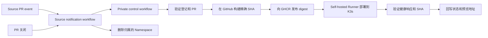

# PreviewMesh

[English](README.md)

PreviewMesh 为每个符合条件的 Pull Request 创建临时预览环境：构建精确的源代码提交，将镜像部署到 K3s，验证应用实际提供的 commit SHA，并在 Pull Request 关闭时删除预览。

> [!WARNING]
> 本仓库是公开模板。复制出来实际运行 PreviewMesh 的 control 仓库必须保持 private。不要把 GitHub Token、kubeconfig、真实仓库登记信息或运行证据放进本仓库。如果本目录来自 private checkout，请创建全新的公开 Git 历史，不要推送原 private 项目的旧提交。

## 工作原理

PreviewMesh 将公开模板、私有控制平面和应用源仓库分开：

| 仓库 | 内容 | 可见性 |
| --- | --- | --- |
| PreviewMesh 模板 | 通用代码、Chart、工作流和配置说明 | Public |
| Control 仓库 | 你的副本、源仓库登记、工作流变量和 Actions Secrets | Private |
| Source 仓库 | 应用、Dockerfile、健康接口和通知工作流 | Public 或 private |

GitHub 托管 Runner 构建并发布不可变的 GHCR 镜像。K3s 机器上的 self-hosted Runner 部署该 digest，并通过 Traefik 检查应用。



重要边界：

- 只有 private control 仓库设置 PREVIEWMESH_ENABLED=true 后，预览工作流才会运行。
- 只有登记过的仓库可以使用；数字仓库 ID 和完整 owner/name 必须与 GitHub 一致。
- Fork PR 会被拒绝。请在已登记的 source 仓库自身创建 PR。
- Source 工作流只转发元数据，不检出或执行 PR 代码。
- Self-hosted Runner 需要受限 kubeconfig，并且只应服务于 private control 仓库和专用开发集群。

## 前提条件

本地检查需要 Git、Go 1.25 或更高版本、Python 3、Bash 和 GitHub CLI。真实预览还需要 Linux 或 WSL2 机器上的 K3s、Traefik、Helm 3 和 kubectl。

Self-hosted Runner 必须有 self-hosted、Linux、X64、previewmesh 四个标签，并能在 PATH 中找到 Go、Python、Helm 和 kubectl。正常镜像构建运行在 GitHub-hosted Runner；本地 Docker 只用于可选的手动构建。

## 首次配置

请按顺序完成。会改变 GitHub 或 K3s 的命令都属于运维操作，执行前请确认目标仓库和集群。

### 1. 创建 private control 仓库

推荐在公开 PreviewMesh 仓库页面点击 Use this template，并选择 Private。Public fork 不能直接改成 private fork。

如果要手动 clone 并推送，请替换两个占位符，然后在父目录运行：

```bash
PUBLIC_REPOSITORY=YOUR_GITHUB_OWNER/PreviewMesh
CONTROL_REPOSITORY=YOUR_GITHUB_OWNER/previewmesh-control

gh auth login
gh repo create "$CONTROL_REPOSITORY" --private
gh repo clone "$PUBLIC_REPOSITORY" previewmesh-control
cd previewmesh-control
git remote rename origin upstream
git remote add origin "https://github.com/$CONTROL_REPOSITORY.git"
git push -u origin main
```

Control 仓库默认分支必须是 main，并且已启用 Actions。不要把 self-hosted Runner 注册到公开模板仓库。

### 2. 启用 private 工作流

公开副本默认不会运行部署。在 private control 仓库创建 Actions repository variable：

```bash
gh variable set PREVIEWMESH_ENABLED --repo "$CONTROL_REPOSITORY" --body true
```

值必须严格为 true。不要在公开模板仓库创建这个变量。

### 3. 登记 source 仓库

当前跟踪的 config/repositories.json 有意为空。复制通用示例，并在 private control checkout 中编辑：

```bash
cp config/repositories.example.json config/repositories.json
$EDITOR config/repositories.json
```

每一项包括不可变的仓库 ID、精确的 GitHub owner/name、应用 HTTP 端口，以及一个 source-access Secret 的名称：

```json
[
  {
    "repository_id": "123456789",
    "source_repository": "YOUR_GITHUB_OWNER/your-application",
    "port": 8080,
    "source_secret": "SOURCE_APP"
  }
]
```

从 GitHub 查询数字 ID，不要从仓库 URL 猜测：

```bash
SOURCE_REPOSITORY=YOUR_GITHUB_OWNER/your-application
REPOSITORY_ID=$(gh api "repos/$SOURCE_REPOSITORY" --jq '.id')
printf '%s\n' "$REPOSITORY_ID"
```

每个 source 仓库使用不同的 source_secret 名称。登记文件只保存名称和元数据，绝不能保存 Token 值。

编译并验证登记：

```bash
mkdir -p bin
go build -o bin/control ./cmd/control
go build -o bin/previewmesh ./cmd/previewmesh
./bin/control resolve \
  --repository-id "$REPOSITORY_ID" \
  --source-repository "$SOURCE_REPOSITORY" \
  --pr 1
git add config/repositories.json
git commit -m "Configure preview source repository"
git push origin main
```

示例中的 --pr 1 只检查编号格式，不要求 PR #1 已存在。

### 4. 准备 source 应用

Source 仓库根目录必须有能构建 linux/amd64 镜像的 Dockerfile。应用必须：

- 在登记的端口监听 0.0.0.0；
- 能以 UID/GID 65532 运行，且不需要额外 capabilities；
- 对 GET /health 返回 HTTP 200，格式如下：

```json
{"status":"ok","commit_sha":"0123456789abcdef0123456789abcdef01234567"}
```

返回的 commit_sha 必须来自 PREVIEW_COMMIT_SHA 环境变量。PreviewMesh 部署时会注入请求的 source SHA，不要硬编码示例值。

### 5. 配置 K3s 和 Runner

在 private control checkout 中应用受限的 Runner 权限：

```bash
sudo k3s kubectl get nodes
sudo k3s kubectl apply -f ops/kubernetes/runner-rbac.yaml
sudo k3s kubectl -n previewmesh-system create token previewmesh-runner --duration=24h
```

使用集群 CA 数据和 ServiceAccount Token，在仓库外创建 kubeconfig。权限设为 600，给 Runner 导出 KUBECONFIG，然后至少检查：

```bash
chmod 600 /absolute/path/previewmesh-runner.yaml
export KUBECONFIG=/absolute/path/previewmesh-runner.yaml
kubectl auth can-i create namespaces
kubectl auth can-i delete namespaces
kubectl auth can-i create secrets --all-namespaces
kubectl auth can-i create clusterroles
```

前 3 项应返回 yes；创建 ClusterRole 应返回 no。不要把 K3s 管理员 kubeconfig 交给 Runner。详见 [Kubernetes Runner 说明](ops/kubernetes/README.md)。

在独立目录安装 Linux x64 GitHub self-hosted Runner，并添加 previewmesh 标签。配置 Runner 环境中的 KUBECONFIG，确认 Go、Python、Helm 和 kubectl 可用，并只将 Runner 注册到 private control 仓库。

### 6. 配置 GitHub Secrets

创建最小权限的 Token，只保存到下表位置：

| Secret | 保存位置 | 最小用途 |
| --- | --- | --- |
| SOURCE_APP 或每个配置中的 source_secret | Control 仓库 | 读取对应 source 的代码、PR 和元数据，并写入该 source 的 commit status |
| PREVIEWMESH_DISPATCH_TOKEN | 每个 source 仓库 | 触发 private control 仓库的工作流 |
| GHCR_READ_TOKEN | Control 仓库 | 带 read:packages 的 classic PAT，用于拉取 control 所有的镜像 |

辅助脚本会读取 private 登记文件，并在输入时隐藏 Token：

```bash
bash scripts/configure-github-secrets.sh "$CONTROL_REPOSITORY" config/repositories.json
```

脚本会为每个登记的 source 上传一个 source Token，为每个 source 上传同一个 dispatch Token，并将 GHCR read Token 上传到 control 仓库。上传失败会停止，之前成功的上传会保留。

### 7. 配置 Ingress 和 source 通知

预览域名使用确定的格式：

```text
pm-r<repository-id>-pr<pr-number>.preview.test
```

让这个域名解析到 Runner 和浏览器都能访问的地址。如果使用 WSL localhost 转发，先将 Traefik 配置为内部 ClusterIP，再创建并编辑 endpoint 文件：

```bash
sudo install -d -m 0755 /etc/previewmesh
sudo install -m 0644 ops/wsl/ingress.env.example /etc/previewmesh/ingress.env
sudoedit /etc/previewmesh/ingress.env
```

设置与集群对应的 endpoint 后，再安装 `ops/wsl/` 下的 unit。Endpoint 不能提交到仓库。

将通知模板复制到 source 仓库：

```bash
mkdir -p .github/workflows
cp /path/to/previewmesh-control/templates/source-notify.yml \
  .github/workflows/previewmesh-notify.yml
```

编辑复制文件顶部的两个值：

```yaml
PREVIEWMESH_CONTROL_OWNER: YOUR_GITHUB_OWNER
PREVIEWMESH_CONTROL_REPOSITORY: previewmesh-control
```

将该工作流提交到 source 仓库默认分支，并启用 Actions。打开 PR 前，source 仓库必须已经配置 PREVIEWMESH_DISPATCH_TOKEN。

通知工作流监听 `opened`、`reopened`、`synchronize` 和 `closed`。GitHub 使用 `synchronize` 表示已打开的 Pull Request 推送了新 commit，因此每个新的 PR head 都会再次请求构建和部署。控制工作流会在构建前读取当前 head，并在部署前后再次检查；如果某次尝试已被更新的 commit 取代，就不会发布旧版本，后续通知会部署最新 revision。

### 8. 运行预览

创建一个 base 和 head 都属于已登记 source 仓库的 PR。通知工作流会触发 private control 工作流。也可以手动触发：

```bash
gh workflow run preview.yml --repo "$CONTROL_REPOSITORY" --ref main \
  -f repository_id="$REPOSITORY_ID" \
  -f source_repository="$SOURCE_REPOSITORY" \
  -f pr_number="$PR_NUMBER"
gh run list --repo "$CONTROL_REPOSITORY" --workflow preview.yml --limit 5
```

工作流成功后，通过域名检查预览：

```bash
PREVIEW_HOST=$(printf 'pm-r%s-pr%s.preview.test' "$REPOSITORY_ID" "$PR_NUMBER")
curl --fail --max-time 10 "http://$PREVIEW_HOST/health"
```

响应必须包含 PR head 的 SHA。关闭或合并 PR 后，应删除其归属的 Namespace；重复的关闭通知也应安全。

## 更新 private control 仓库

通过 GitHub 模板创建仓库只会复制文件，不会创建可以自动同步的 fork。为了便于长期更新，创建 private control 仓库时应保留 Git 历史，并把公开仓库作为 `upstream`：

```bash
git remote add upstream https://github.com/flashrick/PreviewMesh.git
git fetch upstream main
scripts/update-upstream.sh --remote upstream --ref main
```

脚本会创建更新分支，但不会推送。请先检查差异、运行本地检查，再推送到 private 仓库并创建 Pull Request：

```bash
git push -u origin update/previewmesh-main-YYYYMMDDHHMMSS
```

`config/repositories.json` 属于客户；更新过程中会从当前 private 分支恢复它。GitHub Secrets 不在 Git 中，因此不会被修改。如果除了该登记文件以外还有冲突，脚本会停止并要求人工检查；不要对工作流或部署代码直接选择一侧覆盖。

新创建的副本还包含 **Update PreviewMesh from upstream** 工作流，每周检查一次，也可以手动运行。它只在 GitHub hosted Runner 上创建更新 Pull Request，不使用部署 Runner 或客户 Secrets。如果公开模板由其他 owner 维护，可设置可选的 repository variable：`PREVIEWMESH_UPSTREAM_REPOSITORY`。

如果 private 仓库是通过 **Use this template** 创建的，它与模板之间没有共同 Git 历史。第一次运行更新器时会创建一个小的历史桥接提交，同时保留当前 private 文件；之后就可以使用普通 Git merge。第一次桥接仍需审核，登记文件以外的客户自定义文件也需要客户自己确认。

source 仓库中复制出来的 `templates/source-notify.yml`，以及已经安装的 WSL/K3s 文件，是独立的更新面。当对应的上游文件改变时，需要分别同步或重新应用。

## 本地检查

在修改 GitHub 或 K3s 前，从 private control checkout 执行：

```bash
go test ./...
go vet ./...
python3 scripts/check-workflow.py
python3 scripts/check-github-secrets.py
helm lint charts/preview
actionlint .github/workflows/preview.yml templates/source-notify.yml
```

Python 检查使用模拟工具，不会访问 GitHub 或 Kubernetes。通过本地检查不等于 Token、镜像权限、Runner、网络路由和应用契约都已正确。

## CLI 说明

control resolve 只验证登记文件，不访问 GitHub。control inspect 会重新检查当前 PR、Fork 状态和作者权限。control status 会写入 PreviewMesh commit status。

previewmesh build、deploy、verify 和 cleanup 是工作流使用的底层操作。完整 PR 生命周期应使用工作流，因为它会在部署前后重新检查 PR 状态，并处理过期版本和清理。

## 项目结构

| 路径 | 用途 |
| --- | --- |
| cmd/control | 可信的仓库和 Pull Request 验证 CLI |
| cmd/previewmesh | 镜像、Helm、验证、回滚和清理 CLI |
| charts/preview | 受限的 Deployment、Service 和 Ingress Chart |
| config | 私有 source 登记及公开示例 |
| templates | 复制到各 source 仓库的工作流 |
| scripts | Secret 配置、生命周期编排、报告和离线检查 |
| ops | 通用 K3s、Linux 和 WSL 辅助文件 |

## 故障排查

- **工作流被跳过：** 确认 control 仓库的 Actions variable PREVIEWMESH_ENABLED 严格为 true。
- **登记被拒绝：** 检查数字仓库 ID、owner/name、端口和 Secret 名称是否同时匹配登记文件与 GitHub。
- **Source checkout 失败：** 检查 source Token 的仓库范围和 Pull Request 读取权限。
- **没有回写状态：** 检查 commit status 写权限，以及 source_secret 选择的 Token。
- **镜像拉取失败：** 检查 GHCR_READ_TOKEN、Package 权限和预览 Namespace 中的 ghcr-pull Secret。
- **HTTP 验证失败：** 检查 /health 契约、域名解析、Traefik 路由，以及响应是否使用了 PREVIEW_COMMIT_SHA。
- **WSL Docker 网络失败：** 参考 [WSL 出站网络说明](ops/wsl/docker-egress.md)中的可选辅助配置。
