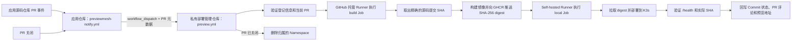

# PreviewMesh

[English](README.md)

PreviewMesh 为符合条件的拉取请求（PR）在开发网络上提供临时应用 URL。它构建 PR 对应的精确源码提交，将镜像部署到 K3s，检查应用通过 `/health` 返回的 commit SHA，并在 PR 关闭或合并后删除预览。

> [!WARNING]
> 本仓库是公开的 PreviewMesh 代码仓库。由它创建的部署管理仓库必须保持私有。不要把 GitHub Token、kubeconfig、真实仓库登记信息或运行证据放进本仓库。如果你从私有仓库复制了本目录，请创建全新的公开 Git 历史，不要公开原有的私有提交记录。

## 导航

- [安装](#安装)，包括[应用要求](#应用要求)
- [按拉取请求查询预览](#按拉取请求查询预览)
- [更新私有部署管理仓库](#更新私有部署管理仓库)
- [本地检查](#本地检查)
- [故障排查](#故障排查)

## 工作原理

PreviewMesh 将公开的 PreviewMesh 代码仓库、私有部署管理仓库和应用源码仓库分开。实现和配置中把部署管理仓库称为 `control`，把应用源码仓库称为 `source`；这只是内部名称，不是额外的仓库类型。

| 仓库 | 内容 | 可见性 |
| --- | --- | --- |
| PreviewMesh 代码仓库（公开） | 可复用代码、Chart、工作流和配置说明；创建部署管理仓库时的代码来源 | 公开 |
| 部署管理仓库（私有） | 可信 PreviewMesh 自动化、应用登记、工作流变量、Actions Secrets 和 Runner 配置 | 私有 |
| 应用源码仓库 | 应用代码、Dockerfile、健康接口和通知工作流 | 公开或私有 |

需要创建新的部署管理仓库时，安装器会把公开 PreviewMesh 代码仓库的代码复制到独立的本地目录，并创建私有部署管理仓库。现有部署管理仓库必须包含 PreviewMesh 部署工具。公开代码仓库不是公开的控制平面，应用源码仓库也不能填作部署管理仓库。

应用源码仓库会通知私有部署管理仓库。控制工作流先使用 GitHub 托管 Runner 构建并发布不可变的 GHCR 镜像，再把单独的 Job 交给 K3s 机器上的自托管 Runner。这个 Runner 部署精确的镜像 digest，并通过 Traefik 检查应用。

重要边界：

- 只有私有部署管理仓库设置 `PREVIEWMESH_ENABLED=true` 后，预览工作流才会运行。
- 只有登记过的仓库可以使用；数字仓库 ID 和完整 owner/name 必须与 GitHub 一致。
- PR 作者必须对已登记的应用源码仓库有写权限。
- Fork PR 会被拒绝。请在已登记的应用源码仓库自身创建 PR。
- 应用源码仓库工作流只转发元数据，不检出或执行 PR 代码。
- 自托管 Runner 需要受限 kubeconfig，并且只应服务于私有部署管理仓库和专用开发集群。

<details>
<summary>工作流与运行细节</summary>


```mermaid
flowchart LR
    A[应用源码仓库 PR 事件] --> B[应用仓库：previewmesh-notify.yml]
    B -->|workflow_dispatch + PR 元数据| C[私有部署管理仓库：preview.yml]
    C --> D[验证登记信息和当前 PR]
    D --> E[GitHub 托管 Runner 执行 build Job]
    E --> F[取出精确的源码提交 SHA]
    F --> G[构建镜像并向 GHCR 推送 SHA-256 digest]
    G --> H[Self-hosted Runner 执行 local Job]
    H --> I[拉取 digest 并部署到 K3s]
    I --> J[验证 /health 和实际 SHA]
    J --> K[回写 Commit 状态、PR 评论和预览地址]
    A2[PR 关闭] --> B
    C -->|PR 已关闭| L[删除归属的 Namespace]
```

### 运行时交接

`previewmesh-notify.yml` 由 `onboard-source` 从应用源码仓库的 GitHub 默认分支准备。预览模式只显示完整 diff；`--create-pr` 会创建一个专门的可审核 PR，由你检查后合并。文件来自 [`templates/source-notify.yml`](templates/source-notify.yml)，合并后在 GitHub 托管的 `ubuntu-latest` Runner 上运行。`jobs.notify.env` 下的两个值决定要通知哪个部署管理仓库；应用源码仓库中的 `PREVIEWMESH_DISPATCH_TOKEN` Secret 授权它在部署管理仓库的 `main` 分支派发 `preview.yml`。派发时只发送应用源码仓库 ID、完整仓库名和 PR 编号。

实际执行生命周期的 [`preview.yml`](.github/workflows/preview.yml) 位于私有部署管理仓库。它的 `build` Job 使用 GitHub 托管 Runner，读取当前 PR head 的 commit SHA，取出这个精确版本，并运行 `previewmesh build`。CLI 本身没有 `--push` 参数；该命令在内部调用 Docker Buildx 并推送镜像。这个 Job 声明 `packages: write` 权限，并使用工作流自带的 `GITHUB_TOKEN` 登录 GHCR；不需要另设镜像发布 Job，也不需要手动创建 Package。

镜像 digest 是类似 `sha256:abc...` 的内容标识，不是源码提交 SHA。Commit SHA 标识 Git 源码版本；镜像 digest 标识确切的容器镜像内容。PreviewMesh 部署的引用类似 `ghcr.io/OWNER/previewmesh-c123-r456@sha256:...`，而不是可能被重新指向其他内容的 tag，因此 K3s 中的工作负载不会悄悄切换到另一份镜像。

`local` Job 通过 `runs-on: [self-hosted, Linux, X64, previewmesh]` 选择 Runner。安装器会在 K3s 所在机器上注册并启动 Runner，可在私有部署管理仓库的 **Settings → Actions → Runners** 中查看。GitHub 会把 build Job 输出的 `image` 和已确认的 commit SHA 传给这个 Job。[`scripts/local-attempt.sh`](scripts/local-attempt.sh) 再把完整的 digest 引用传给 `previewmesh deploy`；Kubernetes 使用由 `GHCR_READ_TOKEN` 生成的 Namespace 内 `ghcr-pull` Secret 从 GHCR 拉取镜像，之后 Helm 创建或更新 K3s 资源。

部署就绪阶段先等待 Deployment 和 Pod，再等待预览 Service 获得 ClusterIP，以及 Traefik 在 Ingress status 中发布地址，之后才进行 `/health` 验证。WSL 配置中 Traefik 发布的是 `127.0.0.1`，它只用于判断路由已就绪；实际请求通过 `18080` 端口的 socket 代理转发。Service 或 Ingress 就绪检查失败时，本次尝试会失败，预览不会被标记为 ready。

部署后，local Job 检查应用的 `/health` 响应和实际提供的 commit SHA。`control status` 使用配置给应用源码仓库的 Token 调用 GitHub 的 commit-status 和 PR comment API。等待中的或最终的 `PreviewMesh` 状态会链接到工作流运行页或预览地址，最终 PR 评论还会包含运行详情和 **Open preview** 链接。这个预览地址仍是本地/私有地址；域名、DNS 和 hosts 的统一访问方法见[预览访问说明](ops/install/access.md)。

</details>

## 安装

支持 **Ubuntu 22.04/24.04 x64**，以及使用这些发行版并启用 **systemd 的 WSL2**。在准备运行 K3s 和 GitHub Runner 的机器上，以有 sudo 权限的普通 Linux 用户操作。使用专门的开发集群，并准备固定的局域网 IPv4。WSL 用户还需要 Windows 管理员权限来配置局域网入口。

先下载并解压本仓库的 ZIP 到 Linux 用户目录，或在已有 Git 的机器上 clone。在该目录打开终端。公开 PreviewMesh 代码目录、部署管理本地目录和每个应用代码本地目录必须分开且不能互相包含。安装器会补齐 Git 等缺少的工具，因此下载 ZIP 的方式不要求预先安装 Git。

`init` 和 `install` 默认使用 `~/.config/previewmesh/setup.ini`；也可以用 `--config /path/to/setup.ini` 指定其他路径。

### 应用要求

每个应用源码仓库的应用代码本地目录根部都需要一个 Dockerfile。它必须构建 `linux/amd64` 镜像，让应用在配置的端口上监听 `0.0.0.0`，并以 UID/GID `65532` 运行且不依赖额外的 Linux 能力（capabilities）。`GET /health` 必须返回 HTTP 200。JSON 中的 `commit_sha` 字段必须使用运行时环境变量 `PREVIEW_COMMIT_SHA` 的实际值，并保留下面的契约：

```json
{"status":"ok","commit_sha":"the value of PREVIEW_COMMIT_SHA"}
```

完整的静态检查和可选本地容器检查见[运行应用预检](#运行应用预检)。

### 1. 运行配置向导

```bash
bash scripts/setup.sh init
```

在网络步骤中，向导会让你选择直接在 Ubuntu 上安装，还是在 WSL 中安装。默认值根据当前平台自动检测；这个选择只用于本次向导，不会写入配置，之后的 install 仍按实际平台自动判断。Ubuntu 模式调用本机只读 `ip` 获取私有 global IPv4 候选值，并过滤已知 VPN/容器接口前缀；WSL 模式调用只读 PowerShell，从正在运行的物理 Windows 网卡读取可用 IPv4，因此不会把 WSL guest NAT 地址当成预览局域网地址。

向导会从选定的部署管理本地目录和应用代码本地目录发现 GitHub remote、可用的局域网 IPv4 候选值，以及 Dockerfile `EXPOSE` 中声明的应用端口，并在展示端口前进行检查。单个网络地址会显示为实际默认值，直接回车即可接受；有多个地址时会列出候选并要求输入编号或完整地址，不会静默选择某个网卡。自动发现失败或没有地址时，提示会说明原因并允许手动填写私有局域网 IPv4。

对于仓库、目录和端口列表，如果只有一个候选值，提示会直接显示实际默认值，例如 `[flashrick/PreviewMesh]`；直接回车即可接受，也可以输入 `1` 选择第一个编号项。候选值超过一个时可输入编号或完整值；没有候选值时，请按提示填写完整的 `用户名或组织名/仓库名`、路径、地址或端口。

向导会分开收集普通配置和 Token 文件路径。不要把 Token 粘贴到向导中；配置文件只保存类似下面的文件引用：

| 配置 | 填什么 |
| --- | --- |
| 部署管理仓库（私有）(`control_repository`) | 负责协调 PreviewMesh 的私有 GitHub 仓库，安装器可以从公开代码仓库创建；现有仓库必须包含部署工具 |
| 部署管理本地目录 (`control_directory`) | 该私有仓库的本地目录，与公开代码目录和所有应用代码目录分开 |
| PreviewMesh 代码仓库（公开）(`public_repository`) | 创建新的部署管理仓库时使用的公开代码来源，不是公开控制仓库 |
| 应用源码仓库 (`[source:name]`) | 每个应用的 GitHub 仓库、应用代码本地目录和实际 HTTP 监听端口 |
| Token 文件路径 | 应用、通知和镜像读取 Token 各自的独立文件，放在 Git 仓库外；配置中不填写 Token 明文 |
| 局域网 IP | Ubuntu 服务器的固定私有局域网 IPv4；WSL 使用 **Windows 主机**的私有局域网 IPv4。向导会列出候选供确认，也允许手填 |
| 允许网段 | `auto` 按选定局域网 IP 所属网卡的网络和前缀长度计算；WSL 使用 Windows 网卡信息；其他客户端网络请填写私有 CIDR |
| 域名后缀 | `auto` 使用 `<LAN_IP>.sslip.io`；也可以选择小写的内部 DNS 后缀 |
| 输出语言 | `auto` 跟随系统，`zh-CN` 为中文，`en` 为英文；`init` 会保存所选值 |

三类仓库的关系是固定的：公开 PreviewMesh 代码仓库提供可复用的部署代码；需要新建部署管理仓库时，安装器把这些代码复制到独立目录并创建私有部署管理仓库；每个应用源码仓库仍是单独登记的应用代码来源。三个本地目录必须互相独立。不要把应用源码仓库填入部署管理仓库，也不要把部署凭据或应用登记信息放入公开代码仓库。

三个 Token 文件的用途不同。每个应用源码仓库使用独立的应用 Token，用于读取源码和回写状态；通知 Token 只选择部署管理仓库，并复制到每个应用源码仓库的 `PREVIEWMESH_DISPATCH_TOKEN`，让通知工作流派发 control 工作流；GHCR Token 是 classic 包读取 Token，保存到部署管理仓库的 `GHCR_READ_TOKEN`，供集群拉取预览镜像。安装器在 `setup.ini` 中只保存文件路径，不保存 Token 明文。

`init` 向导开始时会询问输出语言，并把所选值保存到 `setup.ini`。语言输入无效时会重新提示，输入 `q` 或遇到 EOF 会取消且不写入文件。

保存前，向导会显示仓库、目录、局域网地址、端口和 Token 文件路径等非敏感摘要。请审核后确认保存；在任意提示输入 `q` 都会退出且不写入配置。已有配置时，向导会先询问是否载入并审核，再决定是否替换。

向导默认使用 `allowed_subnet = auto`，按选定局域网地址所属网卡的实际网络和前缀长度计算允许网段，不固定为 `/24`。它还默认使用 `domain_suffix = auto`，将选定的局域网地址与 `sslip.io` 组合。若使用其他私有客户端网段、内部 DNS 或 hosts 替代方案，请填写对应的私有 CIDR 或小写手工后缀，并按[预览访问说明](ops/install/access.md)配置。向导和安装器都不会打印 Token 内容。

如果只需要带注释的配置文件，可显式使用模板模式：

```bash
bash scripts/setup.sh init --template
```

它会把[带逐项说明的模板](config/setup.example.ini)复制到 `~/.config/previewmesh/setup.ini`，不会覆盖已有文件。编辑后，安装时继续使用同一个配置路径。

交互式 `install` 启动时会先显示 `1. English` 和 `2. 中文`，之后的安装提示会使用所选语言。也可以使用 `--language en` 或 `--language zh-CN` 直接指定语言并跳过这个问题。语言输入无效时会重新提示，输入 `q` 或遇到 EOF 会在修改系统前停止。`check` 等非交互命令，或使用已有配置且没有交互式语言选择的命令，继续遵循配置中的 `language`；`auto` 会跟随系统 locale。

### 2. 执行安装

```bash
bash scripts/setup.sh install
```

例如，直接选择英文并跳过启动提问：

```bash
bash scripts/setup.sh install --language en
```

`install` 会先解释当前步骤，再修改本机。八个阶段依次涵盖本机工具、私有部署管理仓库、三类访问 Token、本机 K3s 和受限部署权限、自托管 Runner、`18080` LAN/WSL 预览入口、应用通知工作流和基础环境就绪检查。每个阶段提示都会说明动作及用途；最后的就绪检查不会创建应用预览。结束时会显示摘要并逐个应用报告通知工作流是否仍待接入。需要创建经过审核的应用接入 PR 时，使用显式的 `onboard-source` 命令，然后创建测试应用 PR 验证真实预览链路。安装完成后继续查看[预览访问说明](ops/install/access.md)。

仍需你完成浏览器登录和 GitHub Token 的创建。安装器会展示每个 Token 的创建页面、准确的目标仓库和所需权限。缺少 Token 文件时，可以在隐藏输入提示中粘贴，安装器会保存为仅当前用户可读写的文件。组织审批、SSO 和 Token 到期时间由你的 GitHub 账号管理。这些个人 Token 不会自动续期；到期前更新相应文件并重新安装即可。

WSL 安装期间，Windows 会请求管理员权限来配置局域网转发。当前连接需为“专用”或“域”网络；安装器不会关闭防火墙，也不会把“公用”网络自动改为受信任网络。

某一步失败时，安装器会列出本次运行已完成的阶段、仍需完成的阶段和继续执行的准确命令。修复问题后，重新运行**同一条命令**。

<details>
<summary>继续安装与查看日志</summary>

`install-state.json` 记录各阶段的配置、安装器输入和依赖摘要，以及可验证的产物信息。部署管理仓库准备和应用通知阶段仅在文件及已发布版本仍匹配时复用；凭据、集群、Runner、网络及就绪阶段每次都核对实时状态。配置、脚本、依赖或产物变化、缺失或损坏时，相应阶段会重新运行并说明原因。

`install-state.json.bak` 保留上一次有效状态；状态文件无法读取时，先保留原文件、检查备份，并恢复可信副本后再运行。摘要保存的是摘要值和元数据，不包含令牌内容。已有自定义工作流和配置不会被静默覆盖。

脱敏日志 `~/.local/share/previewmesh/setup.log` 的权限仅允许文件所有者访问；`--verbose` 也会把详细输出显示在终端。

</details>

### 3. 创建经过审核的应用接入 PR

安装结束时，对于仍待接入的应用源码仓库，安装器会打印下一步命令。针对要接入的应用源码仓库执行一次：

```bash
bash scripts/setup.sh onboard-source \
  --config /path/to/setup.ini \
  --source OWNER/REPO
```

`onboard-source` 只读取应用源码仓库的 GitHub 默认分支，并准备一个文件：`.github/workflows/previewmesh-notify.yml`。不加 `--create-pr` 时，它只显示完整 diff，不写本地文件，也不写远程仓库。如果默认分支已经有匹配内容，会报告无需修改。该命令只需要 Python 3 和已登录 GitHub 的 `gh` CLI，以及目标仓库的访问权。classic PAT 需要 `repo` 和 `workflow` scope；fine-grained PAT 需要对目标仓库有访问权，并授予 **Contents: Read and write**、**Workflows: Read and write**、**Pull requests: Read and write** 权限，参见 GitHub 的[细粒度个人访问令牌权限说明](https://docs.github.com/en/rest/authentication/permissions-required-for-fine-grained-personal-access-tokens)。不要求 systemd、K3s 或应用源码仓库的本地目录。

如需让命令创建可审核的 PR，添加 `--create-pr`：

```bash
bash scripts/setup.sh onboard-source \
  --config /path/to/setup.ini \
  --source OWNER/REPO \
  --create-pr
```

创建新 PR 时，命令会先显示完整 diff，只有输入准确的 `create` 后才继续。它使用专用的 `previewmesh/onboard-source` 分支。如果已有开放的接入 PR，命令会返回链接并保留该分支和 PR 内容，不检查是否可合并。没有开放 PR 时，如果专用分支内容或基线与当前提案不同，命令会停止并打印人工处理步骤。PR 只提交通知工作流，不读取或提交应用代码本地目录中的其他改动，也不会自动合并。已有 PR 的审核和合并冲突处理由你自行完成。

PR 合并后，运行 `doctor`，让它重新检查应用默认分支上的通知工作流：

```bash
bash scripts/setup.sh doctor --config /path/to/setup.ini
```

### 4. 开始正常开发

用同一个应用源码仓库的分支创建一个以默认分支为目标的普通测试 PR，不要使用 fork。按下面的顺序确认真实预览链路：

1. 应用源码仓库分支已推送到以应用默认分支为目标的 PR。
2. 应用通知 Actions 运行并成功派发请求。
3. 私有部署管理仓库的 `Preview` 工作流完成 `build` 和 `local` Job。
4. 将预期的源 PR head SHA 与 PR 状态或评论中记录的 SHA 比较，然后按[预览访问说明](ops/install/access.md)在同一局域网的另一台机器上打开生成的 URL 并核对该 URL。
5. 关闭或合并 PR，等待部署管理仓库工作流删除对应预览。

安装、onboarding diff 和通过 `doctor` 检查都不能证明真实预览已经部署；只有这次测试 PR 的构建、部署、SHA/URL 证据和后续清理能证明完整链路。

#### 运行应用预检

<details>
<summary>静态检查与可选本地容器检查</summary>

在应用代码本地目录外构建 CLI，再对干净的应用代码本地目录运行预检。报告文件也必须放在该目录外，因为检查会包含未跟踪和被忽略的文件；把 JSON 重定向到应用目录会使它在检查期间变脏。

```bash
go build -o /tmp/previewmesh ./cmd/previewmesh
SOURCE_DIR=/path/to/source
PREFLIGHT_DIR=$(mktemp -d /tmp/previewmesh-preflight.XXXXXX)
EXPECTED_SHA=$(git -C "$SOURCE_DIR" rev-parse HEAD)

# Static checks only; Docker is not called by this command.
/tmp/previewmesh preflight \
  --source-dir "$SOURCE_DIR" \
  --port 8080 \
  --sha "$EXPECTED_SHA" \
  > "$PREFLIGHT_DIR/static.json"
```

将 `SOURCE_DIR` 和 `8080` 替换为配置中的应用代码本地目录和登记应用端口。

`--sha SHA` 可省略；省略时检查本地目录的 `HEAD`。SHA 必须是完整的小写 Git commit ID。静态预检会检查端口范围、Git 根目录和 revision、包含 ignored files 在内的干净本地目录、根目录 Dockerfile 及其最终阶段的 `EXPOSE`/`USER` 声明，以及 `0.0.0.0`、`GET /health`、`PREVIEW_COMMIT_SHA` 和 health 响应 `commit_sha` 字段等源代码标记。这些检查依靠源代码扫描和启发式规则，不能证明监听地址、HTTP 响应、环境变量传递、文件权限或其他运行时行为。

JSON 报告记录 `source_sha`、`configuration_fingerprint`、UTC 时间的 `checked_at`、端口和契约，以及 `static`、`container`、`deployment` 和 `findings` 字段。`blocker` 会给出修复方向并以非零状态退出；`warning` 也会给出修复方向，并将静态状态保留为 `passed_with_warnings`。由于源代码扫描不能证明运行时行为，静态限制警告总会出现。构建前应查看这些警告。报告只包含受控诊断，不包含源代码片段或工具日志；把它放在应用代码本地目录外，并将其中的 SHA、fingerprint 和时间戳作为本次检查的身份。

如需进行本地运行时检查，在同一命令中加入 `--container-check`：

```bash
# Build and run a temporary local image/container; nothing is pushed or deployed.
/tmp/previewmesh preflight \
  --source-dir "$SOURCE_DIR" \
  --port 8080 \
  --sha "$EXPECTED_SHA" \
  --container-check \
  > "$PREFLIGHT_DIR/container.json"
```

这个显式模式会为 `linux/amd64` 本地构建并运行应用，注入 `PREVIEW_COMMIT_SHA`，发布仅绑定 loopback 的临时端口，并检查 `/health`。容器以 UID/GID `65532:65532` 运行，删除全部 capability 并启用 `no-new-privileges`；资源限制为 512 MiB、1 个 CPU 和 128 个进程。`--timeout` 默认对每个外部操作限制为五分钟，`--http-timeout` 默认将启动和健康检查限制为一分钟；两个值都会记录在 `container_configuration` 中，并计入 configuration fingerprint。若先发现静态 blocker，不会调用 Docker，`container` 会报告 `not_run_static_failed`。检查结束后会删除临时 image 和 container。

这项检查只验证本地启动和健康行为，不验证集群网络、挂载、Ingress 或真实部署，也不会推送镜像或创建预览。

`previewmesh build` 会在 Docker build 和 push 前，对精确的干净应用代码本地目录重复静态检查。传入与预检相同的 `--port PORT`（默认值为 `8080`），让报告与登记的应用端口一致。静态 blocker 会在发布前停止 build；静态 warning 会进入 build 结果供审核。build 不会自动运行可选的本地容器检查。

</details>

安装器负责基础环境，不会改写应用或证明应用的运行行为。第一个真实 PR 会验证镜像权限、应用兼容性和实际提供的 SHA；关闭或合并该 PR 后，再确认部署管理仓库工作流已删除预览。

[预览访问说明](ops/install/access.md)是从安装完成到打开 URL 的统一入口。推荐的 `domain_suffix = auto` 使用 `<LAN_IP>.sslip.io`，DNS 检查通过后不需要为每个预览添加 hosts。小写手工后缀支持内部通配 DNS 或明确的 hosts 替代方案；入口中说明探测条目、每个 PR 的条目、`18080` 端口和 `/health` 验证。如果局域网地址或后缀发生变化，请重新安装并重新部署开放的 PR，旧 URL 不会自动迁移。

### 检查和恢复

```bash
# 读取配置并检查前提条件，不修改系统。
bash scripts/setup.sh check
# 检查已安装服务、凭据、DNS 和 GitHub 配置。
bash scripts/setup.sh doctor
```

所有命令都支持 `--config /配置文件路径/setup.ini`。换终端不需要重新 export 变量。更新配置或 Token 文件后重新执行 `install`；安装器会说明需要重新检查的阶段。每个 Linux 账号管理一套安装，Windows 转发绑定对应的 WSL 发行版。

root 管理的后台维护服务每五分钟检查一次 Runner 的 Kubernetes 凭据，在接近**实际到期时间**时续期，同时刷新 Traefik 代理目标地址。写入受限 kubeconfig 前会放弃 root 权限；续期失败会保留原凭据。WSL NAT 转发会在 Windows 用户已登录且发行版正在运行时刷新，不会为了刷新转发而启动已停止的发行版。

`doctor` 会区分“基础环境就绪”和“应用通知文件尚待发布”；基础环境检查通过不代表已经成功部署过真实预览。已有手工安装可以保留应用登记及 Secret 名称；接入新安装器前，先更新旧版部署管理代码。

需要底层操作说明时，参见[手工安装参考](ops/install/manual_CN.md)。两种安装路径都使用[预览访问说明](ops/install/access.md)统一处理域名、端口和验证。

## 更新私有部署管理仓库

在私有部署管理本地目录中执行更新。实现中把这个目录称为 `control`。先提交本地改动，或用 `git stash` 收起它们；更新脚本要求工作区干净，并且 Git 已配置提交者身份。脚本会复用安装时创建的 `upstream`，如果没有这个 remote，就自动创建：

```bash
git switch main
git pull --ff-only origin main
git status --short
```

如果 `git status --short` 列出了文件，先处理这些改动，再运行更新脚本。确认工作区干净后再执行：

```bash
scripts/update-upstream.sh --remote upstream --ref main
```

有更新时，脚本会在本地更新分支上创建提交，并停留在该分支。如果提示无需更新，就到此结束。否则，检查差异、执行下方的本地检查，再推送实际分支并创建 PR：

```bash
UPDATE_BRANCH=$(git branch --show-current)
git diff --stat main...HEAD
git diff main...HEAD
```

执行[本地检查](#本地检查)中的命令。通过后再推送更新分支并创建 PR：

```bash
git push -u origin "$UPDATE_BRANCH"
gh pr create --base main --head "$UPDATE_BRANCH"
```

更新脚本会保留私有分支中的 `config/repositories.json`，所以你的应用登记不会被覆盖。GitHub Secrets 不在 Git 中，因此不会被修改。如果除了该登记文件以外还有冲突，脚本会停止并要求人工检查；不要对工作流或部署代码直接选择一侧覆盖。

新创建的副本还包含 **Update PreviewMesh from upstream** 工作流，每周检查一次，也可以手动运行。它在 GitHub 托管的 Runner 上执行检查并创建更新 PR，不使用部署 Runner 或你保存的应用 Token。在 **Settings → Actions → General → Workflow permissions** 中启用 **Allow GitHub Actions to create and approve pull requests**；如果组织策略不允许，请使用本地更新流程。参见 [GitHub Actions 设置](https://docs.github.com/en/repositories/managing-your-repositorys-settings-and-features/enabling-features-for-a-repository/managing-github-actions-settings-for-a-repository)。如果公开 PreviewMesh 代码仓库由其他 owner 维护，可设置可选的 repository variable：`PREVIEWMESH_UPSTREAM_REPOSITORY`。

如果私有仓库是通过 **Use this template** 创建的，它与模板之间没有共同 Git 历史。第一次运行更新器时会创建一个小的历史桥接提交，同时保留当前私有文件；之后就可以使用普通 Git merge。第一次运行只关联历史，不会把上游当前的文件改动同步到你的项目中。审核桥接 PR 时，手动合入目前需要的改动；上游之后的新提交才能正常合并。每次更新也要检查登记文件之外的自定义内容。

更新部署管理仓库不会自动更新应用源码仓库中已经发布的通知工作流，也不会替换本机已安装的 WSL/K3s 文件。合并更新后，使用原配置重新运行 `install` 来刷新本机托管副本；如果发现你修改过的文件，安装器会停止并显示差异。应用工作流仍需由你审核并提交；需要创建审核 PR 时，使用显式的 `onboard-source --create-pr` 流程。

## 本地检查

修改或更新部署管理仓库项目后，在项目根目录执行下面的检查。需要 Git、Bash、Go 1.25+、Python 3、Helm 3 和 `actionlint`，缺少时先安装。这些是开发检查，不需要每次运行预览时重复执行：

```bash
scripts/verify-local.sh
```

脚本先检查工具和版本，再依次执行 Go 测试、`go vet`、工作流/Secret/配置脚本检查、Helm lint 和 actionlint；任一步失败立即停止。

Python 检查会模拟外部工具，不会访问 GitHub 或 Kubernetes。这些命令都不会部署应用。检查通过后，仍需运行一次真实预览，确认 Token、镜像权限、Runner、网络和健康接口配置正确。

## CLI 说明

直接使用 CLI 时，可信域名后缀依次由 `--domain-suffix`、`PREVIEWMESH_DOMAIN_SUFFIX` 和旧版默认值 `preview.test` 决定。安装器推荐 `domain_suffix = auto`，解析为 `<LAN_IP>.sslip.io`；也支持小写手工后缀。直接 CLI 的旧默认值仍要求匹配的 DNS 或 hosts 配置，不是安装器推荐方案。显式指定的 `--hostname` 仍必须匹配仓库/PR 身份与该后缀。URL 生成及 DNS/hosts 验证见[预览访问说明](ops/install/access.md)。

`control resolve` 只验证登记文件，不访问 GitHub。`control inspect` 检查当前 PR、Fork 状态和作者权限。`control status` 写入 `PreviewMesh` commit status。

工作流实际调用 `previewmesh build`、`deploy` 和 `cleanup`；`deploy` 内部完成验证。`previewmesh verify` 仍可作为独立的低级命令使用。完整 PR 生命周期应使用工作流，因为它会在部署前后重新检查 PR 状态，并处理过期版本和清理。

### 按拉取请求查询预览

从私有部署管理本地目录根部构建 CLI。请确认用户 shell 的 `PATH` 中可用 Go 1.25+ 和已认证的 `gh` CLI；安装器内部补齐的工具不一定出现在该 `PATH` 中：

```bash
go version
gh auth status
go build -o /tmp/previewmesh ./cmd/previewmesh
```

只知道应用源码仓库和 PR 编号时，可以查询记录中的预览状态：

```bash
/tmp/previewmesh status --repo OWNER/REPO --pr 123
/tmp/previewmesh status --repo OWNER/REPO --pr 123 --json
/tmp/previewmesh status --repo OWNER/REPO --pr 123 --max-age 24h
```

这个命令只读取 GitHub 上的 PR 及预览结果，不需要仓库登记文件、Kubernetes 访问权限、GHCR 凭据或部署凭据。`--max-age` 默认 24 小时，控制已记录健康证据的有效期。查询结果反映历史观测；命令不会访问预览 URL 或执行实时健康检查。

<details>
<summary>状态证据与 PR 评论</summary>

查询结果会合并 build、deployment、readiness、health、cleanup、evidence 和可用的 timing 信息。`ready` 要求当前 head SHA 有完整的结构化证据：build、deployment 和 readiness 成功；HTTP 200 响应含预期的 `status: ok` 和 commit revision；请求的 revision 与应用提供的 revision 相同；预览 URL 与当前 status 匹配。

缺少反馈或只有旧版无结构化反馈时，结果为 `missing`；证据太旧时为 `expired`。这两种状态都不会提供可用 URL。待处理的尝试为 `running`；失败尝试在证据提供时标出失败阶段，并链接 PR 或工作流证据供继续检查。

已关闭或已合并的 PR 不会从这个查询得到实时预览 URL。关闭后，如果清理证据仍在等待、不可用或失败，结果可以是 `running`、`missing`、`failure` 或 `expired`；只有关闭后的状态确认预览已经不存在时，结果才是 `removed`。找不到或无法读取仓库/PR 时，命令会给出可操作的 GitHub 权限或错误信息。自动化需要相同字段时使用 `--json`，不要解析人类可读文本。

工作流拿到足够的 PR 信息后，会尝试在应用源码仓库 PR 中发布结果评论，包含 commit SHA、部署状态和工作流运行链接。部署验证通过后还会显示 **Open preview** 链接。构建或部署失败、版本已被更新的尝试和清理结果不会显示可用预览链接。构建中的状态显示在 PR 的 `PreviewMesh` status check 中。每次结果都会新增评论，重跑同一提交可能再次产生评论。

`control status --comment --run-url <workflow-url>` 启用结果评论。应用 Token 需要[Token 配置说明](ops/install/manual_CN.md#6-配置-github-secrets)中的 **Commit statuses: Read and write** 和 **Pull requests: Read and write** 权限。两种回写会独立尝试；回写失败会记录在结果中，不改变实际部署或清理结果。预览链接仍要求配置相应网络访问和 DNS/hosts 解析，发布链接不会把本地环境公开到互联网。

评论还展示 build 结果、Deployment 副本数量、Pod 就绪情况及失败原因、Service/Ingress 是否存在、`/health` 最后一次 HTTP 状态码、提交版本验证、回滚和清理结果。运行时观测是本次尝试结束时的快照（若进行了回滚，则为回滚之后），未执行或无法获取的检查会明确标记。HTTP 200 不直接等于验证成功，响应还必须包含 `status: ok` 和预期提交 SHA；Service/Ingress 存在也不代表可访问。CLI 通过 `--build-state` 和 `--result-file` 接收这些证据。

运行记录会保存各 CLI 阶段的 UTC 开始和结束时间、耗时及结果，写入阶段 CSV 和结果 JSON，并汇总到 `summary.json`。`resource_observation` 记录运行状态快照的耗时，`resource_verify` 记录清理时检查 Namespace 归属或是否已删除的耗时。

</details>

### 资源测量

<details>
<summary>收集资源证据</summary>

在可信的部署管理环境中运行只读资源收集器，并将输出放在应用代码本地目录外：

```bash
python3 scripts/collect-resources.py \
  --run-id baseline-001 \
  --output /tmp/previewmesh-resource-evidence \
  --samples 13 --interval 10 --max-metric-age 60
```

可以重复传入 `--namespace` 选择指定的受管预览 Namespace；省略时包含所有受管预览。输出目录必须是新目录。收集器不会修改工作负载，并写入 `samples.jsonl` 和 `summary.json`。`--timeout` 限制每个 Kubernetes 请求，`--max-gap` 设置允许积分的最大采样间隔，默认是采样间隔的两倍。

Node CPU 以 cores、内存以 bytes 报告，数据来自近期 metrics 窗口，因此 Node 总量包括系统工作负载和收集开销。预览值要求每个预期容器都有新鲜 metrics，并且 Namespace 身份保持稳定。

汇总积分只使用相邻可用样本之间的梯形面积；更大的间隔保持未覆盖。近期 metrics 窗口重复出现时，它们是保留的观测，不是独立样本。

`helm_release_payload_bytes` 统计内存中的 Kubernetes Secret `data.release` 经 base64 解码后的 payload 字节数，不是 etcd 磁盘用量。`pvc_requested_bytes` 和 `pvc_capacity_bytes` 分别描述 PVC 请求容量和绑定容量，不是文件系统使用量。主机文件系统用量、registry 存储和 volume 文件系统用量无法由此收集器获得。

</details>

### 恢复中断的清理

<details>
<summary>检查并重试清理</summary>

先在私有部署管理本地目录根部构建 CLI。使用与工作流相同的 kubeconfig 和登记身份；同一 PR 的所有部署必须串行进行恢复。重试前确认 PR 应保持关闭，因为这些低级命令不会检查 GitHub 状态：

```bash
go build -o /tmp/previewmesh ./cmd/previewmesh

# Inspect without changing resources; save the original Namespace UID before cleanup.
/tmp/previewmesh cleanup-inspect \
  --repository-id "$REPOSITORY_ID" --pr "$PR_NUMBER" \
  --source-repository "$SOURCE_REPOSITORY" \
  --result-file /tmp/cleanup-before.json

# Use the original UID from cleanup_inspection.namespace_uid or saved pre-cleanup evidence.
/tmp/previewmesh cleanup-retry \
  --repository-id "$REPOSITORY_ID" --pr "$PR_NUMBER" \
  --source-repository "$SOURCE_REPOSITORY" \
  --namespace-uid "$ORIGINAL_NAMESPACE_UID" \
  --cleanup-attempts 3 --timeout 30s \
  --result-file /tmp/cleanup-recovery.json
```

`cleanup-retry` 会执行 1–10 次尝试（默认 3 次），每次重新检查归属，并发送绑定 Namespace UID 的删除请求。中断后重跑时必须保留原 UID；不要替换成新 Namespace 的 UID。它不会删除 finalizer，也不会创建资源。每个外部调用都有自己的 `--timeout`，这不是整个命令的总时限。即使后续尝试成功，失败尝试仍会保存在 `cleanup_recovery.attempts` 中。成功必须确认 Namespace 已不存在；API 错误或重试耗尽会以非零状态退出，最后一次 inspection 失败也会以非零状态退出。

`cleanup-inspect` 会发现所有可列举的 namespaced resource 类型，并在目标 Namespace 内不依赖 label 过滤地建立清单，包括 Helm history、无 label 对象、删除时间戳和 finalizer。JSON 只包含资源元数据。`cleanup_inspection.state` 为 `remaining`、`confirmed_absent` 或 `incomplete`：inspection 成功且为 `remaining`，只表示清单已完成，不表示清理成功。

被禁止的列表、发现失败或 inspection 期间 Namespace 发生变化，会生成 `incomplete` 报告并以非零状态退出。受限 Runner 凭据可能无法访问某些发现出的类型；已经完成的列表会与错误一起保留。检查范围只有目标 Namespace。集群级存储、其他 Namespace、registry 镜像和外部资源需要单独检查。临时文件可能很快丢失，请安全保管结果 JSON 和可选的 `--evidence` CSV。

</details>

## 项目结构

| 路径 | 用途 |
| --- | --- |
| `cmd/control` | 可信的仓库和拉取请求验证 CLI |
| `cmd/previewmesh` | 镜像、Helm、验证、回滚和清理 CLI |
| `charts/preview` | 受限的 Deployment、Service 和 Ingress Chart |
| `config` | 私有应用登记及公开示例 |
| `templates` | 复制到各应用源码仓库的工作流 |
| `scripts` | Secret 配置、生命周期编排、报告和离线检查 |
| `ops` | 通用 K3s、Linux 和 WSL 辅助文件 |

## 故障排查

先看失败 Job 的日志和部署管理仓库运行摘要。应用通知变绿只代表请求发送成功，`report` 变绿只代表结果收集完成。

| 现象 | 接下来检查什么 |
| --- | --- |
| 没有应用通知 | 确认工作流已在应用默认分支上，且已启用 Actions；如果缺少，使用 `onboard-source --create-pr`。Fork PR 会被跳过。对于之前就存在的 PR，推送新提交或按[手动运行说明](ops/install/manual_CN.md#8-运行预览)触发。 |
| 通知返回 403 或 404 | 检查应用工作流中的部署管理仓库 owner/name、部署管理仓库 `main` 上的 `preview.yml`，以及 dispatch Token 选择的部署管理仓库、Actions 写权限、审批状态和有效期。 |
| 部署管理 Job 被跳过 | 将部署管理仓库的 Actions variable `PREVIEWMESH_ENABLED` 设为准确的 `true`，并选择 `main` 触发。 |
| `local` 一直排队 | 确认私有仓库的 Runner 在线，并且有 `self-hosted`、`Linux`、`X64`、`previewmesh` 四个标签。 |
| 仓库 Runner 下载列表为空或没有 Linux/x64 项 | 阶段 5 会从官方 [`actions/runner` 稳定发行版](https://github.com/actions/runner/releases/latest) 获取匹配的安装包，并在解压前验证 SHA-256。若找不到匹配的版本、架构或校验和，安装器会明确停止。已完成阶段和 `install-state.json` 会保留，修复后重新运行同一条 `install` 命令。 |
| 登记或 PR 授权失败 | 与部署管理仓库 `main` 上已提交的登记文件核对仓库 ID、owner/name、端口和 `source_secret`。PR 必须来自已登记的应用源码仓库内部，作者需要有写权限。 |
| 应用本地目录检出失败 | 检查应用 Token 的仓库访问范围、Contents 读取权限、审批状态和有效期。 |
| 没有状态或 PR 评论 | 检查 `source_secret` 对应的 Token、Commit statuses 和 Pull requests 写权限，以及运行摘要中的回写错误。 |
| Kubernetes 返回 Unauthorized 或无法读取配置 | 检查 Runner 服务环境中的 `KUBECONFIG`、文件归属和 Token 有效期。先运行 `setup.sh doctor` 并检查 `previewmesh-maintenance.service`；手工安装可按[Runner 说明](ops/install/manual_CN.md#5-配置-k3s-和-runner)续期。 |
| 镜像推送或拉取失败 | 推送失败时检查部署管理仓库工作流对 Package 的写权限，尤其是已存在的 Package；拉取失败时检查 classic `GHCR_READ_TOKEN`、其用户的 Package 读取权限，以及预览 Namespace 中的 `ghcr-pull` Secret。 |
| 就绪检查或 HTTP 验证失败 | 如果 Deployment、Pod 和 Service 都已就绪，但 Ingress 就绪检查超时，检查 Traefik 是否已在 Ingress status 中发布地址。WSL 配置中的 HelmChartConfig 应将 `providers.kubernetesIngress.ingressEndpoint.ip` 设为 `127.0.0.1`；应用配置并等待 Traefik rollout 完成。然后按[预览访问说明](ops/install/access.md)检查配置的 DNS/hosts 探测、生成的 URL 和 `/health`。 |
| Runner 验证通过，但浏览器打不开 | 从浏览器所在机器按[预览访问说明](ops/install/access.md)检查，再运行 `setup.sh doctor`。如果局域网地址或后缀改变，请重新安装并重新部署开放的 PR；旧 URL 不会迁移。 |
| PR 关闭后预览仍存在 | 找到 `closed` 通知并等待对应部署管理仓库运行完成。如果通知失败，修复后手动触发这个已关闭 PR，重试清理。 |
| 更新工作流无法创建 PR | 检查更新章节中的 Actions PR 创建权限，或者自行推送生成的分支并创建 PR。 |

如果在 WSL 中手动构建 Docker 镜像时遇到容器网络问题，参见可选的 [WSL 出站网络配置](ops/wsl/docker-egress.md)。
