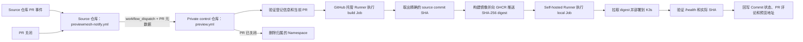

# PreviewMesh

[English](README.md)

PreviewMesh 为每个符合条件的 Pull Request 创建临时预览环境：构建精确的源代码提交，将镜像部署到 K3s，验证应用实际提供的 commit SHA，并在 Pull Request 关闭时删除预览。

> [!WARNING]
> 本仓库是公开模板。复制出来实际运行 PreviewMesh 的 control 仓库必须保持 private。不要把 GitHub Token、kubeconfig、真实仓库登记信息或运行证据放进本仓库。如果本目录来自 private checkout，请创建全新的公开 Git 历史，不要推送原 private 项目的旧提交。

## 工作原理

PreviewMesh 将公开模板、私有控制平面和应用源仓库分开：

| 仓库 | 内容 | 可见性 |
| --- | --- | --- |
| PreviewMesh 模板 | 通用代码、Chart、工作流和配置说明 | Public |
| Control 仓库 | 你的副本、源仓库登记、工作流变量和 Actions Secrets | Private |
| Source 仓库 | 应用、Dockerfile、健康接口和通知工作流 | Public 或 private |

Source 仓库会通知 private control 仓库。Control 工作流先使用 GitHub 托管 Runner 构建并发布不可变的 GHCR 镜像，再把单独的 Job 交给 K3s 机器上的 self-hosted Runner。这个 Runner 部署精确的镜像 digest，并通过 Traefik 检查应用。


```mermaid
flowchart LR
    A[Source 仓库 PR 事件] --> B[Source 仓库：previewmesh-notify.yml]
    B -->|workflow_dispatch + PR 元数据| C[Private control 仓库：preview.yml]
    C --> D[验证登记信息和当前 PR]
    D --> E[GitHub 托管 Runner 执行 build Job]
    E --> F[取出精确的 source commit SHA]
    F --> G[构建镜像并向 GHCR 推送 SHA-256 digest]
    G --> H[Self-hosted Runner 执行 local Job]
    H --> I[拉取 digest 并部署到 K3s]
    I --> J[验证 /health 和实际 SHA]
    J --> K[回写 Commit 状态、PR 评论和预览地址]
    A2[PR 关闭] --> B
    C -->|PR 已关闭| L[删除归属的 Namespace]
```

重要边界：

- 只有 private control 仓库设置 PREVIEWMESH_ENABLED=true 后，预览工作流才会运行。
- 只有登记过的仓库可以使用；数字仓库 ID 和完整 owner/name 必须与 GitHub 一致。
- Fork PR 会被拒绝。请在已登记的 source 仓库自身创建 PR。
- Source 工作流只转发元数据，不检出或执行 PR 代码。
- Self-hosted Runner 需要受限 kubeconfig，并且只应服务于 private control 仓库和专用开发集群。

### 运行时如何交接

`previewmesh-notify.yml` 由 `onboard-source` 从 source 仓库的 GitHub 默认分支准备。预览模式只显示完整 diff；`--create-pr` 会创建一个专门的可审核 PR，由你检查后合并。合并后，文件从 [`templates/source-notify.yml`](templates/source-notify.yml) 复制而来，并在 GitHub 托管的 `ubuntu-latest` Runner 上运行。`jobs.notify.env` 下的两个值决定要通知哪个 control 仓库；source 仓库中的 `PREVIEWMESH_DISPATCH_TOKEN` Secret 授权它在 control 仓库的 `main` 分支派发 `preview.yml`。派发时只发送 source 仓库 ID、完整仓库名和 PR 编号。

实际执行生命周期的 [`preview.yml`](.github/workflows/preview.yml) 位于 private control 仓库。它的 `build` Job 使用 GitHub 托管 Runner，读取当前 PR head 的 commit SHA，取出这个精确版本，并用 `previewmesh build --push` 构建镜像。这个 Job 声明了 `packages: write` 权限，并使用工作流自带的 `GITHUB_TOKEN` 登录 GHCR；不需要另设镜像发布 Job，也不需要手动创建 Package。

镜像 digest 是类似 `sha256:abc...` 的内容标识，不是 source commit SHA。Commit SHA 标识 Git 源码版本；镜像 digest 标识确切的容器镜像内容。PreviewMesh 部署的引用类似 `ghcr.io/OWNER/previewmesh-c123-r456@sha256:...`，而不是可能被重新指向其他内容的 tag，因此 K3s 中的工作负载不会悄悄切换到另一份镜像。

`local` Job 通过 `runs-on: [self-hosted, Linux, X64, previewmesh]` 选择 Runner。安装器会在 K3s 所在机器上注册并启动 Runner，可在 private control 仓库的 **Settings → Actions → Runners** 中查看。GitHub 会把 build Job 输出的 `image` 和已确认的 commit SHA 传给这个 Job。[`scripts/local-attempt.sh`](scripts/local-attempt.sh) 再把完整的 digest 引用传给 `previewmesh deploy`；Kubernetes 使用由 `GHCR_READ_TOKEN` 生成的 Namespace 内 `ghcr-pull` Secret 从 GHCR 拉取镜像，之后 Helm 创建或更新 K3s 资源。

部署后，local Job 检查应用的 `/health` 响应和实际提供的 commit SHA。`control status` 使用配置给 source 仓库的 Token 调用 GitHub 的 commit-status 和 PR comment API。等待中的或最终的 `PreviewMesh` 状态会链接到工作流运行页或预览地址，最终 PR 评论还会包含运行详情和 **Open preview** 链接。这个预览地址仍是本地/私有地址；查看 PR 的人必须能访问对应网络，并配置相应的 hosts 或 DNS 记录。

## 安装

支持 **Ubuntu 22.04/24.04 x64**，以及使用这些发行版并启用 **systemd 的 WSL2**。在准备运行 K3s 和 GitHub Runner 的机器上，以有 sudo 权限的普通 Linux 用户操作。使用专门的开发集群，并准备固定的局域网 IPv4。WSL 用户还需要 Windows 管理员权限来配置局域网入口。

先下载并解压本仓库的 ZIP 到 Linux 用户目录，或在已有 Git 的机器上 clone。在该目录打开终端。公开模板目录和私有 control 目录必须分开。安装器会补齐 Git 等缺少的工具，因此下载 ZIP 的方式不要求预先安装 Git。

### 1. 运行配置向导

```bash
bash scripts/setup.sh init
```

向导会从选定的 checkout 发现 GitHub remote、可用的局域网 IPv4 候选值，以及 Dockerfile `EXPOSE` 中声明的应用端口，并在展示端口前进行检查。没有候选值或候选不止一个时，会要求手动填写或选择，不会静默猜测。WSL 客户端无法从 guest 自动判断 Windows 主机的局域网地址，因此出现提示时请手动填写 Windows 地址。

向导会分开收集普通配置和 Token 文件路径。不要把 Token 粘贴到向导中；配置文件只保存类似下面的文件引用：

| 配置 | 填什么 |
| --- | --- |
| Control 仓库 | 负责协调 PreviewMesh 的私有 GitHub 仓库，安装器可以创建 |
| Control 目录 | 该私有仓库的本机目录，与公开模板分开 |
| Source 配置段 | 每个应用的 GitHub 仓库、本机目录、实际 HTTP 监听端口 |
| Token 文件路径 | Source、通知和镜像读取 Token 各自的独立文件，放在 Git 仓库外；配置中不填写 Token 明文 |
| 局域网 IP | Ubuntu 服务器的固定局域网 IPv4；WSL 填 **Windows 主机**的局域网 IPv4 |
| 输出语言 | `auto` 跟随系统，`zh-CN` 为中文，`en` 为英文 |

保存前，向导会显示仓库、目录、局域网地址、端口和 Token 文件路径等非敏感摘要。请审核后确认保存；在任意提示输入 `q` 都会退出且不写入配置。已有配置时，向导会先询问是否载入并审核，再决定是否替换。

如果只需要带注释的配置文件，可显式使用模板模式：

```bash
bash scripts/setup.sh init --template
```

它会把[带逐项说明的模板](config/setup.example.ini)复制到 `~/.config/previewmesh/setup.ini`，不会覆盖已有文件。编辑后，安装时继续使用同一个配置路径。

### 2. 执行安装

```bash
bash scripts/setup.sh install
```

`install` 命令会先解释当前步骤的作用，再准备工具、私有 control 仓库、Secrets、K3s、Runner、凭据自动续期和局域网入口。结束时会显示八个阶段的完成摘要，并逐个 source 报告通知工作流是否已在 source 默认分支合并，还是仍待接入。它可能在本地准备一份供审核的通知文件，但不会在 **source** 中提交、推送、创建 PR 或合并代码，也不会创建测试预览。需要创建经过审核的 source 接入 PR 时，使用显式的 `onboard-source` 命令。

仍需你完成浏览器登录和 GitHub Token 的创建。安装器会展示每个 Token 的创建页面、应选择的准确仓库及所需权限。缺少 Token 文件时，可以在隐藏输入提示中粘贴，安装器会保存为仅当前用户可读写的文件。组织审批、SSO 和 Token 到期时间由你的 GitHub 账号管理。这些个人 Token 不会自动续期；到期前更新相应文件并重新安装即可。

WSL 安装期间，Windows 会请求管理员权限来配置局域网转发。当前连接需为“专用”或“域”网络；安装器不会关闭防火墙，也不会把“公用”网络自动改为受信任网络。

某一步失败时，安装器会列出本次运行已完成的阶段、仍需完成的阶段和继续执行的准确命令。根据提示处理问题，再运行**同一条安装命令**；安装器会检查并复用已完成的资源，不会静默覆盖已有自定义工作流或配置。工具的详细输出会脱敏保存到仅当前用户可访问的 `~/.local/share/previewmesh/setup.log`；需要在终端查看时，加上 `--verbose`。

### 3. 创建经过审核的 source 接入 PR

安装结束时，对于仍待接入的 source，安装器会打印下一步命令。针对要接入的 source 仓库执行一次：

```bash
bash scripts/setup.sh onboard-source \
  --config /配置文件路径/setup.ini \
  --source OWNER/REPO
```

`onboard-source` 只读取 source 仓库的 GitHub 默认分支，并准备一个文件：`.github/workflows/previewmesh-notify.yml`。不加 `--create-pr` 时，它只显示完整 diff，不写本地文件，也不写远程仓库。如果默认分支已经有匹配内容，会报告无需修改。该命令只需要 Python 3 和已登录 GitHub 的 `gh` CLI，以及目标仓库的访问权。classic PAT 需要 `repo` 和 `workflow` scope；fine-grained PAT 需要对目标仓库有访问权，并授予 **Contents: Read and write**、**Workflows: Read and write**、**Pull requests: Read and write** 权限，参见 GitHub 的[细粒度个人访问令牌权限说明](https://docs.github.com/en/rest/authentication/permissions-required-for-fine-grained-personal-access-tokens)。不要求 systemd、K3s 或 source 本地 checkout。

如需让命令创建可审核的 PR，添加 `--create-pr`：

```bash
bash scripts/setup.sh onboard-source \
  --config /配置文件路径/setup.ini \
  --source OWNER/REPO \
  --create-pr
```

创建新 PR 时，命令会先显示完整 diff，只有输入准确的 `create` 后才继续。它使用专用的 `previewmesh/onboard-source` 分支。如果已有开放的接入 PR，命令会返回链接并保留该分支和 PR 内容，不检查是否可合并。没有开放 PR 时，如果专用分支内容或基线与当前提案不同，命令会停止并打印人工处理步骤。PR 只提交通知工作流，不读取或提交 source 本地的其他改动，也不会自动合并。已有 PR 的审核和合并冲突处理由你自行完成。

PR 合并后，运行 `doctor`，让它重新检查 source 默认分支上的通知工作流：

```bash
bash scripts/setup.sh doctor --config /配置文件路径/setup.ini
```

### 4. 开始正常开发

从同一个 source 仓库内的分支创建一个以默认分支为目标的普通测试 PR（不要使用 fork），按顺序检查完整链路：source 通知 Actions 运行、control 的 `Preview` 工作流运行、结果状态或评论中的 source commit SHA 和预览 URL，以及关闭测试 PR 后的清理结果。再从同一局域网的第二台机器打开预览 URL。安装、接入 diff 和通过 `doctor` 检查都不代表已经部署过真实预览；测试 PR 才能提供这项证据。

应用根目录需要能构建 linux/amd64 镜像的 Dockerfile；应用需监听配置的端口和 `0.0.0.0`，能以 UID/GID 65532 运行且不要求额外 capabilities，并让 `GET /health` 返回 HTTP 200：

```json
{"status":"ok","commit_sha":"PREVIEW_COMMIT_SHA 环境变量的实际值"}
```

安装器负责基础环境，不会改写应用或证明应用的运行行为。第一个真实 PR 会验证镜像权限、应用兼容性和实际提供的 SHA；关闭或合并该 PR 后，再确认 control 工作流已删除预览。

预览链接类似 `http://pm-r123-pr4.192.168.1.20.sslip.io:18080`。[sslip.io](https://nip.io/) 会将域名解析为其中的局域网 IP，因此同事无需为每个预览修改 hosts。这依赖外部 DNS；公司网络若拦截内网 IP 的解析结果，安装器会明确停止并解释，不会暗中更换网络方案。使用局域网 IP 不会把预览公开到互联网。还需让同事从另一台局域网机器实际检查访问。

### 检查和恢复

```bash
# 读取配置并检查前提条件，不修改系统。
bash scripts/setup.sh check
# 检查已安装服务、凭据、DNS 和 GitHub 配置。
bash scripts/setup.sh doctor
```

所有命令都支持 `--config /配置文件路径/setup.ini`。换终端不需要重新 export 变量。更新配置或 Token 文件后重新执行 `install`。每个 Linux 账号管理一套安装，Windows 转发绑定对应的 WSL 发行版。

root 管理的后台维护服务每五分钟检查一次 Runner 的 Kubernetes 凭据，在接近**实际到期时间**时续期，同时刷新 Traefik 代理目标地址。写入受限 kubeconfig 前会放弃 root 权限；续期失败会保留原凭据。WSL NAT 转发会在 Windows 用户已登录且发行版正在运行时刷新，不会为了刷新转发而启动已停止的发行版。

`doctor` 会区分“基础环境就绪”和“source 通知文件尚待发布”；基础环境检查通过不代表已经成功部署过真实预览。已有手工安装可以保留登记及 Secret 名称；接入新安装器前，先更新旧版 control 代码。

需要底层操作说明时，参见[手工安装参考](ops/install/manual_CN.md)。手工流程保留旧的 `preview.test` 默认域名。

## 更新 private control 仓库

在 private control 项目目录中执行更新。先提交本地改动，或用 `git stash` 收起它们；更新脚本要求工作区干净，并且 Git 已配置提交者身份。脚本会复用安装时创建的 `upstream`，如果没有这个 remote，就自动创建：

```bash
git switch main
git pull --ff-only origin main
git status --short
```

如果 `git status --short` 列出了文件，先处理这些改动，再运行更新脚本。确认工作区干净后再执行：

```bash
scripts/update-upstream.sh --remote upstream --ref main
```

有更新时，脚本会在本地更新分支上创建提交，并停留在该分支。如果提示无需更新，就到此结束。否则，检查差异、执行下方的本地检查，再推送实际分支并创建 PR：

```bash
UPDATE_BRANCH=$(git branch --show-current)
git diff --stat main...HEAD
git diff main...HEAD
```

执行[本地检查](#本地检查)中的命令。通过后再推送更新分支并创建 PR：

```bash
git push -u origin "$UPDATE_BRANCH"
gh pr create --base main --head "$UPDATE_BRANCH"
```

更新脚本会保留 private 分支中的 `config/repositories.json`，所以你的 source 登记不会被覆盖。GitHub Secrets 不在 Git 中，因此不会被修改。如果除了该登记文件以外还有冲突，脚本会停止并要求人工检查；不要对工作流或部署代码直接选择一侧覆盖。

新创建的副本还包含 **Update PreviewMesh from upstream** 工作流，每周检查一次，也可以手动运行。它在 GitHub 托管的 Runner 上执行检查并创建更新 PR，不使用部署 Runner 或你保存的 source Token。在 **Settings → Actions → General → Workflow permissions** 中启用 **Allow GitHub Actions to create and approve pull requests**；如果组织策略不允许，请使用本地更新流程。参见 [GitHub Actions 设置](https://docs.github.com/en/repositories/managing-your-repositorys-settings-and-features/enabling-features-for-your-repository/managing-github-actions-settings-for-a-repository)。如果公开模板由其他 owner 维护，可设置可选的 repository variable：`PREVIEWMESH_UPSTREAM_REPOSITORY`。

如果 private 仓库是通过 **Use this template** 创建的，它与模板之间没有共同 Git 历史。第一次运行更新器时会创建一个小的历史桥接提交，同时保留当前 private 文件；之后就可以使用普通 Git merge。第一次运行只关联历史，不会把上游当前的文件改动同步到你的项目中。审核桥接 PR 时，手动合入目前需要的改动；上游之后的新提交才能正常合并。每次更新也要检查登记文件之外的自定义内容。

更新 control 不会自动更新 source 仓库中已经发布的通知工作流，也不会替换本机已安装的 WSL/K3s 文件。合并更新后，使用原配置重新运行 `install` 来刷新本地托管副本；如果发现你修改过的文件，安装器会停止并显示差异。Source 工作流仍需由你审核并提交；需要创建审核 PR 时，使用显式的 `onboard-source --create-pr` 流程。

## 本地检查

修改或更新 control 项目后，在项目根目录执行下面的检查。需要 Git、Bash、Go 1.25+、Python 3、Helm 3 和 `actionlint`，缺少时先安装。这些是开发检查，不需要每次运行预览时重复执行：

```bash
scripts/verify-local.sh
```

脚本先检查工具和版本，再依次执行 Go 测试、`go vet`、工作流/Secret/配置脚本检查、Helm lint 和 actionlint；任一步失败立即停止。

Python 检查会模拟外部工具，不会访问 GitHub 或 Kubernetes。这些命令都不会部署应用。检查通过后，仍需运行一次真实预览，确认 Token、镜像权限、Runner、网络和健康接口配置正确。

## CLI 说明

可信域名后缀依次由 `--domain-suffix` 参数、`PREVIEWMESH_DOMAIN_SUFFIX` 环境变量、默认值 `preview.test` 决定。安装器会在 control 保存此变量。显式指定的 `--hostname` 仍必须匹配仓库/PR 身份与该后缀。

`control resolve` 只验证登记文件，不访问 GitHub。`control inspect` 检查当前 PR、Fork 状态和作者权限。`control status` 写入 `PreviewMesh` commit status。

工作流拿到足够的 PR 信息后，会尝试在 source PR 中发布结果评论，包含提交 SHA、部署状态和工作流运行链接。部署验证通过后还会显示 **Open preview** 链接。构建或部署失败、版本过期和清理结果不会显示可用预览链接。构建中的状态显示在 PR 的 PreviewMesh 状态检查中。每次结果都会新增评论，重跑同一提交可能再次产生评论。

`control status --comment --run-url <workflow-url>` 启用结果评论。source Token 需要[Token 配置说明](ops/install/manual_CN.md#6-配置-github-secrets)中的 **Commit statuses: Read and write** 和 **Pull requests: Read and write** 权限。两种回写会独立尝试，回写失败会记录在结果中，不改变实际部署或清理结果。预览链接仍要求配置相应网络访问和 hosts 映射，发布链接不会把本地环境公开到互联网。

评论还展示构建结果、Deployment 副本数量、Pod 就绪情况及失败原因、Service/Ingress 是否存在、`/health` 最后一次 HTTP 状态码、提交版本验证、回滚和清理结果。运行状态是本次尝试结束时的快照（若进行了回滚，则为回滚之后），未执行或无法获取的检查会明确标记。HTTP 200 不直接等于验证成功，响应还必须包含 `status: ok` 和预期提交 SHA；Service/Ingress 存在也不代表可访问。CLI 通过 `--build-state` 和 `--result-file` 接收这些证据。

运行记录会保存各 CLI 阶段的 UTC 开始和结束时间、耗时及结果，写入阶段 CSV 和结果 JSON，并汇总到 `summary.json`。`resource_observation` 记录运行状态快照的耗时，`resource_verify` 记录清理时检查 Namespace 归属或是否已删除的耗时。

部署就绪阶段会先等待 Deployment 和 Pod，然后等待预览 Service 获得 ClusterIP、Traefik 在 Ingress 状态中发布地址，之后才进行 `/health` 验证。在上面的 WSL 配置中，Traefik 发布的是 `127.0.0.1`；它用于判断路由就绪，实际请求通过 `18080` 端口的 socket 代理转发。Service 或 Ingress 就绪检查失败时，本次尝试会失败，预览不会被标记为 ready。

`previewmesh build`、`deploy`、`verify` 和 `cleanup` 是工作流使用的底层操作。完整 PR 生命周期应使用工作流，因为它会在部署前后重新检查 PR 状态，并处理过期版本和清理。

## 项目结构

| 路径 | 用途 |
| --- | --- |
| cmd/control | 可信的仓库和 Pull Request 验证 CLI |
| cmd/previewmesh | 镜像、Helm、验证、回滚和清理 CLI |
| charts/preview | 受限的 Deployment、Service 和 Ingress Chart |
| config | 私有 source 登记及公开示例 |
| templates | 复制到各 source 仓库的工作流 |
| scripts | Secret 配置、生命周期编排、报告和离线检查 |
| ops | 通用 K3s、Linux 和 WSL 辅助文件 |

## 故障排查

先看失败 Job 的日志和 control 运行摘要。Source 通知变绿只代表请求发送成功，`report` 变绿只代表结果收集完成。

| 现象 | 接下来检查什么 |
| --- | --- |
| 没有 source 通知 | 确认工作流已在 source 默认分支上，且已启用 Actions；如果缺少，使用 `onboard-source --create-pr`。Fork PR 会被跳过。对于之前就存在的 PR，推送新提交或按[手动运行说明](ops/install/manual_CN.md#8-运行预览)触发。 |
| 通知返回 403 或 404 | 检查 source 工作流中的 control owner/name、control `main` 上的 `preview.yml`，以及 dispatch Token 选择的仓库、Actions 写权限、审批状态和有效期。 |
| Control Job 被跳过 | 将 control 仓库的 Actions variable `PREVIEWMESH_ENABLED` 设为准确的 `true`，并选择 `main` 触发。 |
| `local` 一直排队 | 确认 private 仓库的 Runner 在线，并且有 `self-hosted`、`Linux`、`X64`、`previewmesh` 四个标签。 |
| 登记或 PR 授权失败 | 与 control `main` 上已提交的登记文件核对仓库 ID、owner/name、端口和 `source_secret`。PR 必须来自该仓库内部，作者需要有写权限。 |
| Source checkout 失败 | 检查 source Token 的仓库访问范围、Contents 读取权限、审批状态和有效期。 |
| 没有状态或 PR 评论 | 检查 `source_secret` 对应的 Token、Commit statuses 和 Pull requests 写权限，以及运行摘要中的回写错误。 |
| Kubernetes 返回 Unauthorized 或无法读取配置 | 检查 Runner 服务环境中的 `KUBECONFIG`、文件归属和 Token 有效期。先运行 `setup.sh doctor` 并检查 `previewmesh-maintenance.service`；手工安装可按[Runner 说明](ops/install/manual_CN.md#5-配置-k3s-和-runner)续期。 |
| 镜像推送或拉取失败 | 推送失败时检查 control 工作流对 Package 的写权限，尤其是已存在的 Package；拉取失败时检查 classic `GHCR_READ_TOKEN`、其用户的 Package 读取权限，以及预览 Namespace 中的 `ghcr-pull` Secret。 |
| 就绪检查或 HTTP 验证失败 | 如果 Deployment、Pod 和 Service 都已就绪，但 Ingress 就绪检查超时，检查 Traefik 是否已在 Ingress 状态中发布地址。WSL 配置中的 HelmChartConfig 应将 `providers.kubernetesIngress.ingressEndpoint.ip` 设为 `127.0.0.1`；应用配置并等待 Traefik rollout 完成。然后检查 Runner 的 DNS/hosts、Traefik 路由和 `/health`。响应必须包含 `status: ok` 和预期的 `PREVIEW_COMMIT_SHA`。 |
| Runner 验证通过，但浏览器打不开 | 运行安装器的 doctor 命令，检查浏览器所在机器的 DNS 和局域网连接。 |
| PR 关闭后预览仍存在 | 找到 `closed` 通知并等待对应 control 运行完成。如果通知失败，修复后手动触发这个已关闭 PR，重试清理。 |
| 更新工作流无法创建 PR | 检查更新章节中的 Actions PR 创建权限，或者自行推送生成的分支并创建 PR。 |

如果在 WSL 中手动构建 Docker 镜像时遇到容器网络问题，参见可选的 [WSL 出站网络配置](ops/wsl/docker-egress.md)。
